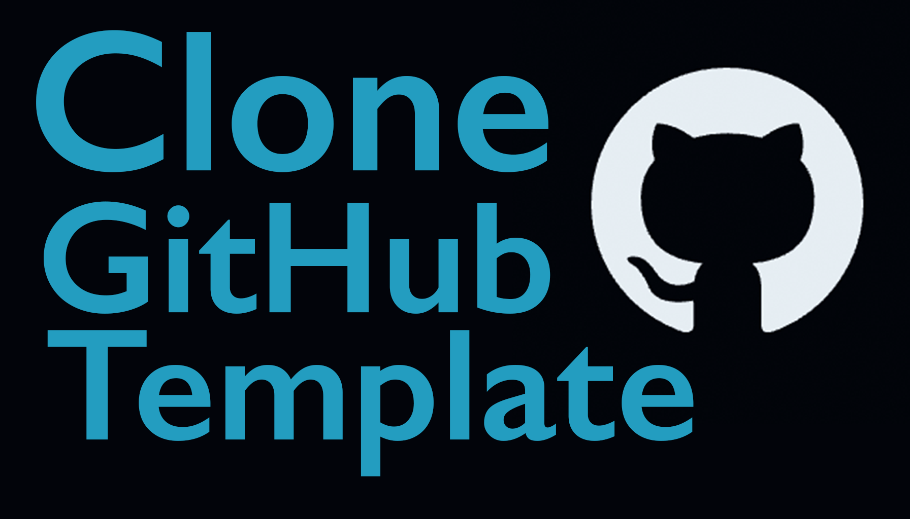

<iframe class="youTubeIframe" width="560" height="315" src="https://www.youtube.com/embed/3ZLoapBD01w?si=zmux-lyKrPSk6lHj?rel=0" title="YouTube video player" frameborder="0" allow="accelerometer; autoplay; clipboard-write; encrypted-media; gyroscope; picture-in-picture; web-share" referrerpolicy="strict-origin-when-cross-origin" allowfullscreen></iframe>

This tutorial provides a comprehensive guide on using a template from GitHub to create a new repository, and then integrating and working on this repository using Visual Studio Code, specifically for a p5.js project. Here's a step-by-step breakdown of the process:

1. **Creating a New Repository from a Template on GitHub**:

   - Log into your GitHub account.
   - Navigate to the p5 project template repository (link provided in the video description).
   - Click on "Use this template" to start creating a new repository.
   - Name the new repository (e.g., "jubilant octo chainsaw").
   - Choose whether it's public or private and provide a description if desired.
   - Click "Create repository" to finalize.

2. **Cloning the Repository to Visual Studio Code**:

   - Open Visual Studio Code.
   - Click on "Source Control" on the left side.
   - Select "Clone Repository" and then choose "Clone from GitHub".
   - Authorize Visual Studio Code to access GitHub if prompted.
   - Select the new repository from the list.
   - Choose a local directory for the repository (e.g., the "programming for artist" folder).
   - Confirm to open the repository in Visual Studio Code.
   - Trust the authors of the files if prompted.

3. **Editing and Committing Changes**:

   - Open the project files, like `index.html` or JavaScript files, and make desired changes.
   - For instance, you can replace the contents of the `sketch.js` file with a p5.js example from the official website.
   - Save your changes.
   - To preview the changes, use the "Go Live" feature in Visual Studio Code.

4. **Committing and Syncing with GitHub**:

   - In Visual Studio Code, navigate to "Source Control".
   - Review the changes and type a commit message, like "added p5js example from website".
   - Commit the changes.
   - Optionally, sync the changes with the remote GitHub repository.

5. **Sharing Project via GitHub Pages**:

   - To share your project, go to the repository settings on GitHub.
   - Scroll to the "Pages" section.
   - Set the source branch for GitHub Pages (usually "main").
   - Once deployed, GitHub provides a link to the live project.

6. **Ensuring Project Independence**:

   - Any changes committed will affect only your new repository, not the original template repository.
   - The original template repository remains intact and can be used for future projects.

7. **Importance of Sharing**:
   - The tutorial emphasizes the value of sharing creative coding projects, as it allows others to see and interact with your work.

This tutorial not only guides through the technical process of using GitHub and Visual Studio Code for project development but also encourages the sharing and display of creative work. Happy programming!

## Clone GitHub Template Repository Video Transcript

In this programming for artist tutorial I'm going to show you how you can use a GitHub repository that's a template and clone it so it's one of your repositories, but then you update it as a new repository.

Here I have a p5 project template repository that I set up in an earlier video. This repository is a public repository that is set as a public template. Instead of cloning the repository, we want to use this as a template to create a new repository. So what you need to do log into your GitHub account, then navigate to this page right here, the link is in the description. Then click use this template.

Here we can create a new repository. It uses the base template as the structure of the repository and then we can name it as a new repository. We can use jubilant octo chainsaw and then create a repository. You can choose whether it's public or private depending on your needs. You can also give it a description. Click create repository and now we have a repository here, and as you can see it says initial commit, so this is our first commit to this repository. That means we can use the original project template anytime we want to make a new p5.js project. Of course you can create your own template repository if you have different customizations you want to use. Once you've made a new repository from the template repository and you've saved it to your GitHub account how can we use that repository in Visual Studio Code?

What we need to do is clone the repository. Once you open up Visual Studio Code and you click on Source Control on the left, then you'll see an option for Clone Repository. If we click this, we can click clone from GitHub. If you've never used this before you need to allow access to GitHub. This will authorize Visual Studio Code to use GitHub. Then once you've authorized it you should see your repository listed at the top. I'll click the repository, then you need to select a location. I'm going to select the programming for artist folder and select this repository destination.

You have an option to open the repository and generally you want to. It will ask you if you trust the authors of the files in the folder and in this case we can say yes. Now if I click on index.html I can see this project repository and now I can make changes to it, now it is my own repository that I can use for my project but created from the original temp template file. Hopefully this allows you to clone template repositories to your GitHub account and then use them in Visual Studio Code.

If I make changes to this repository and then I commit them, they'll go to my repository and not the original template repository. Let's see how that works. If I twirl out js and then I open up the sketch file here, I have a blank p5.js template. I can erase this and then paste in an example from the p5.js website. This is a simple example showing how to use the mouse as input. If I save this, I can click on Go Live and then I can see the p5 sketch happening right here.

Then in Visual Studio Code I can click on Source Control and then I can see the changes that are going to be made. I can type in a commit message "added p5js example from website? and then I can commit it. I can also sync my changes.

Once we've made our commit we can go to the GitHub website and we can see our commit message right here. Then we can go into the folder and we can click on sketch.js and we'll see the example from the p5.js website. If we go to the original template repository and then we click on js, and we click on sketch, we'll see that it is still the template sketch.

If we want to share our new project with our friends we can go back to our new repository, click on settings, then we can come down to the bottom that says Pages. Then we can click under Branch - Main and then save it. This will now be available online. Once GitHub Pages has deployed your site you'll see this link ,and then we can click on visit site and then right here we have our example but rather than running on our local live preview and Visual Studio Code this is live on the web.

So we will be doing this with lots of projects in this course and then sharing them. Cuz what's the point of doing any creative coding if no one gets to see it?

Happy programming.

