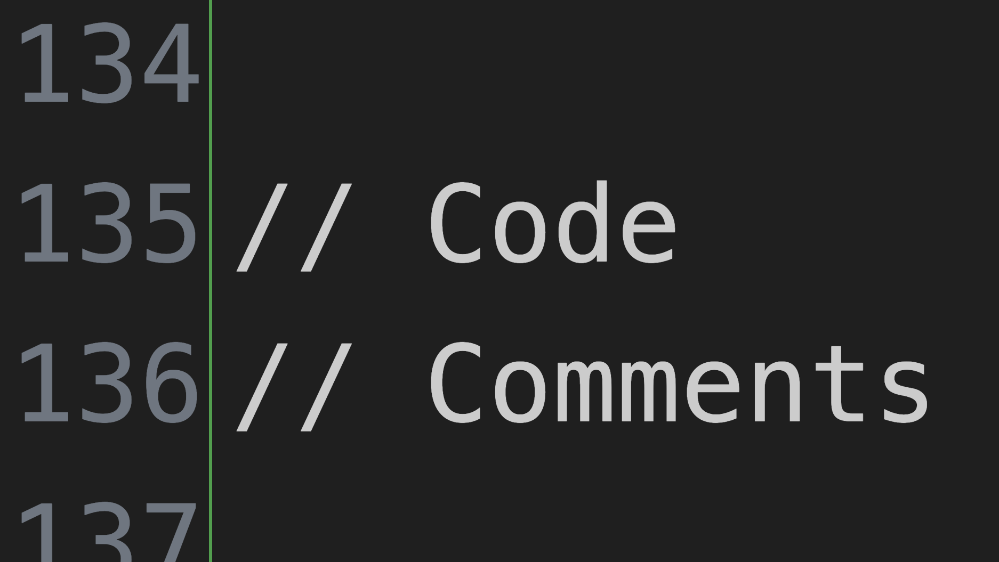

<div class="iframe-16-9-container">
<iframe class="youTubeIframe" width="560" height="315" src="https://www.youtube.com/embed/A2pH3TOEgok?si=dv9BxZTB8orHlm8M?rel=0" title="YouTube video player" frameborder="0" allow="accelerometer; autoplay; clipboard-write; encrypted-media; gyroscope; picture-in-picture; web-share" allowfullscreen></iframe>
</div>

In this tutorial on programming for artists, the concept of code comments is introduced as a fundamental and valuable tool for enhancing code readability and maintainability. Let's break down the key points:

1. **Purpose of Code Comments**: Code comments allow you to insert text into your program without the computer executing it. Since computers execute code sequentially, anything not meant for execution, like notes or explanations, can be turned into a comment.

2. **Creating Comments**: You can create a single-line comment by using two forward slashes (`//`). Anything after these slashes on the same line won't be executed. For example:

   ```javascript
   // This is a single-line comment
   background(220); // Sets background to grey
   ```

3. **Using Comments for Testing**: Comments are particularly useful for testing different parts of your code without deleting or rewriting it. By commenting out certain lines, you can easily switch between different states or behaviors in your program. For instance:

   ```javascript
   background(220); // Grey background
   // background(23, 56, 147); // Dark blue background
   ```

4. **Documenting Your Code**: Comments at the top of your code are often used for documentation purposes. This can include a description of the program, instructions, licensing information, or links to documentation pages.

5. **Multi-line Comments**: For longer comments or to comment out large sections of code, multi-line comments can be used. These are initiated with a forward slash followed by an asterisk (`/*`) and closed with an asterisk followed by a forward slash (`*/`). Everything in between is commented out. For example:

   ```javascript
   /* This is a multi-line comment
      It can span multiple lines
      and is very useful for large sections of text */
   ```

6. **Commenting Out Code Sections**: Multi-line comments are useful for temporarily disabling large portions of code. This can be helpful in debugging or when trying to isolate certain parts of your program.

7. **Importance of Comments**: Comments are crucial for documenting your code, making it easier for others (and yourself) to understand what each part of your code is intended to do. They are also valuable for noting the source of code snippets, especially if you are using or modifying code from an open-source repository.

In summary, comments are a vital part of programming, particularly in artistic and creative coding, where experiments and modifications are frequent. They help in keeping track of changes, understanding the functionality of various code segments, and maintaining a clear and understandable codebase. As emphasized in the tutorial, always strive to document your code clearly, whether it's for personal use or for sharing with others.

## Code Comments p5.js Video Transcript

In this programming for artists tutorial, I'm going to show you how you can make code comments. Code comments are great ways that you can put actual text inside your program and then not have the computer execute that code. Remember the computer goes through each step and then executes that code. o for example if I run this sketch and it says background 220 and then I type background( 23, 56, 147) it makes it blue. I could comment out one of these lines by putting two slashes in front of it. Then it only makes the background the 220 gray scale. I can also give myself comments to remember what it is so I can put a comment at the end of this line, "This is a dark blue color." I may not remember that until I run the sketch so if I comment out this line then it becomes a dark blue color. This is a really convenient way to test things without having to delete things in your code.

Another thing that you can use it for is putting messages at the top. So here I have some comments up at the top, a lot of times you'll put in what your program is about, how it works, what the licensing is, maybe a website for a documentation page.

So far we've done single line comments. We can also make multi-line comments by putting a slash then a star. Then I can put lots of comments in and the entire line is commented out so no matter what I type here it's not run. This is very convenient for commenting out large sections. For example I could comment out this entire section and then the entire draw function doesn't work anymore, there's just nothing happening. So there are multiple ways I could comment out each individual line or use a multi-line comment.

Comments are really super important. Always try to document clearly what your code is doing. They're also a great way to show where you've gotten other code snippets. So if you've borrowed code, even it's if it's an open source repository you really should let others know where that code is from and so that way you can clearly delineate how different functions and operations work. So hopefully you can now use code comments in your programming projects. Happy programming.

[](./attachments/code-comments-thumb.png)
