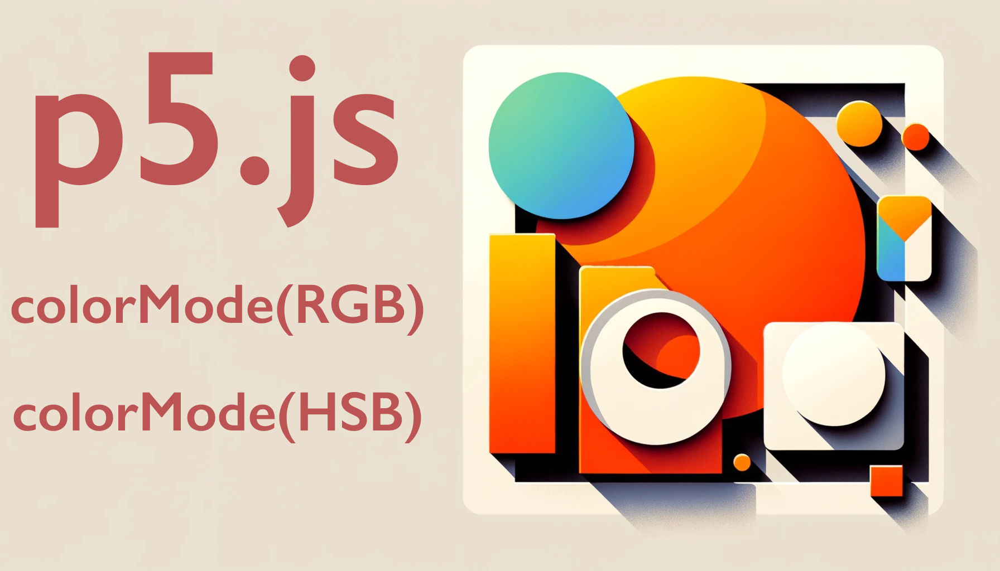

<iframe class="youTubeIframe" width="560" height="315" src="https://www.youtube.com/embed/uBj4dZmxONA?si=e3HsTRd8_PHR8KZo?rel=0" title="YouTube video player" frameborder="0" allow="accelerometer; autoplay; clipboard-write; encrypted-media; gyroscope; picture-in-picture; web-share" allowfullscreen></iframe>

This tutorial dives deep into color, color modes, and shape attributes in p5.js, building upon previous knowledge of creating basic shapes. Let's break this down for better understanding:

### Modifying Shapes

#### Centering Shapes

- **Problem**: Centering shapes like rectangles can be mathematically challenging.
- **Solution**: Use `rectMode()`. By default, it's set to 'CORNER', but you can change it to 'CENTER' or 'RADIUS'.
  - Example: `rectMode(CENTER)` makes a rectangle's starting point (`199, 199`) its center.
- Similarly, `ellipseMode()` changes the drawing mode for ellipses and circles.

#### Stroke Attributes

- **Stroke Caps**: Modify the appearance of the lines' ends using `strokeCap()`.
  - Options: 'SQUARE' or 'ROUND'.
  - Example: `strokeWeight(12); strokeCap(ROUND);` gives rounded ends to lines.
- **Order Matters**: The sequence of these commands affects which shapes they apply to.

### Understanding Color

#### RGB Color Mode

- **Basics**: Color in p5.js is typically defined using Red, Green, and Blue (RGB).
- **Additive Color**: Mixing all RGB colors yields white; absence of color results in black.
- **Grayscale**: A single value (e.g., `background(220)`) sets a gray tone.
- **RGB Values**: Using three values sets the specific color (e.g., `fill(255, 0, 0)` for red).
  - Example: `background(255, 255, 0)` gives a bright yellow (red + green).

#### HSB Color Mode

- **Difference from RGB**: HSB stands for Hue, Saturation, and Brightness (Value).
- **Advantages**: Easier to cycle through a rainbow of colors.
- **Usage**: `colorMode(HSB)` to switch modes.
  - Hue ranges from 0 to 360, Saturation and Brightness from 0 to 100 (or 0 to 255, depending on the range set in `colorMode()`).
  - Example: `background(230, 100, 100)` in HSB mode gives a bright blue.

### Additional Tips

- **Tidying Code**: Use the editor's 'Tidy up' feature for better readability.
- **Exploring Further**: Experiment with `noFill()` and `noStroke()` to create different effects.

### Applying This Knowledge

To apply this knowledge in p5.js, start by experimenting with the `rectMode()` and `ellipseMode()` for different shape positioning. Then, play around with the stroke settings to see how they affect the appearance of your shapes. For color, try setting backgrounds and fills using both RGB and HSB modes to see how they differ. The key is to experiment and see the results in real-time, which will deepen your understanding of how these attributes work in p5.js.

Remember, p5.js offers a versatile platform for creative coding, and mastering these basics opens up a world of possibilities in digital art and interactive designs.

## Color Modes p5.js Video Transcript

In this programming for artist tutorial I'm going to talk about color, color modes, and shape attributes in p5.js. In the previous video we played around with creating some shapes, some rectangles, triangles, even some quads, and ellipses, and we did a little bit of playing with some of their attributes, and their color. But now we're going to dive a bit more into color, and talk about what it is, and also the way we can modify the attributes of the shape.

The first thing I want to talk about are some ways that we can modify shapes. So here I have a rectangle and it starts at 199, 199. So this is at the very center of the canvas but it starts at the top left and then goes over 100 and 100. So I could try to make this be in the middle, so I could try to lower this down, maybe have this be 149 and 149, that starts to become a lot of math to be able to center a rectangle. And especially with complex shapes. Luckily if we go to the p5.js reference and under attributes we can see rectMode.

So what is rectMode? So we could change it to different places. By default it's Corner. We can have it also be Radius or Center. So let's go back and change it to CENTER in the editor. So now the rectMode is drawing right in the center of that point. So now if I type my 199 by 199, the rectangle will be right in the middle and we can do the same thing with circles. So we can have circles draw in the center if we look back here at the P5 reference, we can see ellipseMode which can be used to draw circles as well.

Another thing we can do is for example, we can cap strokes. So if we look here we can cap them by being either square or round. This is a really nice way to change the way that your lines work. So for example if I change this here and then paste it, you can see that I have a stroke weight of 12 up here with that rounded stroke. Now once again we need to remember that order matters. So why does this change the stroke of the rectangle?

It's because I need to come back in here and take this strokeWeight copy it, and put it back up at the top. I need to put this back at the top and if I change this to 1, suddenly I have the small stroke weight for the rectangle and then the caps and then I can also make this much larger if I wanted to. So now that stroke weight is very big and you can really see those caps and shape attributes.

But let's talk about color. So we can think of color as the combination of red, green, and blue. And it's important to remember that when you mix all of the colors together you get white. That's because in p5.js and in computers it's additive color, color made with light. This is different than if you're using using paint and you mix up red, green, and blue and you get this muddy color. That is subtractive color. Talking about additive and subtractive color is a topic for another video but for right now remember that all the colors together make white. If there's no color then it's black.

But how do I know all the color if we just have one place for color? So for right right now we have the background is filling in at 220. If I make the background zero that means there's no color, so now the background is fully black. If I make the background 255 then it has all the color and it's white, but this is only on a gray scale. What I want to do is be able to have all the color with RGB. So this first one here is red, then green, then blue. Notice it's still white. If I make blue to be zero now I get this bright yellow cuz we have red and green together and in additive color that makes yellow. If I want to have it all be green I can make this first number be zero and then we have this bright eye jarring green. So having all of those numbers together is what gives us our colors in an RGB color system. This is great it's very easy to find RGB colors on different objects. Now remember that this is only the background. If I go ahead and I add a fill now it is filling in this square with this color. It would also be filling in any other shapes of that color were they to exist on the screen. So it's important to remember that the order of each thing matters.

Now notice how I have these items over here. One nice thing you can do is you can go to edit and tidy up your code, and that'll fix that and keep everything nice and tidy.

We can also have color modes. Let's go to the reference and right here we can see colorMode. So under colorMode we have some options that we can use RGB or HSB. These are two very common color modes. What is the difference? Well, with RGB it's moving in between the red, green, and blue space whereas with HSB it's you moving between hue, saturation, and value. Let's see the difference of these two.

So let's go back to here and we'll copy colorMode right here, and let's replace this colorMode. So it's RGB it stays the same but we could go ahead and replace this to HSB. Now we have a saturation value. Notice that this here is much less saturated so if I make this fully saturated it will be very, very saturated. And then the value of this if I make it 156 it becomes brighter. And then this is a color wheel. It goes all the way around so as we change our hues. I can type in 230 and it moves in a more predictable way. So if I now type in 200 you can see how that changed to a light blue. So it's much easier to cycle through a rainbow of colors than it is with RGB values because then you can just go from 0 to 255 with this. So very often we will use the HSB color mode.

Hopefully that gets you started with using colors and color modes as well as some shape attributes in p5.js. It's important to go back in and explore some more of these options including noFill and noStroke, then you can start to be making more images with p5.js

