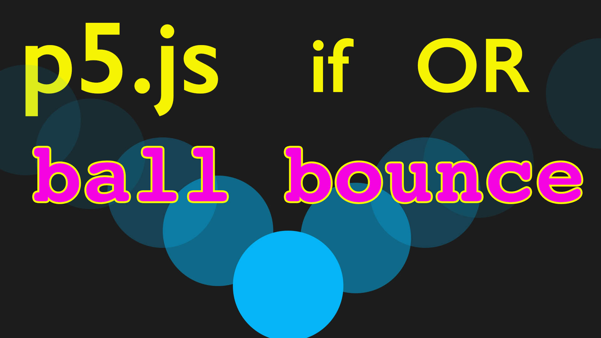

<iframe class="youTubeIframe" width="560" height="315" src="https://www.youtube.com/embed/y14SpHKL1gg?si=XlEGEaZWYJ_C8yf-?rel=0" title="YouTube video player" frameborder="0" allow="accelerometer; autoplay; clipboard-write; encrypted-media; gyroscope; picture-in-picture; web-share" allowfullscreen></iframe>

In this "Programming for Artists" tutorial, we're going to enhance a simple animation of a ball moving across the screen in a programming environment, using [JavaScript](../javascript.md) with the graphical library p5.js. From the [previous tutorial](./conditional-statements-p5-js.md), the initial state of the program has the ball moving in one direction until it goes off-screen. Our goal is to modify the code so that the ball bounces back when it reaches the edge of the screen.

Initially, the ball's movement is controlled by using the [increment operator](./increment-operator-p5-js.md) to incrementally increase the [variable](./variables-p5-js.md) for the `x` coordinate, causing it to move horizontally and by incrementally increasing the variable for the `y` coordinate, causing it to move in the vertical direction. To make the ball bounce back, we introduce a `speedX` variable set to 1. This variable is used to modify the `x` value (`x = x + speedX`). This gives the same functionality as the original. In order to reverse the direction of the ball's movement when the ball reaches the screen's width, we multiply `speedX` by -1 to change the sign of the variable.

To create a similar vertical movement, we introduce a `speedY` variable and apply the same logic. The ball's vertical position is updated by `y = y + speedY`. Conditional statements are used to check if the ball exceeds the screen's boundaries (both width and height), and if so, the respective speed variable (`speedX` or `speedY`) is multiplied by -1 to reverse the direction.

We also introduce a `ballSize` variable to control the size of the ball and ensure that it bounces back correctly from the screen edges. The conditional statements are updated to account for the ball's size, ensuring that the ball appears to bounce off the screen's edges accurately as the ball touches.

To make the program more dynamic, the speed variables can be set to different values or even randomized to create varied motion patterns. Additional features, such as color changes upon bouncing, can be added to enhance the visual effect.

The key takeaway from this tutorial is the use of variables and conditional statements to control and modify the motion of graphical elements on the screen. By adjusting variables like position (`x`, `y`), speed (`speedX`, `speedY`), and size (`ballSize`), and using conditional checks, you can create rich, interactive animations. This approach is fundamental in programming for artists, enabling creative exploration through code.

## p5.js Ball Bounce Video Transcript

In this programming for artists tutorial, I'm going to talk about how we can change our console log statements to an actual program command that makes the ball go back the other way. So right now, every time our program goes, the ball just goes off the screen. And of course our program tells us it's off the screen, but the program needs to be able to move the ball back.

So what we're saying here is if X is less than width the width of the screen, the ball is on the screen, else the ball's off the screen. And why is it moving? Because we're using this incremental fashion operation from the previous video and it's adding one to the value of X. We could even go ahead and print console.log x to see that happening. So here we can see that value of x is increasing.

So now what we need to do is have the value of X decrease. So let's go ahead and try that. So here we could go ahead and put X minus minus a different type of decrement or and now when it gets to the edge of the screen, the ball will bounce back. Except it doesn't bounce back. It gets stuck at 399. Why is that?

Well, as the program goes through, it says, well, if it's less than with, it must be on the screen, otherwise go minus, minus. But then when we come back through the program, we're adding to x again. There's no way for it to stay there. So what we need to do is change this to if X is greater than with, and then we can go ahead and put this up here and we're just waiting for it to go off the screen and once again we get stuck. That's because we still have this increment value here. So what we need to do is have a different variable. We need to have a way to flip that incremental version of X. going to go ahead and delete this else right here because we don't need this else statement and I'm going to go ahead and delete these two increments options.

So what we need to do is have a new kind of variable. So instead of this a right here, I'm going to change this to speed x and I'm going to make speed X be one. And then let's just see if we can get this going back the way we had it. So I'm going to say instead of X plus plus like we had, I'm going to say x equals x plus speed x. Let's just see if we can get that working. So now we have the ball going across the screen. Excellent.

So that's kind of the same thing we had before. Let's go ahead and add another variable. let speed y equals one. And we'll do the same thing here. We'll have Y equals Y plus speed y. So if we look at this now, this is basically what we had in our original program. So now how can we use this information to change our program? Now what we want is when X is greater than with, we want it to go back the other way.

Well, there's a cool math trick that we can do, so we can go ahead and multiply speedX by negative one and it'll change its sign or its value. So let's go ahead and try that. if X is greater than with let's take speed x equals speedX times negative one. Now let's see what happens. Now you can see the ball comes back, but we still don't have any Y.

So let's go ahead and add another conditional. So I'm just going to copy this conditional right here and then right up here and edit you can tidy your code, so I'm going to go ahead and make this y. If y is greater than height and I'm going to delete this console.log ball on screen because we don't need that right now.

And we can have it console.log y and then this will be speedY and speedY. So now if we watch the ball should come back the other way. And it does. But now it is going away forever. It's not coming back. how do we get the ball to come back? Well, we need a new conditional comparative operator.

So far we just been using less than or equals. But we can combine comparator so we can use and or or so I'm going to put a comment right here so and in JavaScript is written as two ampersands and then or is written as two pipes so we can use this, let's think about how we could do that. So it's greater than the width and it comes back, then it gets stuck over here. Remember, zero zero is at the top left, so let's try or x is less than zero. Then we can try the same thing down here with Y.

So then we can say or Y is less than zero. so now our ball should be moving and bouncing back. And as a bonus, it automatically has this simulated physics that bounces off the walls. Now if you see here, we don't actually have the ball hitting right on the edge, we would want to change how that is calculated.

So we'd want to have it width minus the size of the ball right now this ellipse here has 100, so we'd want to take off 50 of that so we could put in a parentheses here y height -50 and we could do y greater than 50. And so now it looks like it is bouncing right there. This would be better to replace with a value. So a variable so we can come up here and we could say, let ball height, the ballH equals 100 and then we could go ahead and write ballH right here.

And then instead of having this hard coded value we could write ballH And then ballH so that way we can change the height of the ball when we need to. here we need ballH Divided by two here less than ballH divided by two. So now we have that working and if we change ball H his value,
we could change that as well. Let's go ahead and add a ballW Let ballW equal 100 and then we'll change everything right here so now we can go ballW.

And if you wanted to keep it a circle, you don't need the width and height. I'm using Ellipse so I have the width and height. You can just have ball size and then put the same value right here. In fact, let's, let's go ahead and do that so we can just write ball size and then right here we'll write ball size and then right here, ball size, and we can come down and change this instead of ball H We can write ball size as well as ball size. And then that way we could have the same expression right up here so we could go ahead and put this right there and then we could paste it there as well. And now it should be working. And I don't think I need these parentheses so I can take those off because it knows the order of operations. And so now we have the ball actually bouncing off the edge.

Now, to make this a little bit more exciting, we'd probably want to go ahead and have the ball squish and things like that. So now would be a nice experiment to try. We can also as a benefit, since we're using variables, we can go ahead and change the speed. We can have different X and Y speed so we can have 11 on the Y, and you can see now we get this much cooler random action, which is a lot of fun. So we could even have these speeds be random based on when the program starts.

But we'll talk about random and ways of getting variability in our program later. So go ahead and try it out yourself, maybe experiment with the speeds, maybe try to have the color change when it gets to either side. So instead of having this fill B right here, we could put fill up at the top and set up so we could go ahead and say fill is in the setup.

So it runs once and it tells it that. But then we could have fill here and it'll be the same, except then we could have random. And now each time it hits on the X, we're going to get a different color. So see if you can control that with more deliberate actions. And we'll talk about the random function a little bit more in another video. But this is a great example of how to use conditionals to be able to have your ball bounce around the screen and use this logical statement here of multiplying by negative one. So it flips the direction or the sign of the variable.

Happy programming.

[(./attachments/if-or-conditional-ball-bounce-thumb.jpg]
