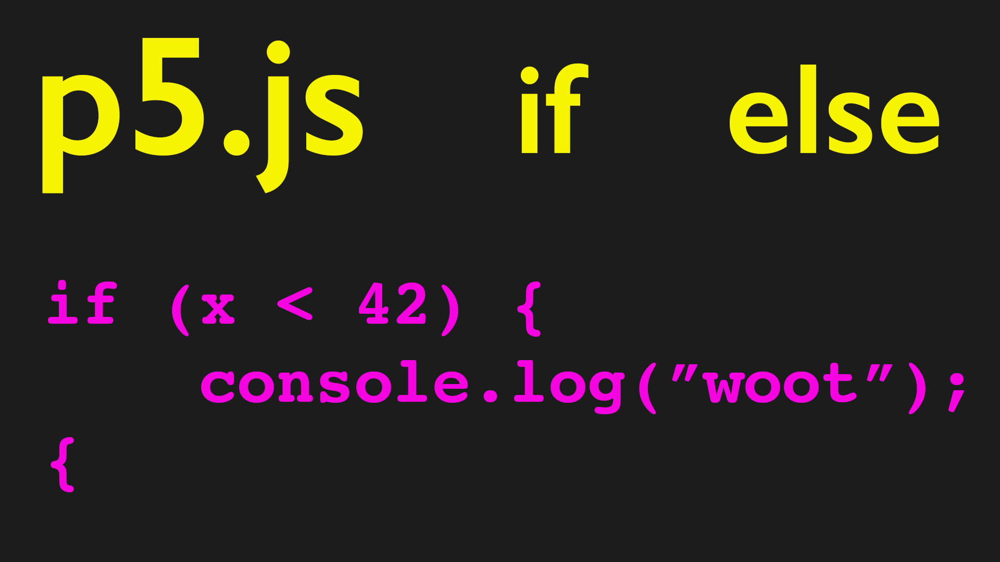

<div class="iframe-16-9-container">
<iframe class="youTubeIframe" width="560" height="315" src="https://www.youtube.com/embed/ka-LMj_VfNU?si=4VE4Zv64WjUsEo2t?rel=0" title="YouTube video player" frameborder="0" allow="accelerometer; autoplay; clipboard-write; encrypted-media; gyroscope; picture-in-picture; web-share" referrerpolicy="strict-origin-when-cross-origin" allowfullscreen></iframe>
</div>

## Conditional Statements

Conditional statements allows the program to do different things based on information or conditions. To this point, the program in p5.js starts with the `setup()` function and then moves to the `draw()` function. Once in the `draw()` function it keeps repeating over and over until we stop the program. What if we wanted the program to run during the day but turn off at night? What if we wanted the program to draw pineapples on Wednesdays, lots of wavy lines on Fridays, and alligators on every remaining day?

To do these tasks and other specific tasks we need to have control over the flow of the program. One way to control a program is with `if` statements. We can see the program logic in the hypothetical situations above. Even plain language explanations in English use the word "if." Think of a conditional statement as basically meaning, "If something then do something." or "If there isn't something then do something else." There are many more permutations, but the basic idea is that if a condition is met in the program then a specific set of instructions is run, and if those conditions are not met then the instructions are not run.

### Booleans True and False

The if statement compares a boolean expression. What is a boolean expression? A boolean expression can either be `TRUE` or `FALSE`. Often in computers this is shortened to `1` or `0` with 1 being true and 0 being false.

### if Statement

```javascript
if (mouseX > 125) {
  fill(0, 255, 0); // fill green
}
```

### Comparative Operators

How does the program know if something is or not? The program needs to evaluate something and decide if it is correct. In computers, a program will evaluate a conditional statement as "true" or "false" by using comparative operators. In p5.js there are a number of comparative operators available.

- `<` Less than
- `>` Greater than
- `<=` Less than or equal to
- `>=` Greater than or equal to
- `===` Equal to (strict)
- `==` Equal to (not-strict)

_It is very easy to mistake `=` for equal to. Remember that `=` is setting or assigning a value, while `===` or `==` are comparing or testing a value._

### `else` and `else if` Statements

You can check multiple conditions in a single statement. For example, "If the store has pizza, buy 20 pizzas and eat, otherwise stay hungry." The "otherwise" is converted to `else` in programming. The program will check the first condition "if there is pizza in the store" and if that is true it will do the first task, "buy 20 pizzas" but if the store doesn't have any pizza, then the program does a different "task", it "stays hungry."

In a conditional statement there can only be a single `if` and a single `else`. So how can I check if there is pizza, and then if there isn't pizza check if there are sandwiches, and if there aren't sandwiches check if there is ice cream, and if thee isn't ice cream, check if there is sushi, and then finally "otherwise" stay hungry? For multiple conditional checks in a single statement `else if` is used.

_Note: Once any `if` or `else if` evaluates to `TRUE` then the program will jump out of the conditional statement, even if later the next `else if` becomes true._

For example, maybe the store was originally out of ice cream but has lots of sandwiches. So the program keeps buying sandwiches. Then there is an ice cream delivery but the store still has lots of sandwiches in stock. If the "sandwiches `else if`" is before the "ice cream `else if`" then the program will always stop at sandwiches unless the store sells out.

## Conditional Statement Code Example

[Code example](https://editor.p5js.org/whatmakeart/sketches/7ASLZOIph) in the p5.js web editor.

```javascript
// conditional statements example
// https://editor.p5js.org/whatmakeart/sketches/7ASLZOIph

let x = 200;
let y = 100;
let a = 34;

function setup() {
  createCanvas(700, 600);
}

function draw() {
  background(220);
  fill(31, 145, 87);
  ellipse(x, y, 100, 100);
  x++;
  y++;
  a--;

  if (x < width) {
    console.log("ball on screen");
  } else {
    console.log("ball off screen");
  }
}
```

### Additional Evaluations with Boolean Variables and ! Not

`and` and `or` allow for multiple conditions to be checked in a single `if` or `else if`

"and" is represented by two ampersands `&&` and "or" is represented by two pipes `||` (these are usually on the right hand side of a US keyboard)

```javascript
// an and conditional
let myVariable = 23;

if (myVariable >= 20 && myVariable <= 86) {
  fill(0, 255, 0); // fill green
} else {
  fill(255, 0, 0); // fill red
}
```

[](./attachments/if-else-introduction-thumb.jpg)

## Conditional Statements p5.js Video Transcript

In this programming for artists tutorial we're going to talk about conditional statements, if then. We don't really say the "then" part in the programming, but it's the concept that we need to have, "If this thing happens then that happens maybe, something else happens." So let's talk about why we might want to use this.

So in our previous example we used an incrementation operator in JavaScript to have our ball start moving down, but our ball goes off the screen. We'll talk about how to fix that in a second, but let's talk about how a conditional statement works. We want to have something happen only when a certain condition is met. The syntax for that is relatively straightforward, but it has some more elements to it.

In the p5js reference we can see how this syntax works. We have a variable of a and it's equal to four, so then the if and then we have these parentheses, so this is the condition that is either true or not true. If a is greater than zero then it says console.log positive else console.log negative. So let's try that. Let's go ahead and just copy this code straight from the p5.js reference, and that's generally a great thing to do to learn. Then if we go back to our code and we paste this in the draw function and then we run our code we're going to see that in the console, it's just constantly logging positive, because a is always greater than zero.

What if I move this variable declaration. So I'm going to cut it then I'm going to put it up here at the top so now it's a global variable. If it's in the draw function it's a local variable. And then in the draw function I'm going to go ahead and say a minus minus so now if I stop the program and I restart it we'll see that it was positive for three times, three times through the program and then it became negative. If I stop this again then and I make a a larger number, let's say 34, and then I press play we see that it stayed positive for a while, then it went negative.

This is a way that the program can change based on the conditions. So that's why we call them conditional statements. So what if we change this to a different thing what if we say if x is less than width remember width is a variable that's in p5.js. We can say ball on screen and then we can say else ball off screen. Let's see what happens here.

So we're have the ball on the screen and then when the ball goes off the screen. Suddenly the ball is off the screen. So using console logs is a great way to debug your program before you have to put all the function in there. So we're going to talk about how we can use a conditional like this to make our program move the ball back but this is the first thing that we need to know just how the structure of this conditional works. So we'll investigate more about that and actually putting in some logic of how to get the ball back.

Happy programming.
