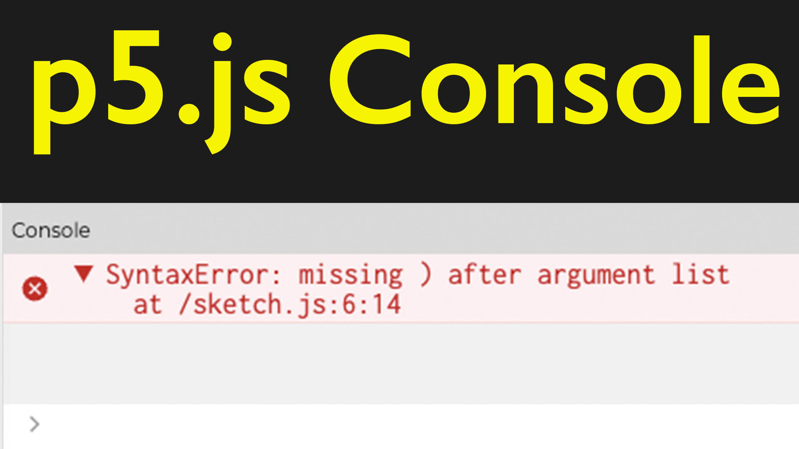

<iframe class="youTubeIframe" width="560" height="315" src="https://www.youtube.com/embed/6mqHhBcZrdw?rel=0" title="YouTube video player" frameborder="0" allow="accelerometer; autoplay; clipboard-write; encrypted-media; gyroscope; picture-in-picture; web-share" allowfullscreen></iframe>

In this programming tutorial, we're diving deeper into the [p5.js online web editor](./p5-js-web-editor-basics.md), particularly focusing on the console. The console is a crucial tool in the p5.js environment, located at the bottom of the editor beneath your code. It essentially serves three main purposes:

1. **Displaying Error Messages**: When your code has an issue, such as a syntax error, the console will display an error message. For instance, if you remove a curly bracket from your code, the console might show a syntax error, indicating a problem. While the error messages are sometimes vague, they usually provide enough information to help you locate the error. For example, it might highlight areas in your code where the error could be, allowing you to deduce that you've missed a curly bracket.

2. **Writing Messages**: You can use the console to write custom messages or data. This is done using the `print()` function in p5.js. For example, if you write `print("Hello")` in your code, _Hello_ will appear in the console when you run your sketch. Be cautious with the `print()` function, especially if you have the Auto Refresh feature enabled. An empty `print()` call might trigger the browser's print dialogue, attempting to print the page. To avoid unintended printing, make sure to either disable Auto Refresh or provide an argument to `print()`.

3. **Debugging**: The console is invaluable for debugging. By using `print()` or the standard JavaScript `console.log` command, you can output variable values, messages, or any data you want to monitor. This is extremely useful for tracking the behavior of your code and identifying issues. . However, you must be cautious with placing these commands, especially in functions that run repeatedly like `draw()`, as this can lead to a large number of messages being printed, potentially affecting performance. For example, placing `console.log("Hello")` or `print("Hello")` inside the draw function will continuously print "Hello" to the console as long as the draw function is running

It's important to understand the difference between printing to the console and to the webpage. For example, using `createP("hello")` in your sketch will actually create a paragraph element on the web page itself, not in the console. This distinction is crucial as you begin to create more interactive and dynamic sketches.

As your programming skills progress, especially with more complex projects, you'll find yourself relying on the console for debugging and tracking variable values. It becomes an indispensable tool in understanding what's happening in your code, especially when dealing with those tricky error messages.

Remember, programming can have its challenges, but tools like the p5.js console are there to help you navigate and resolve issues as they arise. Happy coding!

## Console p5.js Video Transcript

In this programming for artists tutorial, I'm going to show you a bit more about the p5.js online web editor and the console. What is the console? The console is down at the bottom here underneath the code. So we have three windows. We have our sketch, our preview window ,which shows our code, and then the console. What is the console used for?

Well, you can write messages to yourself, you can send data to the console, and the console will give you error messages. So when something goes wrong you can see it in the console. So for example, if I delete this first curly bracket ,suddenly in the console it says that I have a syntax error unexpected identifier or create canvas. Sometimes it's helpful with its error messages and sometimes it's less helpful. Really instead of expecting this right here it should say it's missing a curly bracket but the compiler may not be smart enough to get that, but at least it kind of knows where it is. It's highlighted these different items right here and so if I investigate that I may notice that, "oh yes, I'm missing a curly bracket." and if I put that there I'm going to get another error because it's being too helpful and it put two curly brackets there. So if I delete that now everything is back to normal, but what else can I put into the console?

For example at the top here I could put in a function called print() and then inside print() I could put "Hello" and then if I run this, you'll see down at the bottom of the console it says Hello. Now there's something you need to be careful with if you have Auto Refresh selected and you make an empty print() call. It's going to automatically try to print something from the browser so be careful with that because it'll run automatically. So for example, if I have this without anything. Here I don't have Auto refresh clicked but if I press play it's going to try to print this page at the printer. I can cancel that, you may not want that to happen so if you need to type and you have Auto refresh there it may happen.

So now I can print messages to the console. this is a special function in p5.js so if we go to the reference of p5js. Here in the reference we can see the print() function. So print() is helpful for printing values while debugging. Each call to print() makes a new line of text. If we need a blank line we can put a /n and it says that if we call print() without an argument it prints the browser's dialogue.

So let's go back and try putting this into the print() command. Notice that I have quotes here for print() so if I come down here and I'll turn off auto refresh. Notice that there's a new line space in between Hello and World?

Normally for this print() what we would write in JavaScript is console.log. So console.log then Hello and this will be the same. This still puts hello in the console but p5.js is making it a little bit easier for you by having a print() command.

We can also print into the actual web page. So for example if I type createP hello and then I run this sketch, you'll notice that I have hello and this is actually on the web page. It's actually created a paragraph tag and we could make that into a variable perhaps and then have it update.

Watch what happens if I put this createP hello into the draw function. Now it just keeps printing many many many hellos until my web page runs out of memory. So we need to be careful about where we put different commands. The same thing would happen if I take the console.log or print() hello and I put it into the draw function. So here we're going to see that it's just printing, printing, printing, printing, printing, printing, printing. We can use something like this for debugging but we should be careful how we put the messages into our program.

When we get into more complex programs, we'll be using console.log and print() to debug and get variable values for our programs, but this is just letting you know where the console is and what to do when you get that dreaded error message.

Happy programming.

