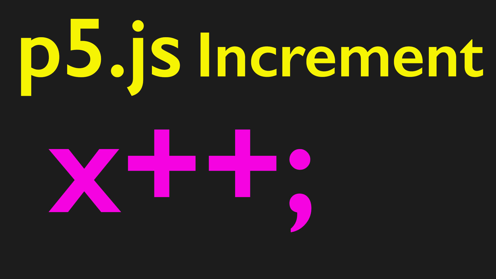

## Increment Operator Video Transcript

In this programming for artists tutorial I'm going to talk about increment functions. So what is an increment function? Well, previously we talked about setting some variables and here in my sketch I have two variables. I have let x = 100 and let y = 100 then I use those two variables for the X and Y of this ellipse. If I change the value of the X variable to 200 suddenly the ball moves over but that means I have to manually change the variable and computers are supposed to be automagical devices that do all these wonderful things. So how can I program the computer to do something automatically?

We're going to talk about many ways to program the computer but a very common way is to add something to a variable value, or subtract it, or divide it, or multiply it and then each time through the program loop, the value of that variable is different and then the program updates based on that value. So how can we increment a variable?

Well if we go to the reference page of p5.js and we scroll down, we don't see anything that talks about incrementing variables. We have some comparative operations that we'll talk about but there's nothing here for incrementing a variable. That's because incrementing a variable is something that's so fundamental to programming and coding that it's actually part of JavaScript. So if we go to the JavaScript docs then we can see the syntax that we need for the increment operator. It's commonly used as ++ or -- or -= or += but let's look at a simple example before we start using this shorthand.

So if I go back to the web editor and here in the draw function I have my X and the Y so after I draw this what if I write x = x + 1 now suddenly the ball is moving across the screen. It's going at a very slow pace but we can change that by having it go across at five, now it's going very quickly. We can even have the Y value change as well so if I go y = y + 1 now it's moving in a diagonal way. This is a way of incrementing a variable and the shorthand way of doing this is to just write X ++ So that's exactly the same thing. Each time through it adds one. But what if I want to add a different value to this?

Of course I could write a different value, so I could write a value of three. There's got to be a shorthand way of writing that increment operator in JavaScript. So if I delete the Y and then replace it with += then we get += 3 it's not that much shorter but it definitely saves some writing and we can also do this with multiplication. So we could put a multiplication here and it's going to go very quickly or we can do other operations as well.

So the incrementation feature is very helpful in programming. I'll put this back to y++ so now we're going at an angle. Hopefully you can use incrementation operators and check the JavaScript documentation to see the different things that you can do. So there's many different examples of how we can go through and increment our things in JavaScript. Next we're going to go ahead and examine some conditional statements so we can make the ball do different things. For example maybe when it gets down to the bottom of the screen we'll have it come back the other way. Happy programming.

