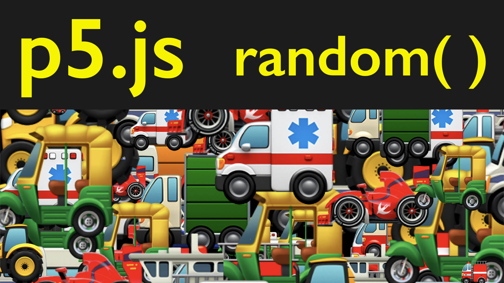

<div class="iframe-16-9-container">
<iframe class="youTubeIframe" width="560" height="315" src="https://www.youtube.com/embed/2LJuwA_olPc?si=KfVpq-ruHa-3nLCD" title="YouTube video player" frameborder="0" allow="accelerometer; autoplay; clipboard-write; encrypted-media; gyroscope; picture-in-picture; web-share" referrerpolicy="strict-origin-when-cross-origin" allowfullscreen></iframe>
</div>

The built in `random()` function in p5.js needs two parameters to work. It needs a minimum value and a maximum value. If no parameters are given to the `random()` function then it defaults to a minimum of `0` and a maximum of `1`. If a single value is given, then the function assumes the minimum is `0` and the passed parameter becomes the maximum. That means that `random(42);` is the same as `random(0, 42);` and each would give a random number between 0 and 42.

```javascript
// random(minimum, maximum);
// random number between 37 and 92
random(37, 92);
```

_Note: The `random(37, 92)` function will not give 37 or 92. It will give from 37 up to 92. So it could be 91.999594 but never 92._

What does it mean to "give" a value? Functions in programming in JavaScript and in other coding languages, have the option to "return" something. This can be a value or other activity. Instead of "creating" something like the [primitive shape functions](primitive-shapes-p5-js.md) such as `circle(100,150,50);` the `random()` function returns a value. You can set a variable to this random value.

```javascript
// set variable to random value
// must be called either within setup() or draw()
let myRandomVariable = random(0, 42);
// use variable in circle() function
circle(100, 150, myRandomVariable);
```

Or you can use it in place of a variable or value.

```javascript
// use random() function for the size of the circle
circle(100, 150, random(0, 42));
```

It is also possible to pass an array to the random function. An array is a list of values. If the array is passed to random then it will pick one of the items from the array. The p5.js reference use a fun example of an array of animal emojis for the `random()` function, but it works for numbers, vectors, or any other array content. [^random-reference]

```javascript
// declare an array of vegetables as text strings
let myArray = ["brocolli", "carrot", "daikon", "cabbage", "eggplant", "potato"];

//use the random() function to pick a random vegetable
random(myArray);

// declare an array of emoji
let myEmojiArray = ["⛴️", "🚒", "🚜", "🚑", "🛺", "🏎️", "🚛", "🚐", " 🚚"];

//use the random() function to pick a random emoji
random(myEmojiArray);
```

Each time the program is run or the function is called, a new random number will be given or returned. It is possible to always get the same random number by using the function `randomSeed()`. [^random-seed-reference]

## p5.js Web Editor Demo

[p5.js Random with vehicle emoji demo](https://editor.p5js.org/whatmakeart/sketches/YYP6Ld3gt)

```js
// Random with vehicle emoji demo
// https://editor.p5js.org/whatmakeart/sketches/YYP6Ld3gt

// array of vegetables
let myArray = ["brocolli", "carrot", "daikon", "cabbage", "eggplant", "potato"];
// array of emoji vehicles
let myEmojiArray = ["⛴️", "🚒", "🚜", "🚑", "🛺", "🏎️", "🚛", "🚐", " 🚚"];

function setup() {
  createCanvas(windowWidth, windowHeight);
  background(0);
}

function draw() {
  textSize(random(500));
  // commented line picks random veggies from array
  // text(random(myArray),random(-100,width),random(0,height+100));
  // line below picks random emoji from array
  text(random(myEmojiArray), random(-100, width), random(0, height + 100));
  stroke(255, 0, 255);
  fill(0, 255, 255);
}
```

[](attachments/random-p5js-thumb.jpg)

<button class="text-start btn btn-outline-dark mb-3" style="width:100%;" type="button" data-bs-toggle="collapse" data-bs-target="#random-transcript" aria-expanded="false" aria-controls="random-transcript">

## Random p5.js Video Transcript

</button>

<div class="collapse" id="random-transcript">

In this programming four artists tutorial. We're going to show how to add a little bit more life and activity to your sketches. right now we have a sketch that just has a circle with a stroke around it. It is a beautiful circle and a great stroke, but it's not doing anything. We saw in previous videos how we can add a value of the mouse to move the circle around and we're going to create all kinds of ways to animate and change circles. sometimes we want a little bit extra activity or lifelike movement to our objects. And one of the ways we can do that is by using a random function. there's other ways of adding randomness with the noise function that we'll explore later. But for right now, let's just explore the random function as we get started. how does the random function work and how do we use it? In this sketch, I have a circle size as a variable. That's 123.

Then I have outline size as ten. So here I have stroke weight, outline size in circle circle size. What if instead of having these be 123 or ten, I go ahead and use a random value. So here I can type circle size equals random and I can give it a value so I can have it be between zero. The minimum value and 123 the maximum value. And now my circle is fluctuating and giving me a headache. So I'm going to go ahead and change that to, let's say, 50. And it's still going to fluctuate a lot because we're erasing the background every time. when we erase the background, the circle has to blink and flash at the frame rate of our sketch. Of course, we can move the background up to the top into the setup function and that'll change it a bit. So it's a little bit less in our face, but it's still just layering on top of each other. Let's see what happens if we go ahead and change the outline size as well. So then we can go outline size equals random. So now you can see that the outline size of the circle is also fluctuating. it's gotten a little flashy again because each time circle is kind of writing over it. it's important to note with the random function that the first value is minimum, and the second value is maximum.

If you don't give it any values, it's going to assume a value of zero or one. So here we see the stroke rate is fluctuating between zero and one. If I only give it one value, say ten, then it's assuming the minimum value is zero. So it's a shorthand way of getting a random between zero and your number. one of the nice things about the random feature is that we don't have to only get random numbers. We can get a random array. what is an array? An array is a list of objects. So at the top of this I paste in an array of vegetable names. then I can get a random vegetable and print it out. We've not talked about how to print text on the screen yet, but it's pretty simple. In pages we can write text and then we can put our text and we can say hello. And then we need to add two more arguments. So we need to have where the text starts so we could have it start at hundred. So here we have our hello and you can see that it inherits this stroke and the fill that we have. it has the default stroke and fill.

There's another option that we can also use. We can use text size and so we can make that text size much larger and then we can bring it down on the screen. There we go. So now we have an hello right there. And it always says hello, what if we want to decide which vegetable to eat today? So instead of putting hello here, I could put random random my array. each time it writes it picks a new value. it's in the draw function, so it keeps writing new values. having a bunch of words popping up on top of each other is less exciting than if they were doing something else. what I'm going to do is I'm going to go ahead and get rid of this circle Then I can get rid of circle size. now I have just my text, watch what I can do. Remember, I can use random. Now I have this horizontal randomness and I can do the same thing with the wind direction. So now I have the potato and the cabbage and everything going all around. But remember, there's a couple variables in five G's that are built in. We've used these before, so for the x value, I could type in width and then for the Y value I could type in height. so now I get my vegetables popping in the screen all over. but because of the way typography and text works. Notice that even though they're starting at zero, there's a little buffer on the left. So what we can do is instead of assuming zero, we could type -100 comma with and then that's going to take care of it. So we have text filling the screen in a completely chaotic way. We could also do a little bit of random height so we could write zero comma height plus 100. And then that way it's going to fill up the complete bottom of the screen. So now we have a much more chaotic and complete filling screen of vegetables. Eat your vegetables.

But we're not limited to the alphabet characters. We can also use emojis. So if I paste in a list of emojis, so this is my emoji array. And then instead of having the text be random, my array, I can make it my emoji array. So now I have all these emojis popping up on top of each other. And of course I could make my text size be random so I can go random 200. now I have emojis that are all different sizes, now the vehicles are piling on top of each other, seems to be a little bit constrained right here. What if I want more vehicles when I change the size of my window? Well, there's another great built in variable in p5j Yes. When we create our canvas, instead of saying 600, 600, we can go ahead and say window with now it's the width of the window. And if I change this with, it's going to always be that size to restart, to sketch, and then it'll always start that size of the window. And then if I make it window height, it'll always be the height of the window. So this is a really great if you wanted to have full page welcome screen of all these emoji vehicles for your website, then it would be full screen, whether it's on a mobile browser or on a desktop. So hopefully you can use the random function to add just a little bit more excitement to your sketches. Any parameter you have right with random, we'll talk more about random and how to use it in our sketches as we progress in this course. Happy programming.

</div>

## References

[^random-reference]: [p5.js random() Reference](https://p5js.org/reference/#/p5/random)
[^random-seed-reference]: [p5.js randomSeed() Reference](https://p5js.org/reference/#/p5/randomSeed)
