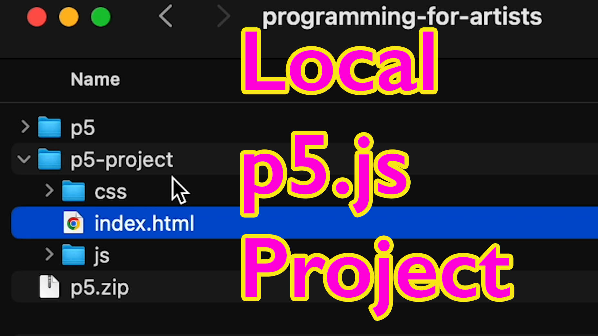

<iframe class="youTubeIframe" width="560" height="315" src="https://www.youtube.com/embed/9Wxxh-vzg2w?si=G_EsL63LTzZiW9QK?rel=0" title="YouTube video player" frameborder="0" allow="accelerometer; autoplay; clipboard-write; encrypted-media; gyroscope; picture-in-picture; web-share" referrerpolicy="strict-origin-when-cross-origin" allowfullscreen></iframe>

Setting up a local p5.js project is a great way to work on more complex projects or to have complete control over your file hosting. Here's a detailed guide on how to set up your p5.js project on a local machine.

## Setup Local p5.js Project Steps

### 1. **Preparation:**

- **Text Editor:** Choose a text editor like Visual Studio Code, Sublime Text, Brackets, Notepad++, or even the basic TextEdit or Notepad.
- **Install Git:** Necessary for version control. [Setup Visual Studio Code and Git](../setup-visual-studio-code-and-git.md)

### 2. **Installing p5.js:**

- **Using Content Delivery Network (CDN):** This is one way to use p5.js by fetching it from a web server each time it's needed. It's convenient but requires an internet connection.
- **Downloading Library Files:** Alternatively, download the "p5.js complete" package from the p5.js website. This includes everything needed for local development.

### 3. **Setting Up the Project Structure:**

- **Create a Project Folder:** Name it something like `p5-project`.
- **Organize Folders:** Inside `p5-project`, create two folders named `css` and `js`.
- **Move Files:** Place `p5.min.js` and `p5sound.min.js` in the `js` folder, and `index.html` and `sketch.js` in the project root.
- **Modify Index.html:** Update the script paths in `index.html` to match the new structure. For example, change the src of `p5.min.js` to `js/p5.min.js`.

### 4. **Using Visual Studio Code:**

- **Open Project Folder:** In Visual Studio Code, open the `p5-project` folder.
- **Edit index.html:** Ensure the paths to scripts and stylesheets are correct. Remove the leading dot in script src paths to avoid navigating up a directory.

### 5. **Preview with Live Server:**

- **Install Live Server Extension:** In Visual Studio Code, find and install the "Live Server" extension.
- **Launch the Project:** Open `index.html` and click the "Go Live" button to view your project in a browser.

### 6. **Version Control with Git:**

- **Initialize Repository:** Open the Source Control panel in Visual Studio Code and click "Initialize Repository."
- **First Commit:** Add a commit message like "first commit" and commit your changes.
- **Publish to GitHub:** Choose to publish your branch to GitHub, creating a public repository named something like "p5-project-template."

### 7. **Refactoring CSS:**

- **Create a CSS File:** In the `css` folder, create a new file named `styles.css` and paste your inline CSS code from `index.html` into this file.
- **Link CSS in HTML:** Replace the inline style tags in `index.html` with a link to `styles.css`. For example, use `<link rel="stylesheet" type="text/css" href="css/styles.css">`.
- **Commit Changes:** Commit these changes with a message like "made external stylesheet" and sync them to your GitHub repository.

### 8. **Final Steps:**

Now your p5.js project template is set up. You can start programming in p5.js, and for every new project, you can duplicate this `p5-project` folder. Remember, this is just one way to set up your project environment; you might find other methods that work better for you. Now you can use [HTML](../html.md), [CSS](../css.md), and [JavaScript](../javascript.md), to create hostable p5.js projects.

This setup ensures that you have a robust and flexible development environment for your p5.js projects, with the ability to work offline, manage versions through Git, and easily test and deploy your projects.

## Setup p5.js Local Project Video Transcript

In this programming for artists tutorial I'm going to show you how you can set up a p5.js project on your local machine. Previously we showed how to use the p5.js online editor and this is a great way to work, but sometimes you want to work on a larger project or just have the files hosted locally on your computer, so then you can upload them to a specific website or customize the project in the way that you see fit.

There's a couple of things that we need to get started. First you definitely need to have some sort of text editor. There are many to choose from Visual Studio Code, Sublime Text, Brackets or any other Simple Text Editor such as Notepad++, or just the plain TextEdit or Notepad that comes with your operating system. Once you have that installed you also will need to install git. I have instructions how to do both of these things linked In the description.

After you have your programming environment, we actually have to get the p5.js library installed. There's a couple of ways to do this. We can use a Content Delivery Network. This means that the library will be hosted on a different web server and then we fetch it each time that we need it. This works really well because many users may already have the library saved in their browser cache but you are subject to web connectivity and it doesn't always work if you don't have internet access. Another way to do it is to actually download all the library files and host them in your own project folder.

Luckily on the p5.js site they have a get started page and on this page they have a really great download. If we scroll down they have a complete "p5.js complete" download. If we click on this, this gives us everything that we need to download. So we can go ahead and download "p5.js complete" then we can open up that zip file. Here I have the p5.zip file and if you extract it you get this p5 folder. If I twirl this out you'll notice that I get an empty example. So here I have index.html and sketch. This is great because it has everything that we need to use. It also has some things called p5.js and p5sound.min.js but this isn't in the exact structure that I would recommend hosting your project. But it does have everything we need to get started.

So there's a couple changes we can make. So for example, I'm going to make a new folder and I'll call this folder p5-project. Inside p5-project, I'm going to make two other folders. Now inside p5-project I have a folder called css and I have a folder called js. Now what I can do is go ahead and put in these different example files into this js folder so I can bring in p5.js or better p5.min.js because it takes up less space and will load faster. So I'll put that in the js folder, then I'll also put this p5sound.min.js and then I can put the sketch.js and then I can go ahead and put the index.html inside this project folder. Now I don't necessarily need anything else from the p5 folder and I can save this as my template, but there's a couple things I need to change. So rather than open this up in a browser I'm going to open this up in Visual Studio Code.

When you start Visual Studio Code, it gives you the option to open a folder. I'm going to go ahead and open a folder. I'm going to select the p5-project folder and click open. It asks if you trust the authors of this folder and since I am the author I do. Then I can open up the index.html here. I have the index.html file that has a template for starting up a p5.js project but we need to change a few things. If you see here we have a link to p5.min.js but this is actually not here. We put it in a js folder, so right here I need to change this to js so now it will go ahead and get into the js folder and I want to remove that first dot so it doesn't go up a directory. Then I also want to add a js here in front of the sketch.js and then I can change this comment to js with one single period. And then if I save that, I now have a project template that I can use to start any project. All I have to do is duplicate the p5-project folder and I have everything locally on my machine.

But how do we actually see this if we use Visual Studio Code? We can use a "Live Server." If you don't have the live server extension installed you can click on extensions and then you can search, and if I type "live" right here live server. If I install this and I go back to my code and I click on index.html you'll see right down here this "Go Live" button. If I click this button it now shows my p5.js example.

Now granted I don't have anything in this because we haven't added anything to our project file. We'll do that in a separate video but this way we now have our project setup in Visual Studio Code. There are many other ways to set up a project and you can do it with the way that you prefer but this is a great way to get started so that way we can just duplicate this p5 project.

Now that we have our p5.js project template setup we can actually initialize it as a git repository, that way we have some Version Control that's really easy to do in Visual Studio Code. We can click on Source Control, and then we can simply click "initialize repository." Now that it is initialized we can type in a commit message. We can type "first commit" and then we can commit it and then we can click "always" and then we can choose to "Publish this Branch to GitHub." I'm going to go ahead and click "Publish" and then I can title this as "p5-project-template". That way I can always download this and I'm going to make it a public repository. Then you can open it up in GitHub and you can also periodically run git fetch.

If I look back at my files, now we have our p5.js template initialized as a git repository and synced with our GitHub account. I want to make one more change to my project template, that way I don't have to do it every time that I start a new project.

We're going to cover more about HTML, CSS, and JavaScript in this course but for right now we're going to move the CSS into its own file. Currently we have the CSS that's inline inside the document right here between these style tags, we're going to go ahead and take this code and copy it, and then we're going to click the css folder on the top left. And this is the new file button, and I'm going to click this and type "styles.css". Then I can just paste that code right here and then press save. Then if I go back to my index.html file now I can delete this style tag, but I need to replace it with something that links to the new file we just created, "styles.css" To do that I can type link then press tab. This brings in everything that we need except for the actual link. So now I can press "css" and now it will use that CSS. I can press save and now if I look at my Source Control, we have a number two badge. That means we've made two changes.

So now I want to click on Source Control and for my commit message I want to write something descriptive so that I know what happened. I'm going to say "made external stylesheet" then I can commit and then I have a choice to sync the changes to my GitHub repository, and I'll do that. Now I have this synced on my GitHub repository and I'll put a link to that repository in the description so you can download this project template. Of course you can set up your own project templates the way that you want to but this is a great way to do that as well.

Now we're ready to really start programming in p5.js, happy programming.
