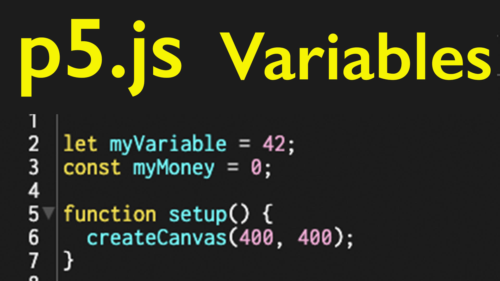

<div class="iframe-16-9-container">
<iframe class="youTubeIframe" width="560" height="315" src="https://www.youtube.com/embed/NIXc_THhTqc?si=xvduCNsULcZtpmW_" title="YouTube video player" frameborder="0" allow="accelerometer; autoplay; clipboard-write; encrypted-media; gyroscope; picture-in-picture; web-share" referrerpolicy="strict-origin-when-cross-origin" allowfullscreen></iframe>
</div>

## Variables

Variables are representations of value. In JavaScript, variables need to be defined adn then given an initial value. This value may or may not be updated during the program while the variable is used. To define a variable in JavaScript you use `var`, `const`, or `let` followed by the variable name and then a semicolon `;`. In JavaScript variables are not typed. What does that mean? It means that a variable can store any type of value and that type can change. It can store an integer, then a string, then a floating point number, and then an array, and then back to a string. Other programming languages like C++ are more strict with variable types.

An example of a variable we all have is age. Each of us has a specific value for our current age, yet this value is ever changing. You are a different age now, and even now you are a different age. Instead of "hard coding" the value of your age we can use a variable `let age = 7;` or whatever your age is. The program of life constantly updates your age. In a computer program you can make an instruction to add a year to the variable `age`.

### Creating a Variable

```javascript
// three variables defined
var myVariable1; // for supporting older code - best to use let
const myConstantVariable;
let myVariable2;
```

### Setting a Variable's Initial Value

```javascript
// giving the variables initial values

myVariable = 76; // initial value of an integer
myConstantVariable = "Always"; // initial value of a string
myVariable2 = 0.93847; // initial value of a float
```

The defining and initializing of variables can be combined into one step.

```javascript
// three variables defined and initialized in a single step
var myVariable1 = 76;
const myConstantVariable = "Always";
let myVariable2 = 0.093847;
```

### Using a Variable

To use a variable, it must be defined and have an initial value. Then it can be used in place of that value.

```javascript
// this defines a variable and gives it a value of 76
// then the variable is used in the setup() function
// to set the background to the value of the variable
var myVariable1 = 76;

setup() {
    createCanvas( 400, 400 );
    background(myVariable1);
}
```

### Built in Variables in p5.js

There are many variables built into the p5.js library that can be helpful in your coding projects since you do not need to code the logic that produces these variable values. Examples include `mouseX` and `mouseY` which give the (x,y) positions of the mouse as well as `width` and `height` that give the width and height of the canvas.

#### Additional Built in p5.js Variables [^p5-reference]

Learn more about these built in variables in the [p5.js Reference](https://p5js.org/reference/).

- accelerationX
- accelerationY
- accelerationZ
- deltaTime
- deviceOrientation
- displayHeight
- displayWidth
- focused
- frameCount
- key
- mouseButton
- mouseIsPressed
- movedX
- movedY
- pAccelerationX
- pAccelerationY
- pAccelerationZ
- pmouseX
- pmouseY
- pRotationX
- pRotationY
- pRotationZ
- pwinMouseX
- pwinMouseY
- rotationX
- rotationY
- rotationZ
- touches
- turnAxis
- webglVersion
- windowHeight
- windowWidth
- winMouseX
- winMouseY

## Global vs Local Variables

Global variables are available to any part of the program. Local variables are only available in the function or method that they were declared in. When starting out it is simpler to use global variables by declaring variables at the top of a program or sketch.

[](./attachments/p5-js-variables-thumb.jpg)

## References

[^p5-reference]: [p5.js Reference](https://p5js.org/reference/)
