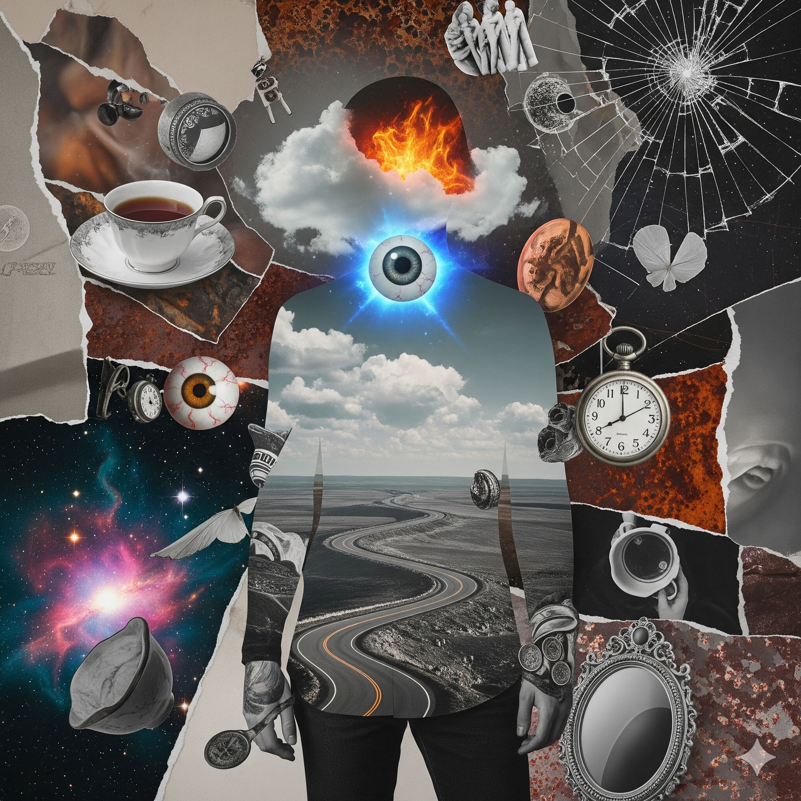
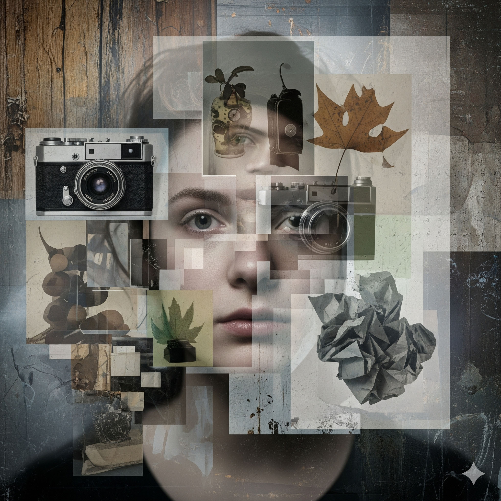
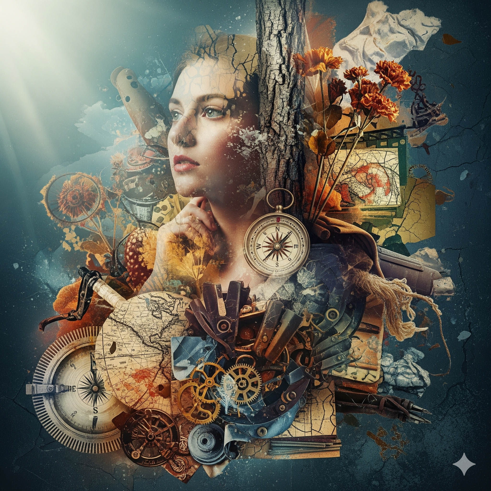

## Assignment Deliverables

1. Photoshop PSD file sized 11” x 17” or 17" x 11" with 5100 pixels on the long side. Do not flatten the image, keep all of the layers in the file.
   - Label the file YYYYMMDD Lastname Firstname Slop Slayers.psd
2. Exported JPG file of same image
   - Label the file YYYYMMDD Lastname Firstname Slop Slayers.jpg
3. Brief writeen description of your analysis of the Slop and what you did to slay it and why?
   - Label the file YYYYMMDD Lastname Firstname Explaining the Slaid Slop.docx

## Assignment Overview

Transform a raw, unrefined AI-generated "Slop" image into a compelling, intentional, and technically proficient work of digital art.

Use one or more of the provided images from Google's Gemini Image Generator that were generated using only the raw text from our [in-class exercise](./01-02-make-new-original-content-now-in-class-exercise.md) as a prompt. These images likely have compositional oddities, strange lighting, nonsensical details, and a general lack of artistic focus. Choose one or more of the images and become its "slayer." Identify its weaknesses and use your creativity to correct, enhance, and ultimately slay the slop.

## Requirements

Combine multiple pixel based images into a purposeful and intentional composition.

### AI Slop to Slay

<figure>

<figcaption>

AI Slop to Slay 1

</figcaption>
</figure>

<figure>

<figcaption>

AI Slop to Slay 2

</figcaption>
</figure>

<figure>

<figcaption>

AI Slop to Slay 3

</figcaption>
</figure>

## Process

1. Begin by critically examining your chosen AI Slop image(s).
2. Write down: Are there obvious biases in the image? What works? What fails? Why? Identify specific problems related to composition, lighting, anatomy, texture, and overall mood, etc. Or if it is just lame, write down why.
3. Before you begin editing, decide on your artistic direction. What kind of story do you want to tell? What mood are you trying to achieve? Your goal is not just to "fix" the image, but to elevate it with a clear vision.
4. Introduce new elements, textures, or effects on separate layers to build a richer visual narrative.

## Learning Objectives:

- Develop a critical eye for analyzing digital images.
- Use non-destructive editing workflows using layers and masks.
- Gain proficiency with selection tools in Photoshop.
