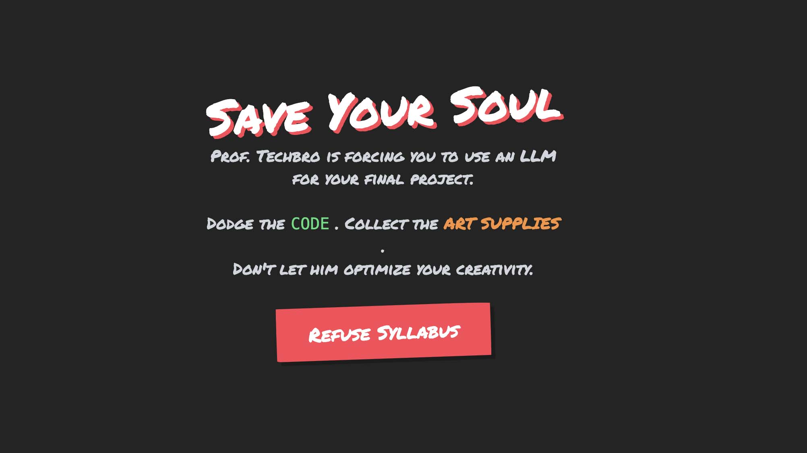
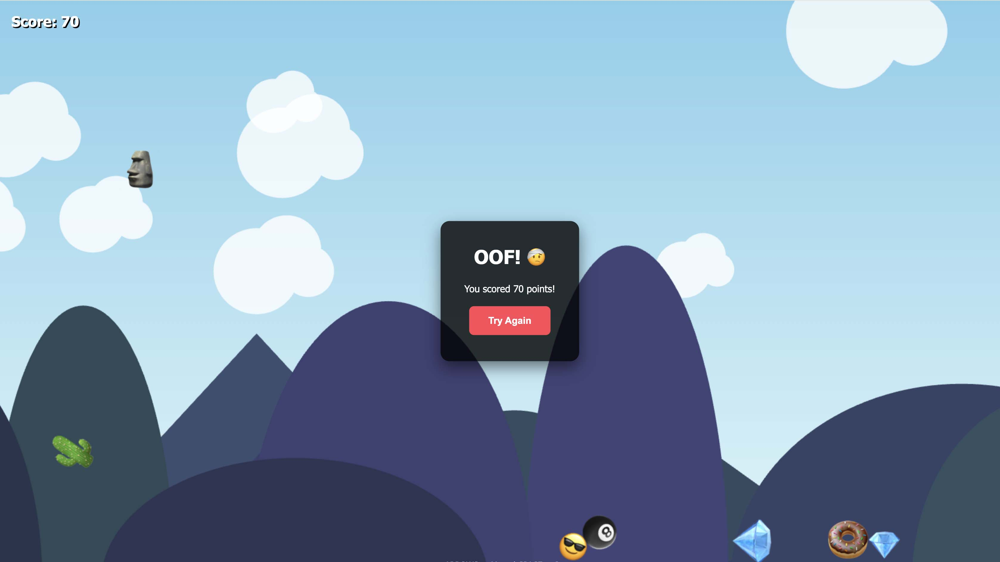
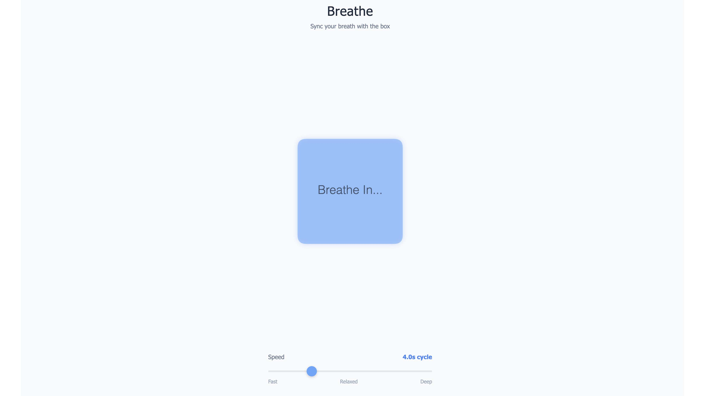
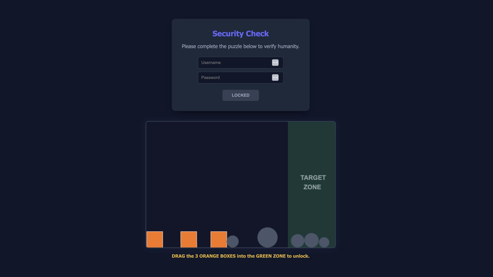

## Assignment Deliverables

1. Screenshot or Screen Recording showing your revised interactive web experience running with the new assets visible/audible.
   - Label file YYYY-MM-DD Lastname Firstname revised interactive web experience (`.png`, `.jpg`, `.mp4`)
2. Active URL to your hosted interactive web experience, n̶o̶t̶ t̶h̶e̶ l̶o̶c̶a̶l̶h̶o̶s̶t̶ U̶R̶L̶ o̶n̶ y̶o̶u̶r̶ m̶a̶c̶h̶i̶n̶e̶
   - Label file YYYY-MM-DD Lastname Firstname revised interactive web experience url (`.png`, `.jpg`, `.mp4`)
   - _You may paste the URL into the comment section of the assignment submission page_

## Assignment Overview

Move beyond the "prototype" phase of the previous natural language programming assignment. Similar to the development of creative, artistic work,software development is rarely one and done. It requires iteration, refinement, and the integration of bespoke artist created assets such as imagery, animation, and sound.

In this assignment, you will take your existing natural language coded web experience, or start a completely fresh project, and replace placeholder elements such as colored rectangles, blank background, and basic beeps with original content created by you. You will continue to use GitHub Copilot in Visual Studio Code to implement these changes, focusing on how to prompt an Large Language Model or "AI" to handle external files and assets.

Think of GitHub Copilot as an incredibly fast, highly technical assistant who knows every coding language in the world but has zero common sense. It cannot see your vision, it can only follow your specific instructions. You are the Creative Director while Copilot is the Technical Assistant.

### Interactive Web Experience?

_Interactive web experience_ simply means any webpage that responds to user input such as clicking, hovering, scrolling, typing, or microphone input to change the state of the audio or visuals. It does not need to have a "win state," a "score," or "enemies."

Here are examples of experiences you can build with GitHub Copilot and your original assets.

#### Interactive Narrative

Instead of a game, create a story that advances as the user interacts. This is excellent for students who want to focus on illustration and voice-over. This could take the form of a digital comic book or poetry reader where the environment changes based on the user's progress.
Scrolling down the page or clicking Next might advance the story.

Backgrounds could fade from day to night or characters could change expressions as the mood shifts. Ambient noise such as rain or city traffic could fades in on certain sections. Specific voice over lines could play at specific moments.

#### Audio Visual Instrument

You could turn the web browser into a musical instrument or a sound board. Create a page where every key on the keyboard or click on the screen triggers a specific sound and a corresponding visual animation. The visuals could include audio reactive sbstract shapes, colors, or vector graphics that scale and rotate when a beat hits. You could use existing drum samples, synthesizer notes, or sounds created in Adobe Audition.

#### Physics Sandbox

A sandbox differs from a game because there is no specific predetermined end goal. It is a system to play with rather than beat. Create a simulation where users can manipulate objects on the screen to see how they react. This could take the form of virtual bubble wrap, a gravity simulator, or a digital pet that needs more avacados to eat. Consider creating sounds for collisions and pops.

### Process

1. Make a list of things to change, remove, and add to your natural language coded web experience.
   - What placeholder graphics look boring?
   - What physics feel floaty or what gameplay is non responsive?
   - Does it work on mobile?
   - Do you want to add computer vision face detection or pose detection?
   - What sound effects are missing. such as jump sounds, background ambience, button clicks?
2. Spend time creating original visual and auditory content to add to the site. Spend minimum 1 hour creating original content. This includes recorded sounds, images sprites, vector graphics, text and story information, voice over, music, and any other type of experiential digital content made by you.
3. File management and organization is important when working on digital projects.
   - Save images with descriptive, lowercase names without spaces such as `player-idle.png` or `background_forest.jpg` This helps you stay organized and helps the LLM understand your content better than `untitled.jpg` It is also helpful to make a folder such as `img` or `assets` to put content files in.
4. Spend a minimum of 1 hour using Copilot in visual Studio code to create an interactive web experience. This could be a game, an abstract sequence of animations, a physics simulation, a poetry evaluator, or any other interaction that can occur via a webpage. Try some of the example prompts below or modify them to fit your project.
   - `Change the red player rectangle to use the image located at 'assets/images/hero_sprite.png'`
   - `Play the sound file 'assets/audio/jump_sfx.mp3' whenever the spacebar is pressed.`
   - `Create a CSS animation that rotates the logo image when the user hovers over it.`
   - `Adjust the physics so the character falls faster, and play 'thud.mp3' when they hit the ground.`
5. Use your content in the webpage.
6. Put sound files, image files, and video files into the folder of your project.
7. Give instructions to copilot to use those specific files on your web program.

## Assignment Resources

- [GitHub Copilot Model Selection](../10-natural-language-programming/10-01-github-copilot-model-selection.md)
- [Copilot Web Game](../10-natural-language-programming/10-03-copilot-web-game.md)
- [Add Image Sprite](../10-natural-language-programming/10-05-add-image-sprite.md)

### Sound Resources

- [Create Sound Effect in Adobe Audition](https://youtu.be/UnGAhaMU9aU)
- [Export MP3 from Adobe Audition](https://youtu.be/UwqosXZv2jE)
- [Add Sound Effects with GitHub Copilot](https://youtu.be/TtZg2koyWuY)
- [Set Audio Hardware Adobe Audition](https://youtu.be/CXCpECgCBVY)
- [Create New Audio File Adobe Audition](https://youtu.be/o70n1NHDz8s)

### Tips and Troubleshooting

1. When building non-game experiences, focusing on _States_ rather than _Scores_ can be a useful conceptual framework. Are you in the state of sleeping or eating breakfast? Studying or waterskiing? A prompt for a game might read `Add 1 to score when clicked.` while a prompt for an experience might read `Switch the state from calm to chaos when clicked. In the chaos state, shake the images and play a loud noise.`
2. Sometimes Copilot hallucinates, makes up code that doesn't exist, or gets stuck in a loop Delete the last block of code it gave you and rephrase your request. Make sure the file you are referencing, the `index.html` or `styles.css` is actually open in a tab in Visual Studio Code so Copilot sees the context. Sometimes the classic IT trick of turning it off and on again by reloading the Visual Studio Code window helps clear the context.
3. When things break, and they will, don't panic. Look at the error message, or describe what is happening such as "The screen is blank". Try to be descriptive and precise. Often just pasting in the error message is enough to get it working. Example prompts for fixing errors:
   - ` The screen is white and nothing is loading. Here is my code. What is wrong?`
   - `I pasted this code but the image shows a broken icon. Check if the file path to 'assets/image.png' is correct in the code.`

### Useful Prompts for this Assignment

These prompt patterns can be helpful for working with code or web projects.

1. For HTML Setup: "Create a responsive HTML boilerplate. Link a style.css file and a script.js file. Add a container div centered on the page."
2. For CSS Styling: "Make the background of the body a dark gradient from blue to black. Use the font 'Courier New' for all text."
3. For Physics/Movement: "In script.js, create a gravity variable. Apply it to the square so it falls down. Stop it when it hits the bottom of the canvas."
4. For Audio: "Create a function called playSound. It should take a file path as an argument. Use this function to play assets/music/loop.mp3 when the user clicks anywhere on the page."

### Open Source Code Libraries to Mention in Prompts

Mentioning these libraries in a prompt will guide the LLM to use these prebuilt resources to solve tasks. This is common practice in software development. Most projects are built on a fragile house of cards of libraries and other pre written code. The general rule is, "Don't spend time writing something that already exists."

- matter.js - 2D physics engine
- three.js - 3D graphics library
- ml5.js - machine learning library
- babylon.js - 3D graphics library
- howler.js - audio playback library
- d3.js - data visualization
- tone.js - generative audio

## Example Single Prompt Games

These examples show how far a single prompt gan get to a complete project. Often the results from the initial prompt are quite good, other times the results are simple and underwhelming. Don't hesitate to redo the prompt and start over right away if you do not like the first results.

The key objective is to take the mediocre initial output and improve it through the addition of original content and creative direction by you. Anyone can write a prompt, how you make the results better, more unique, and polished will make your work stand out and be desired.

It can be helpful to use an LLM to expand on a prompt before using the prompt to assemble the code. This happens behind the scenes with most image and video generators. Whey you write a simple prompt such as a video of a dancing duck, the LLM will expand more details on the prompt. You can do the same thing by prompting the LLM to make a prompt to do a task. It will often have details that will help the output be more accurate. This technique was used for the Art Student vs AI Professor game below.

<figure>

<figcaption>

[Prompt used to create prompt for Game:](art-student-vs-ai-professor.html) `write a prompt that would create an amazing html game all about how a student hates that their art school professor is making them code with a large language model since the student hates generative ai`

</figcaption>
</figure>

<figure>

<figcaption>

[Emoji Avalanche Prompt:](emoji-avalanche.html) `make a html single page game that has falling emoji that bound into each other and react with real physics and gravity the play need to move around with out getting hit they an press space to jump and have lots of parallax scrolling background`

</figcaption>
</figure>

<figure>

<figcaption>

[Breathing Box Prompt:](breathing-box.html) `Code a "Breathing Box" relaxation widget using HTML5 Canvas. It should be a soft blue square that expands and contracts rhythmically over 4 seconds. Add a slider so I can adjust the speed, and display the text "Breathe in... breathe out..." in sync with the animation.`

</figcaption>
</figure>

<figure>

<figcaption>

[Digital Soundboard Prompt:](soundboard.html) `I need a complete code setup for single page webpage, everything included (HTML/CSS/JS) for a soundboard. Create a CSS Grid with 2 columns and 2 rows. It should fill the whole screen. In each grid cell, place one of my images: assets/img1.jpg, assets/img2.jpg, etc. Make the images object-fit: cover so they fill the cell perfectly. When I hover over a cell, make it slightly brighter (filter brightness). When I click a cell, play the corresponding sound (assets/sound1.mp3, etc.) and make the image flash white for 100 milliseconds." For now make generated place holder graphics and sounds`

</figcaption>
</figure>

<figure>

<figcaption>

[Physics Login Puzzle Prompt:](physics-login-puzzle.html) `Write a single web page in HTML and JavaScript that requires the user to do a puzzle like maybe move some blocks around to be in a line. And use some like physics. So like when they're moving the blocks around they bounce into each other and it's kind of cool. So basically they got to get the different shapes together and they have to do this before they log in to the page if they successfully do it then it logs in and it shows the text super huge on the screen you did it make this all in one single web page make sure all the code is correct and then give me everything working. now`

</figcaption>
</figure>

## Grading Rubric

| Assessment                        | Weight    |
| --------------------------------- | --------- |
| Original Content Added            | 50 points |
| Concept Development and Iteration | 50 points |
| Screenshot Uploaded               | 50 points |
| URL Submitted                     | 40 points |
| File Management and Labeling      | 10 points |

