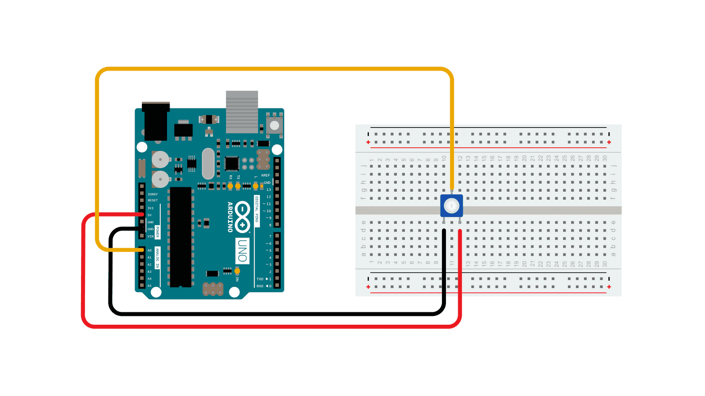

## Analog Signals

Binary 1's and 0's are great but not all input is so clear. Sometimes a range of values is a better way to capture input. If a button is a "digital" on off type of input device, what is an analog input device. Knobs or levers are examples of analog devices. A simple volume knob is a common example. We will use a device called a potentiometer as an input device.

It acts like a resistor that can have its resistance varied by turning a knob. This change is voltage that happens with the change in resistance can be measured and then used to make the music louder or softer. Eventually this voltage range of 0V - 5V needs to be converted to finite range that the micro-controller can deal with rather than the infinite range in between 0-5.

The Arduino analog pins store the 0-5V values as a 10 bit number. [^1] What is a 10 bit number? A bit can be 1 or 0 so a 10 bit number has 10 places for 1's and 0's. 0000000000 and 1111111111 are both 10 bit numbers. The first one has a value of 0 and the second one has a value of 1023 if counted in binary. When the pin is 0V it is 0 and when it is 5V it is 1023. 2.5V maps to this 10 bit number which 1000000000 is 512 in binary and is the value the Arduino reads on the pin.

## Circuit Setup

According to a datasheet[^2] from Bourns, a manufacture of potentiometers including the common 3386 small blue potentiometers, of a potentiometer the center pin is usually the wiper. Wiper? This pin has the remaining voltage after teh resistance of the potentiometer effects the incoming voltage. In this case the remaining voltage could be 0V - 5V depending on the position of the knob.

The middle pin on the potentiometer goes to the Arduino pin used for input and the other two pins are connected to 5V and GND. The standard way is to have the pins facing you and start on the left with the GND connection, then the "wiper", and then the 5V connection. Since the potentiometer acts like a variable resistor, and resistors don't have a direction, the polarity of the 5V and GND should not matter except for keeping expected behavior.

<figure>

[](analog-in-out-serial-from-arduino-docs.png)

<figcaption>

[Circuit](https://www.arduino.cc/en/Tutorial/BuiltInExamples/AnalogReadSerial) by [Arduino](https://www.arduino.cc/) is licensed under [CC BY-SA 4.0](https://creativecommons.org/licenses/by-sa/4.0/) [^2]

</figcaption>
</figure>

```C
/*
  AnalogReadSerial

  Reads an analog input on pin 0, prints the result to the Serial Monitor.
  Graphical representation is available using Serial Plotter (Tools > Serial Plotter menu).
  Attach the center pin of a potentiometer to pin A0, and the outside pins to +5V and ground.

  This example code is in the public domain.

  https://www.arduino.cc/en/Tutorial/BuiltInExamples/AnalogReadSerial
*/

// the setup routine runs once when you press reset:
void setup() {
  // initialize serial communication at 9600 bits per second:
  Serial.begin(9600);
}

// the loop routine runs over and over again forever:
void loop() {
  // read the input on analog pin 0:
  int sensorValue = analogRead(A0);
  // print out the value you read:
  Serial.println(sensorValue);
  delay(1);  // delay in between reads for stability
}
```

[^1]: https://cdn.sparkfun.com/assets/resources/4/4/Input_scaling_for_Arduino_analog_readings.pdf [(Archive)](Input_scaling_for_Arduino_analog_readings.pdf)
[^2]: https://www.bourns.com/pdfs/3386.pdf [(Archive)](3386-potentiometer-bourns-data-sheet.pdf)
[^3]: https://www.arduino.cc/en/Tutorial/BuiltInExamples/AnalogReadSerial
