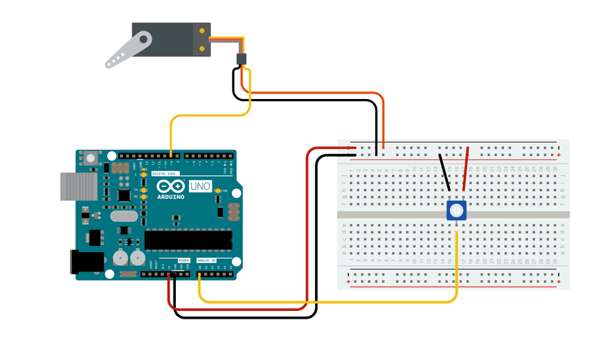

## Do Something with the Input

We read a button state and then blinked an LED with it. We just read a voltage value of a turned knob on a potentiometer, so let's do something with it. We will use the knob to control a servo motor, rather than having the motor act on its own.

## Potentiometer and Servo Example Circuit

This circuit is similar to the sweep servo example but adds a potentiometer to control the position of the servo arm.

<figure>

[](servo-knob-circuit-from-arduino-docs.png)

<figcaption>

[The Knob Circuit](https://docs.arduino.cc/learn/electronics/servo-motors) by [Arduino](https://www.arduino.cc/) is licensed under [CC BY-SA 4.0](https://creativecommons.org/licenses/by-sa/4.0/) [^1]

</figcaption>
</figure>

## Knob Servo Example Sketch

This sketch only introduces one new concept that we have not used yet, mapping. What is mapping?

Mapping is like scaling used in maps of cities that are smaller than the actual cities. A ratio is applied to one range of numbers to have if scale to fit within another range of numbers. If the city is 20 miles wide but your map needs to fit on a 8.5 inch wide piece of paper you would map the larger values of the city to the smaller values of the paper.

We learned the the analog pin will read a number from 0 - 1023 from the potentiometer and that the servo moves from 0 - 180 degrees. The `map();` function will scale the pin readings to the servo positions like this `map(val, 0, 1023, 0, 180);`.

<div class="responsive-table-markdown">

| Analog Pin Value | Servo Position Value |
| ---------------- | -------------------- |
| 0                | 0                    |
| 256              | 60                   |
| 512              | 90                   |
| 768              | 120                  |
| 1023             | 180                  |

</div>

The `map();` function can be used to scaled all kinds of values for use in your sketches and designs.

```C

#include <Servo.h>

Servo myservo;  // create servo object to control a servo

int potpin = 0;  // analog pin used to connect the potentiometer
int val;    // variable to read the value from the analog pin

void setup() {
  myservo.attach(9);  // attaches the servo on pin 9 to the servo object
}

void loop() {
  val = analogRead(potpin);            // reads the value of the potentiometer (value between 0 and 1023)
  val = map(val, 0, 1023, 0, 180);     // scale it to use it with the servo (value between 0 and 180)
  myservo.write(val);                  // sets the servo position according to the scaled value
  delay(15);                           // waits for the servo to get there
}

```

## Other Types of Potentiometers

Soft potentiometer datasheet. [^2]

[^1]: https://docs.arduino.cc/learn/electronics/servo-motors
[^2]: https://www.spectrasymbol.com/wp-content/uploads/2016/12/SOFTPOT-DATA-SHEET-Rev-F3.pdf [(Archive)](SOFTPOT-DATA-SHEET-Rev-F3.pdf)
