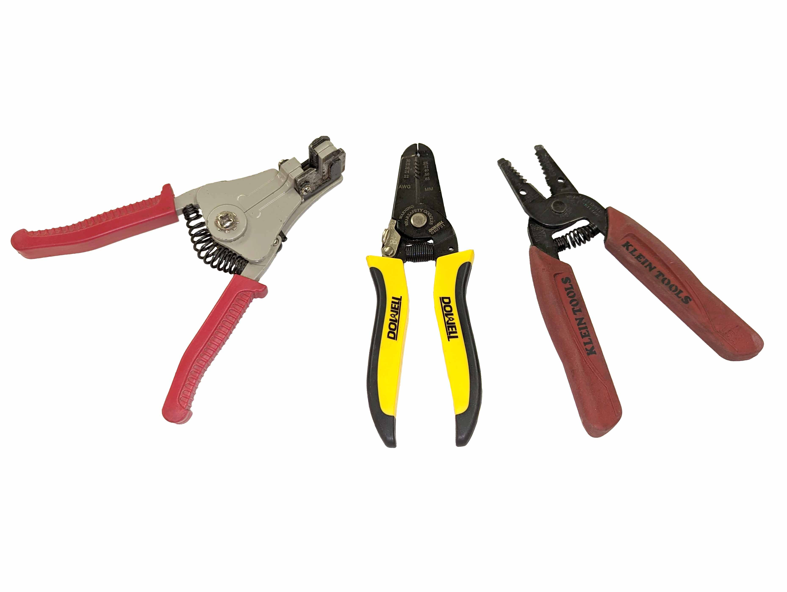

Stripping wire removes the insulation from the conductors at the end of the wire. So the metal conductors can be inserted into a device or a crimp connector. It is important to use proper tools to strip wire so the conductors are not damaged. This is especially true with stranded wire because slight damage can completely sever one of the strands and therefore change the size of the wire and increase its resistance.

Utility knives, or razor blades or pliers or any other non-dedicated wire stripping tools should never be used to strip wire. Wire. Always use a proper wire stripper so the chances of damaging the conductors is minimized as much as possible. The amount of insulation that needs to be stripped varies based on the intended purpose. If using crimp terminals, then there needs to be enough insulation to provide strain relief yet enough of the conductor exposed to fit into the crimp terminal. When making soldered connections on a perfect board or PCB, enough insulation needs to be removed for the wire to go through the hole and connect to the proper location. When stripping wires for household electrical wiring, there needs to be enough of the conductor exposed to make a tight connection inside a wire nut, but not have any of the conductor exposed outside of the pig tailed connection.

### Wire Stripping tools

Never use a razor blade to strip wire, you will likely damage the conductors.

Unless it's an emergency, do not use cheap wire strippers like this, they are not precisely machined, make the work more difficult, and also increase the likelihood of damaging the conductors.

Wire strippers come in different sizes for different ranges of wire. Make sure you use the specific stripper for the size wire that you have. This style. Stripper works quite well for stripping wire. This style stripper clamps the wire and can be used for repeatable actions of wire stripped at a particular depth.

It's generally easier to trim the wire to the proper length before stripping, especially with stranded wire. It can take some practice to make sure that you remove the proper amount of insulation.

