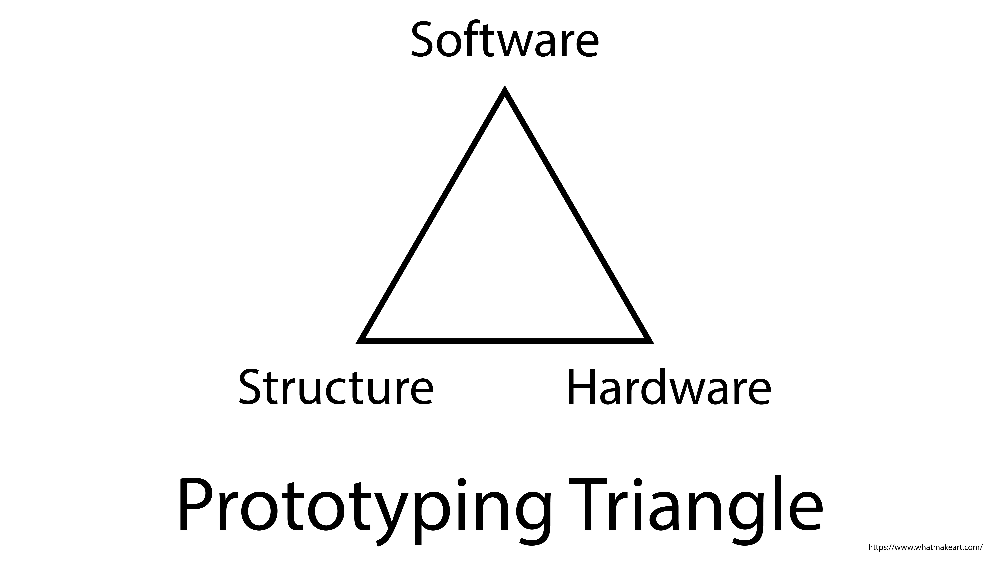

Making a new electronics project can be broken into three main categories:

- Software
- Hardware
- Structure

Then each of these categories can be broken down into individual components. We will use the toaster project example to show one way to break up a prototype project.

## Toaster Hardware

The hardware of the toaster includes the parts that do something. The insulation on the wiring keeps you from getting shocked, but that is more of a material property than a function. The same is true for the housing of the toaster. It keeps the heat inside but it doesn't have an active function.

- Lever to raise and lower toast
- Heating element
- Power Supply / cord
- Knob to select toast doneness
- Mechanism to raise and lower toast
- LED to indicate that Toaster is on

## Toaster Software

A toaster could be built completely with analog components and no software, but if you wanted to use a microcontroller like the Arduino to control your toaster, you might break the software up into components like this. We will talk more about making software components, or functions, in another section.

- Check if toast is inserted and lever is pressed down
- Check if toaster is set to light or dark
- Set timer based on the toast setting
- If timer is set, then turn on the toaster heater
- If heater is on, then turn on LED
- Check if the timer is finished
- If timer is finished, then turn off the toaster heater
- If heater is off, then turn of LED
- If the heating element and the timer are finished, then pop up the toast
- Standby mode waiting for a new piece of toast

## Toaster Structure

The structure of the toaster is what allows all of the separate hardware pieces to work together. If the heating element was just laying on the counter, next to a knob to select toast doneness, next to a lever, it would not be a good toaster. It would be very dangerous. The structure physically supports the hardware but may not have a specific function other than support.

- Exterior Housing
- Interior brackets and mounting points
- Screws
- Heat shielding
- Gap for lever to move
- Opening for toast
