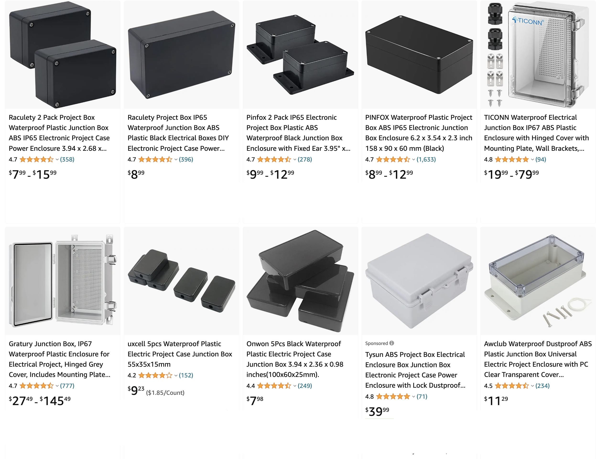
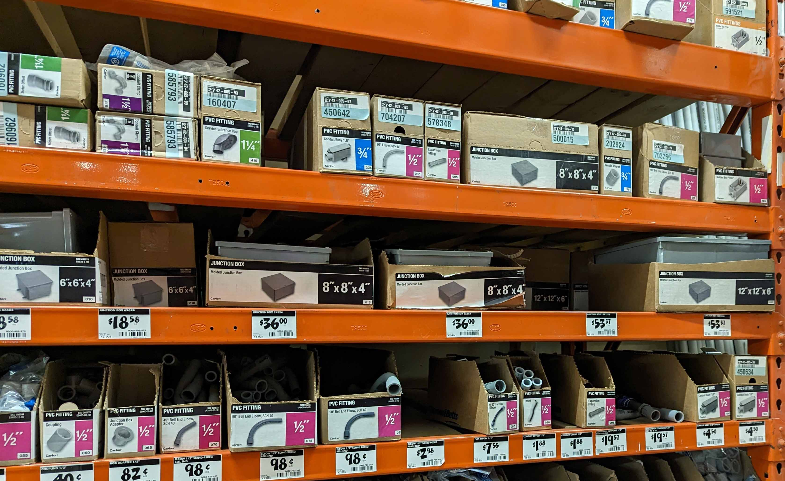

## Low Voltage Enclosures

Before spending time designing and fabricating, check to see if there are off the shelf solutions. Often there is a generic rectangular electronics project box available for purchase at a reasonable price. It might not be the exact size needed but can make up for that shortcoming with time saved.

For low voltage and low current electronics projects, the options for enclosures widens to any found container. This includes everything from a cardboard box to snap together food storage containers.

<figure>

<figcaption>

Examples of electronics enclosures available from an oline retailer.

</figcaption>
</figure>

<figure>

<figcaption>

Examples of electronics enclosures available from a brick and mortar retailer.

</figcaption>
</figure>

## Line Voltage Enclosures

For and projects that use line level voltage and power (120 in the US) you must use a NEMA rated or ul rated enclosure that meets all electrical codes. This is for your safety and the safety of your audience. It is mostly harmless to hold a low voltage AA battery in your hands. That is not true for uninsulated and unenclosed high voltage power devices. Even if it costs a bit more to get the proper electric box, it is always much cheaper than an accident.
