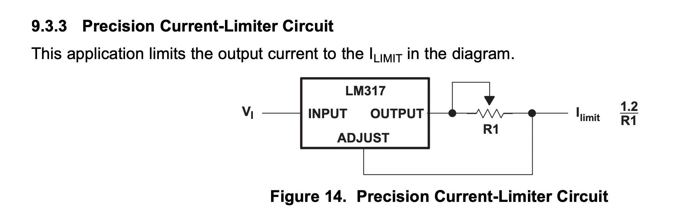
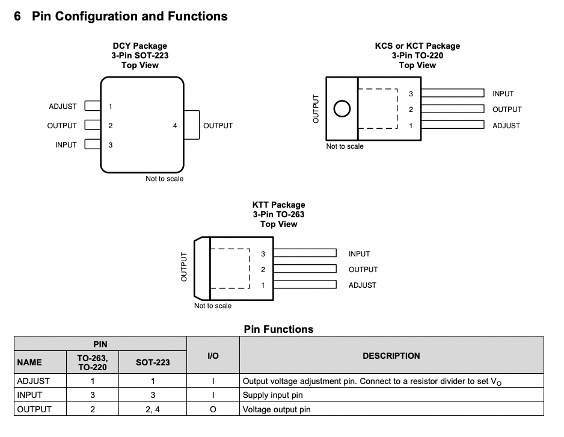
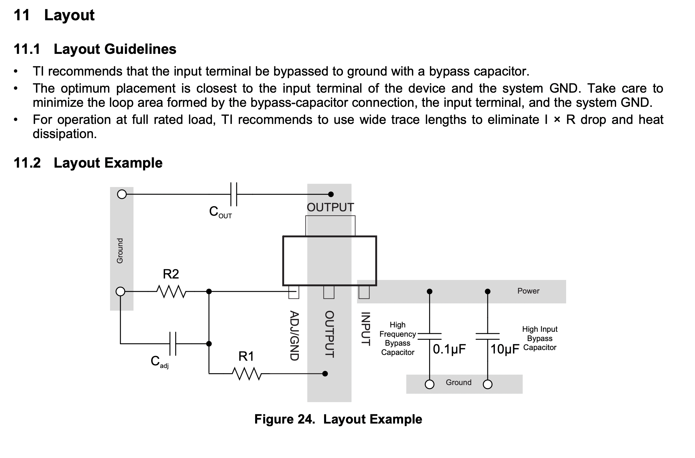
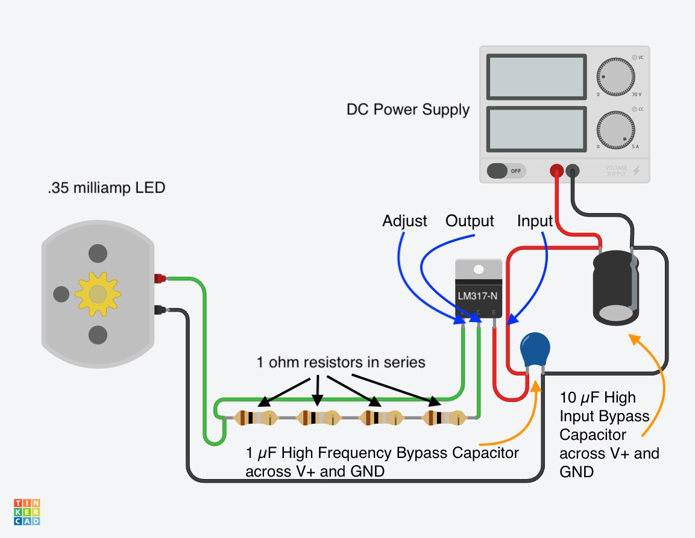

LEDs need constant current or they wil be damaged or destroyed. FOr low power single LEDs, a simple resistor can be used to limit current. As power increases for high power LEDs a more reliable current limiting circuit is required. The LM317-N voltage regulator can be repurposed as a constant current device. This [Texas Instruments Article](https://e2e.ti.com/blogs_/b/powerhouse/posts/flashback-design-create-a-simple-led-driver) describes how to use a LM317-N as a constant current LED driver. This type of current limiting circuit is also detailed in the [LM317-N datasheet](https://www.ti.com/lit/ds/symlink/lm317.pdf).

## LM317-N Current Limiter Circuit

<figure>

<figcaption>

LM317-N Current Limiter Circuit Diagram from Texas Instruments Datasheet [^1]

</figcaption>
</figure>

### LM317-N Pinout

<figure>

<figcaption>

LM317-N Pinout Diagram from Texas Instruments Datasheet [^1]

</figcaption>
</figure>

### LM317-N Input Bypass Capacitor

<figure>

<figcaption>

LM317-N Layout showing recommended bypass capacitor on the input from Texas Instruments Datasheet [^1]

</figcaption>
</figure>

### LM317-N Wiring Example

<figure>

<figcaption>

LM317-N wired to a high power LED with four 1 ohm resistors in series and a 1 µF bypass capacitor

</figcaption>
</figure>

## Calculating Resistor Value for Constant Current

Using Ohm's Law R = V/I or Resistance (R) = Voltage (V) divided by Current (I) we can make the following equation for calculating the needed resistor value to have the constant current value needed for a specific LED.

Ohm Resistor Value = LM317-N (Vout (max) (V)) divided by LED current in Amps

The LM317-N Vout (max) is listed in the parameter table below. This is the voltage that it always outputs. Its value is 1.25 V. A high power LED can have a forward operating current range from 350 milliamps to 700 milliamps to 1000 milliamps. These values converted to Amps are .35 A and .7 A and 1 A respectively.

To calculate the power flowing through the resistor in Watts can be calculated with P = V _ I or Power (P) = Voltage (V) _ Current (I). The resistor needs a power rating in Watts above this calculated value.

| LED Current | Resistor Value | Resistor Power Rating |
| ----------- | -------------- | --------------------- |
| .35 Amps    | 3.6 ohms       | .44 Watts             |
| .7 amps     | 1.8 ohms       | .88 Watts             |
| 1 amp       | 1.3 ohms       | 1.25 Watts            |

 

### LM317-N Constant Current Resistor Calculator

This calculator determines the resistor value for a desired constant current output from the LM317-N. To use the calculator, enter the desired constant current in milliamps. This can be found on the high power LED data sheet. This will likely be different for different colors. The calculator also determines the power rating needed for the resistor in Watts. Many through hole resistors are rated at 1/4 Watt or 1/2 Watt. Some are rated at 1 Watt. Make sure that the power rating for the resistor is above the calculated value.

If you do not have a resistor of the exact value needed, then you can join multiple resistors together in series. Then add up all the resistance values to determine the total resistance. Note that the power rating needs to be higher than the needed value for each resistor in series.

<form>
 <label for="firstNumber" class="form-label">Desired Constant Current Output from LM317-N</label>

 <input type="text" class="form-control" id="firstNumber" aria-describedby="firstNumberHelp">
 milliamps

Enter the the desired current in milliamps

<button type="button" class="btn btn-primary" onClick="divideBy()">Calculate Resistance</button>
</form>
 

Resistor Value &nbsp;&nbsp;&nbsp;&nbsp;&nbsp; ohms
 

Resistor Power Rating &nbsp;&nbsp;&nbsp;&nbsp;&nbsp; Watts

 

### LM317-N Parameters

Table of parameters for the LM317-N from Texas Instruments. [^2]

| Output options                   | Adjustable Output |
| -------------------------------- | ----------------- |
| Iout (max) (A)                   | 1.5               |
| Vin (max) (V)                    | 40                |
| Vin (min) (V)                    | 3                 |
| Vout (max) (V)                   | 37                |
| Vout (min) (V)                   | 1.25              |
| Noise (µVrms)                    | 38                |
| Iq (typ) (mA)                    | 5                 |
| Thermal resistance θJA (°C/W)    | 24                |
| Rating                           | Catalog           |
| Load capacitance (min) (µF)      | 0                 |
| Regulated outputs (#)            | 1                 |
| Accuracy (%)                     | 5                 |
| PSRR at 100 KHz (dB)             | 38                |
| Dropout voltage (Vdo) (typ) (mV) | 2000              |
| Operating temperature range (°C) | 0 to 125          |

## Additional Resources

- [Logic Level LED Driver Datasheet](https://www.onsemi.com/pdf/datasheet/cat4101-d.pdf)

[^1]: [LM317 Data Sheet](https://www.ti.com/lit/ds/symlink/lm317.pdf) ([Web Archive](https://web.archive.org/web/20220114090312/https://www.ti.com/lit/ds/symlink/lm317.pdf))
[^2]: [LM317-N Parameters](https://www.ti.com/product/LM317#params) ([Web Archive](https://web.archive.org/web/20230328105408/https://www.ti.com/product/LM317))
