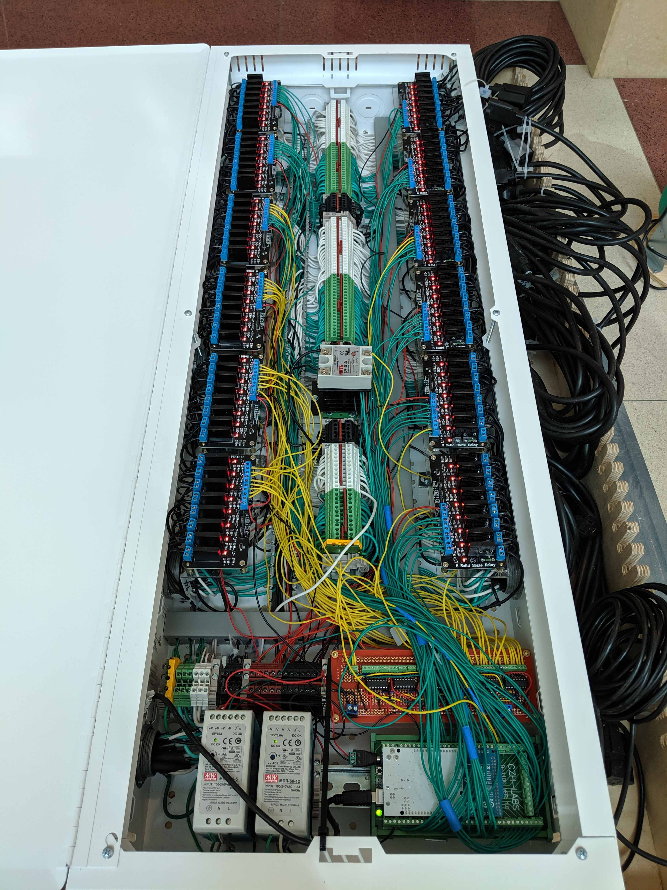
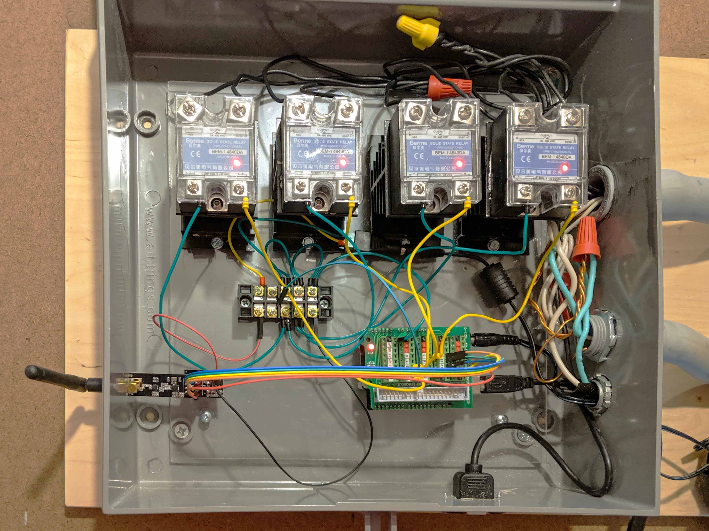

Solid state relays do not have a mechanical switch. Rather, they use a semiconductor to switch the electrical load. This makes for fast and silent switching. Solid state relays can last longer than mechanical relays due to the lack of moving parts.

Usually solid state relays are rated for lower current than mechanical relays but high current versions are available. Higher current solid state relays require a heat sink to dissipate heat.

Wiring a solid state relay is similar to a mechanical relay.

<figure>

<figcaption>

Many solid state relay modules hooked up to an Arduino Mega

</figcaption>
</figure>

<figure>

<figcaption>

High current solid state relays with heat sinks hooked up to an Arduino

</figcaption>
</figure>

