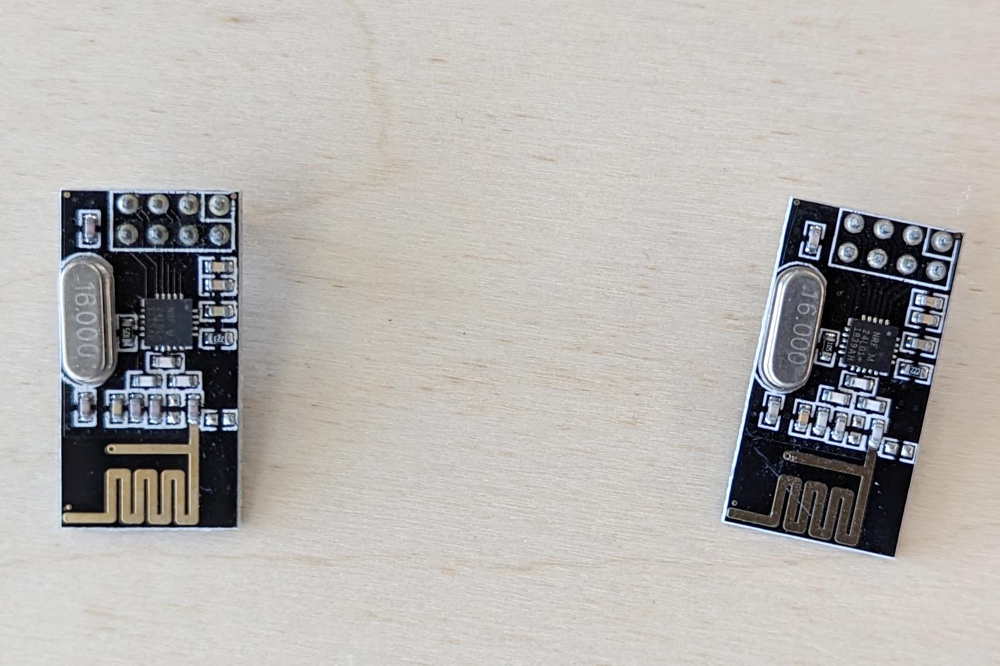

## nRF24 Modules

The nRF24L01+ made by Nordic Semi is a 2.4 GHz radio transmitter that has library support for working with an Arduino for wireless communication between multiple devices.

[](2023-nrf24-modules.jpg)

## Example Send and Receive Sketches based on Arduino Forum Post [^1]

These sketches from the Arduino forums show how to send a simple data message in one direction between to radio modules connected to two Arduinos.

### Send Sketch Example

```C
// Transmit from Sender to Receiver
// Based on sketch from Arduino Forum user Robin2
// Link to original post https://forum.arduino.cc/t/simple-nrf24l01-2-4ghz-transceiver-demo/405123

#include <SPI.h>
#include <nRF24L01.h>
#include <RF24.h>

#define CE_PIN   9
#define CSN_PIN 10

const byte receiverAddress[5] = {'R','x','A','A','A'};

RF24 radio(CE_PIN, CSN_PIN); // Create a Radio

char dataToSend[10] = "Message 0";
char txNum = '0';

unsigned long currentMillis;
unsigned long sendTimer;
unsigned long sendInterval = 1000; // send once per second

void setup() {

    Serial.begin(9600);

    Serial.println("Radio Test Start");

    radio.begin();
    radio.setDataRate( RF24_250KBPS );
    radio.setRetries(3,5); // delay, count
    radio.openWritingPipe(receiverAddress);
}

void loop() {
    currentMillis = millis();

    if (checkTime (sendTimer, sendInterval)) {
        send();
    }
}

void send() {

    bool rslt;
    rslt = radio.write( &dataToSend, sizeof(dataToSend) );
        // Always use sizeof() as it gives the size as the number of bytes.
        // For example if dataToSend was an int sizeof() would correctly return 2

    Serial.print("Data Sent ");
    Serial.print(dataToSend);
    if (rslt) {
        Serial.println("  Acknowledge received");
        updateMessage();
    }
    else {
        Serial.println("  Tx failed");
    }
}

void updateMessage() {
        // so you can see that new data is being sent
    txNum += 1;
    if (txNum > '9') {
        txNum = '0';
    }
    dataToSend[8] = txNum;
}

// variable names modified from original  by Larry D for clarity
// timerLength is how long the timer is in Milliseconds
// lastTimerExpiredTime is the time in Milliseconds of the last time the timer expired
// BEGIN CheckTime()
boolean checkTime(unsigned long &lastTimerExpiredTime, unsigned long timerLength)
{
  // is the time up for this task?
  if (currentMillis - lastTimerExpiredTime >= timerLength)
  {
    lastTimerExpiredTime += timerLength;  //get ready for the next iteration
    return true;
  }
  return false;
}
//END CheckTime()
```

### Receive Sketch Example

```C
// Receive message from Sender by Receiver
// Based on sketch from Arduino Forum user Robin2
// Link to original post https://forum.arduino.cc/t/simple-nrf24l01-2-4ghz-transceiver-demo/405123

#include <SPI.h>
#include <nRF24L01.h>
#include <RF24.h>

#define CE_PIN   9
#define CSN_PIN 10

const byte receiverAddress[5] = {'R','x','A','A','A'};

RF24 radio(CE_PIN, CSN_PIN);

char dataReceived[10]; // this must match dataToSend in the TX
bool newData = false;

void setup() {

    Serial.begin(9600);

    Serial.println("Radio Receive Test Start");
    radio.begin();
    radio.setDataRate( RF24_250KBPS );
    radio.openReadingPipe(1, receiverAddress);
    radio.startListening();
}

void loop() {
    getData();
    showData();
}

void getData() {
    if ( radio.available() ) {
        radio.read( &dataReceived, sizeof(dataReceived) );
        newData = true;
    }
}

void showData() {
    if (newData == true) {
        Serial.print("Data received ");
        Serial.println(dataReceived);
        newData = false;
    }
}
```

## Resources and Examples

[NRF24L on Arduino Project Hub](https://projecthub.arduino.cc/tmekinyan/81395722-47c9-4cab-9ecf-79e81b89e334)

[^1]: [Radio Transmit Arduino Forum Post](https://forum.arduino.cc/t/simple-nrf24l01-2-4ghz-transceiver-demo/405123) by [Robin2](https://forum.arduino.cc/u/robin2/summary)
