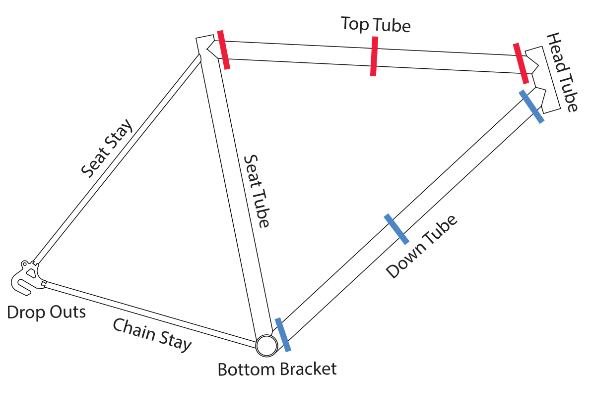

## Assignment Deliverables

1. Disassembled Bicycle Components
   - Preserve useful mechanical components including bearings, hubs, cranks, wheels, and other potential moving parts.
2. Prepared Bicycle Frame / Tubing
   - Seperated headtube from bottom bracket and seat tube
   - Deburr sharp edges
   - Remove coatings 3-4" from areas that will later be welded

## Bicycle Disassembly Process

Study the bicycle before cutting anything. Identify components that contain useful mechanical systems and try to preserve them whenever possible.

Pay particular attention to:

- Headset and head tube
- Fork
- Bottom bracket
- Cranks and pedals
- Chainrings
- Chain
- Rear sprockets or freewheel
- Wheel hubs
- Wheels and rims
- Handlebars and stem
- Seat and seat post
- Brake components
- Frame tubing

Remove reusable components before making destructive cuts. Consider keeping bearing assemblies intact. A functioning headset, bottom bracket, or wheel hub gives you a precise rotational mechanism that would be much more difficult to fabricate from scratch.

## Cutting the Bicycle

1. Decide which portions of the frame may be useful.
2. Mark planned cuts before cutting.
3. Secure the frame before using cutting tools.
4. Make controlled cuts that preserve as much usable tubing as possible.
5. Save useful offcuts and unusual components.
6. Deburr sharp cut edges before handling the pieces.

Do not immediately cut everything into small pieces. Larger sections can always be cut smaller later.

## Preparing Metal for Fabrication

Remove paint, rust, grease, and other contaminants from areas that will eventually be welded. Use the sandblaster, strip discs, or other demonstrated methods to expose clean steel.
You generally do not need to strip the entire bicycle immediately. Concentrate on areas that will be cut, fitted, or welded.

The bicycle you begin with is only the starting point. Over the next several weeks, it will become both raw material and a mechanical toolkit through which you learn the fundamentals of metal fabrication.

## Grading Rubric

| Objective                                  | Points |
| ------------------------------------------ | ------ |
| Components removed from bicycle frame      | 20     |
| Frame cut in half with minimum two cuts    | 25     |
| Ends of cuts deburred with files           | 25     |
| Paint / Coating removed 3-4" from cut ends | 30     |

