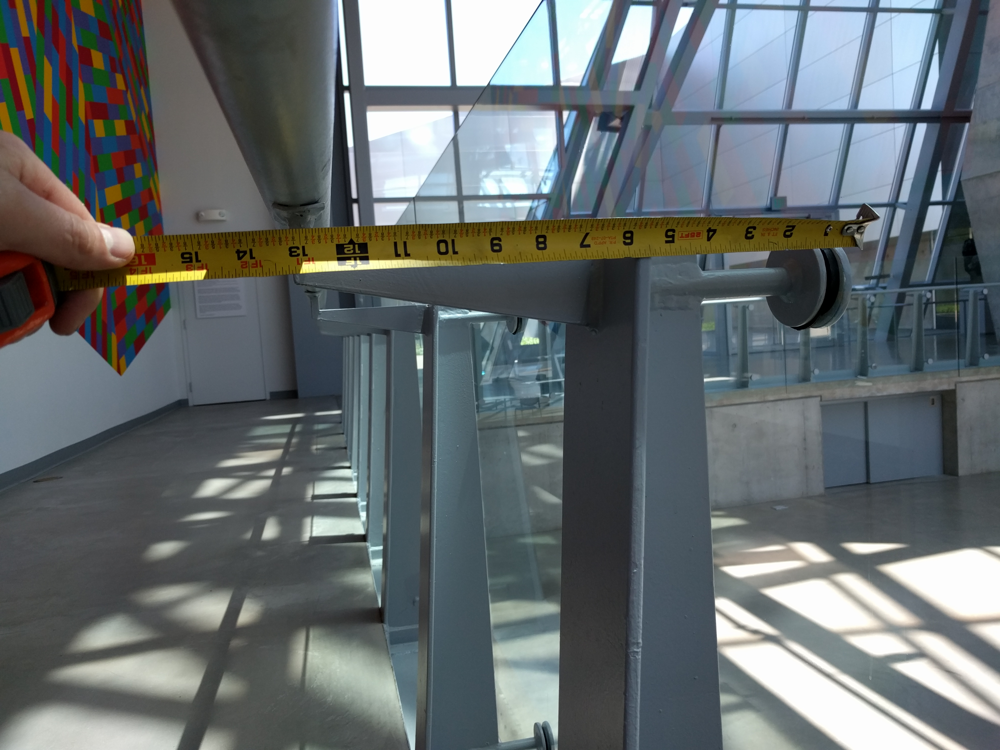

A site visit is an important step in a custom or site specific installation project. Before a site visit one will likely have floorplans and / or site plans for the space or location. Plans accompanied by photographs, video, and potentially 3D models can give a good sense of the space but there is no substitute to physically visiting a location.

When you look at a floor plan, you may not know the height of the ceilings. Or if the ceiling height is indicated for one section, the plans may omit dramatic changes in ceiling height. A site visit can correct these types of omissions. Floor plans for exhibition spaces regularly focus on wall length for the purposes of hanging 2D artwork on the walls. These dimensions are often accurate for determining the spacing of 2D art but may not be accurate enough for planning the fabrication of a large site specific sculpture or installation. It is important to double check measurements on a floor plan with reality when on a site visit.

## Tasks to Complete on a Site Visit

### Photographs

Take photos of the space from multiple angles. Make sure to get detail shots of important elements. A good technique is to lay a tape measure on the ground when taking photos, so you have a scale reference. Due to perspective and distortions from the camera lens point of view, the tape measure will not be completely accurate, but it can give a close enough approximation for general planning and is much better than forgetting to take measurements at all.

<figure>

<figcaption>

Photograph with tape measure on ground for size reference during site visit at the Akron Art Museum.

</figcaption>

</figure>

<figure>

<figcaption>

Photograph of railing detail with tape measure for size reference during site visit at the Akron Art Museum.

</figcaption>

</figure>

### Measurements

Double check measurements from any floor plans or drawings of the space. Check the longest dimension available on the floor plan since this will be less error prone. Look for pillars and other features that may not have measurements or might not even be on a floor plan. Make your own drawing to note the dimensions of these features. Look for locations of power recepticals and take measurements so you can plan for extension cord length.
