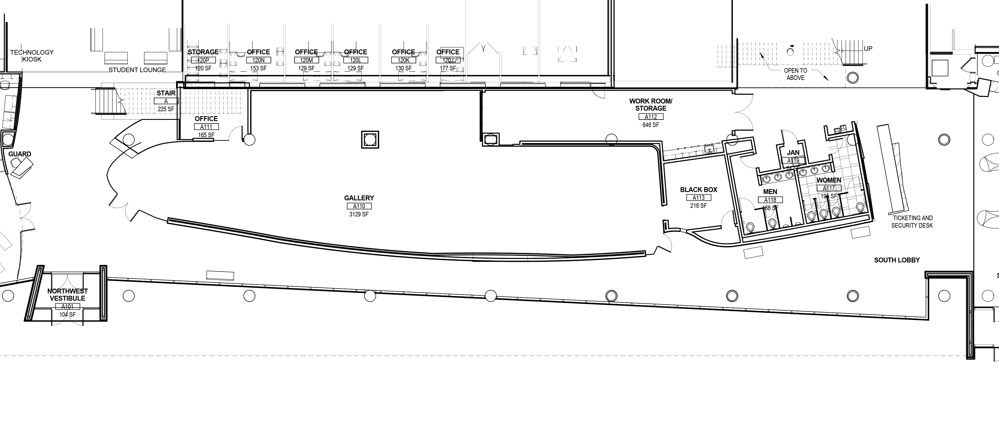

Site plans give a top down view of the location of an installation. Often they are drawn to scale or at least have dimensions on non scale drawings. These measurements should always be verified with reality. Never trust a site plan without at lease spot checking a few dimensions with the actual site.

[Link to PDF of Floor Plan](./2023-Cleveland-Institute-of-Art-Reinberger-Gallery-Floorplan-dimensions.pdf)

## Better Site Plans

Sometimes the site plan or floor plan for an exhibition space is a simplified version of the actual space. This can be useful for planning the layout of 2D work on walls since the most critical factor is the width and height of the walls. Installation art and site specific work needs more detailed and accurate drawings. Often a venue will have better drawings if you ask. It may take a few attempts until you find the facilities person with the files, or the former architect that designed the building remodel, or someone from the building committee that still has a copy of the plans on their computer. While it is generally rare for a venue to have accurate .dxf files, they will often have PDF files made from the original .dxf files. These will be more accurate than a converted jpg or png floor plan.

[Link to PDF of Better Floor Plan](./gallery-floor-plan-better.pdf)
