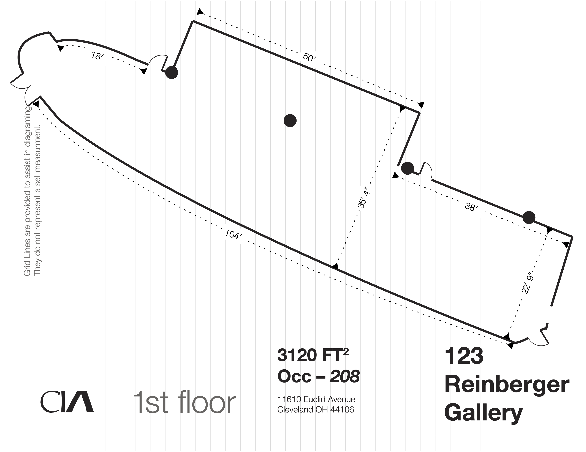

Site plans give a top down view of the location of an installation. Often they are drawn to scale or at least have dimensions on non scale drawings. These measurements should always be verified with reality. Never trust a site plan without at lease spot checking a few dimensions with the actual site.

](./2023-Cleveland-Institute-of-Art-Reinberger-Gallery-Floorplan-dimensions.png)

[Link to PDF of Floor Plan](./2023-Cleveland-Institute-of-Art-Reinberger-Gallery-Floorplan-dimensions.pdf)
