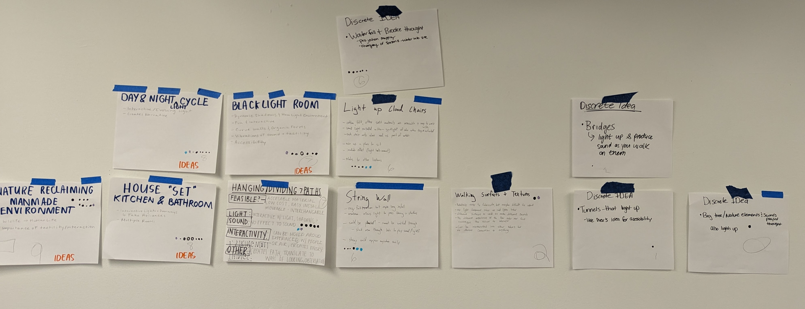
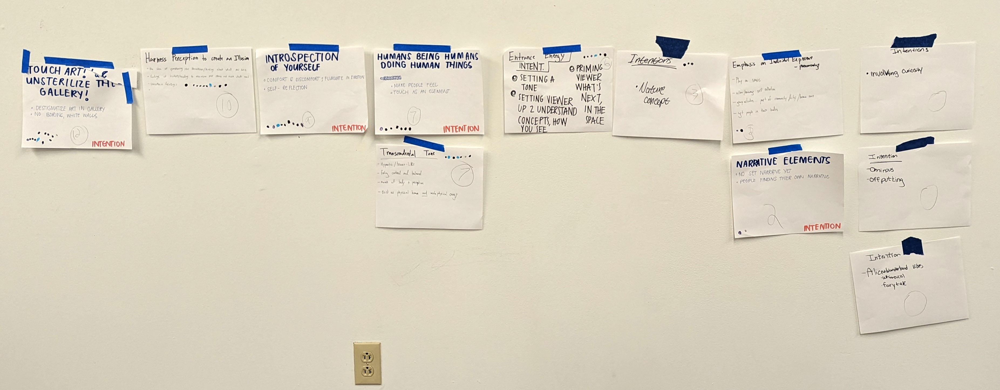

## Assignment Deliverables

In a reply to [this discussion](https://cia.instructure.com/courses/719/discussion_topics/2112):

1. Write 3 potential titles for the exhibition.
   - Look at the photo of "ideas" and then describe your interpretation of the voting in three sentences.
   - Look at the photo of "intentions" and then describe your interpretation of the voting in three sentences.
2. Write 3 sentences combining the intentions and ideas.

## Grading Rubric

| Objective                                  | Points |
| ------------------------------------------ | ------ |
| 3 Titles                                   | 25     |
| 3 Sentences Combining Ideas and Intentions | 25     |

