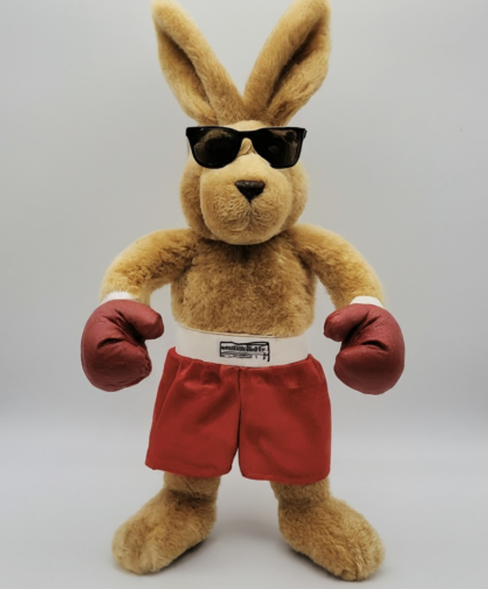
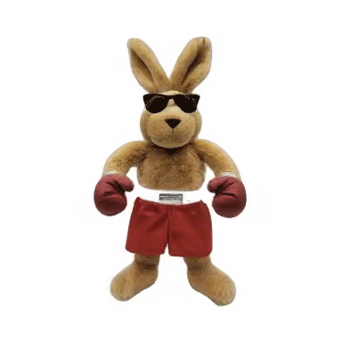

AI mesh generation uses trained models to generate a 3D mesh from a 2D source image or a text prompt. This technology does not currently produce high quality meshes but it is important to be aware of ongoing developments in the field in order to take advantage of them in your artistic practice.

<figure>

<figcaption>

Boxing Bunny image made with Google Gemini

</figcaption>
</figure>
<figure>

<figcaption>

3D Video from 2D image created with VFusion3D

</figcaption>
</figure>

## AI Mesh Generation Tools

- [VFusion3D Demo on Hugging Face](https://huggingface.co/spaces/facebook/VFusion3D) - Makes good videos but the meshes are blocky
- [VFusion3D Demo on Google Colab](https://github.com/whatmakeart/VFusion3D-colab) - Requires access to Google Drive
- [StableVision123 Demo on Hugging Face](https://huggingface.co/spaces/p4vv37/Stable-Zero123)
- [Luma Labs Genie](https://lumalabs.ai/genie?view=create) - Requires sign in
- [Rodin](https://hyperhuman.deemos.com/rodin) - Requires sign in
- [Meshy AI](https://www.meshy.ai/) - Requires sign in
- [Spline AI Generate](https://spline.design/ai-generate) - Requires Sign in
- [MasterpieceX](https://www.masterpiecex.com/) - Requires Sign in

## In Class Exercise

1. Use images and photos of objects and the mesh generation tools above to create 3D .obj meshes and videos.
2. Try images made with AI image generators for different results.
3. Save and label your mesh and video files.

## Further Reading

[LRM: Large Reconstruction Model for Single Image to 3D](https://yiconghong.me/LRM/)
