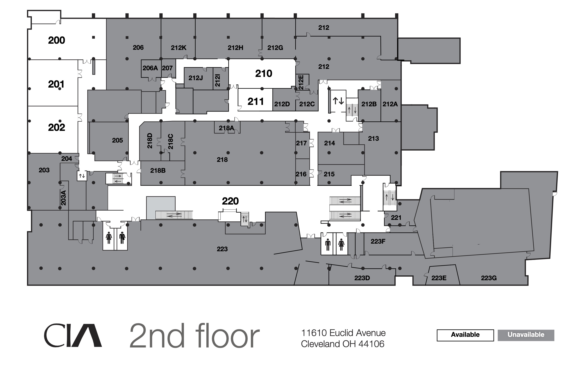

## Assignment Deliverables

1. 3D Model file of scale model of Sculpture + Expanded Media Installation Rooms (.blend, .mb, ma, .skp)
   - Label File YYYYMMDD Lastname Firstname install rooms model
2. Minimum of 1 rendered image of each install room .(png, .jpg)
   - - Label Files YYYYMMDD Lastname Firstname install room 1 render

## Overview

Use measurements taken from the physical space, photos, fSpy, and available floor plans to create and accurate 3D digital model of the Sculpture + Expanded Media Installation Rooms.

<figure>

 <figcaption>
 
[PDF of Cleveland Institute of Art Floor Plans](https://my.cia.edu/ICS/Portlets/ICS/Handoutportlet/viewhandler.ashx?handout_id=12c7143a-c6d1-4f6d-8e71-32e74f93d9a0) [Archive Link](./CIA-All-Floors-28-Oct-2022.pdf)

</figcaption>
</figure>
