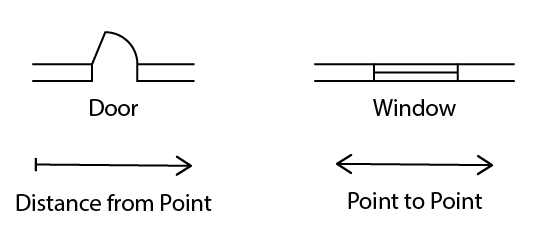

Floor plans and site plans of venues are not always accurate. Sometimes things change during the construction process and are not updated on a floor plan. Often a floor plan may be made for an exhibition venue but key details may be missing or incorrect. If a gallery generally shows 2D artwork then the focus of the dimensions on the floor plan will show usable wall space. This could be the actual length of the wall or it could be the approximate space between the fire extinguisher and a light switch with a buffer for space around paintings. While this is helpful for deciding were to hang 2D artwork, it is less helpful for using in space planning, visualization, ideation, and fabrication of 3D works.

If a floor plan is available for a space it is a great place to start. Make a quick 3D model and check if the written dimensions are able to make a closed shape. Sometimes this is possible and other times the written dimensions create a physically impossible shape. In the latter case it is best to attempt to see which dimensions are the most important and attempt to adjust from there.

If it is possible to visit a venue, then bring a tape measure and spot check important measurements. The most important measurements are generally the full size of the space and the distances between corners. If you assume every corner is a 90 degree angle then your model will likely be off. If you measure the distance to a point from two other points, then you can determine where that point is in space relative to the other two points. Repeat this arc based intersection process for multiple points and you can "survey" the space in an accurate way. To reduce errors, include the longest measurement possible in the space to compare to measurements of smaller features.

## Make a Rough Drawing of the Space

Draw out a basic outline of the space. It doesn't need to be detailed. Then draw circles where you need dimensions.

### Useful Architectural Symbols

