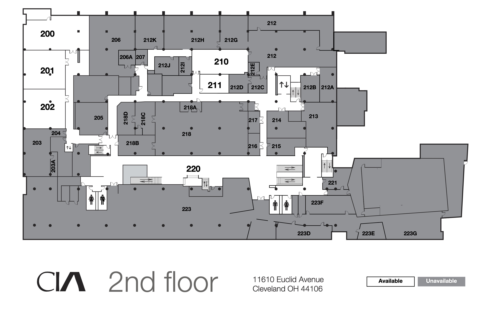

## Assignment Deliverables

1. 3D Model file of scale model of Sculpture + Expanded Media Room 212A (`.blend`, `.mb`, `.ma`, `.skp`)
   - Label File YYYY-MM-DD Lastname Firstname room 212A model
2. Minimum of 2 rendered images of room 212A (`.png`, .`jpg`)
   - Label Files YYYY-MM-DD Lastname Firstname room 212A render

## Overview

Use measurements taken from the physical space, photos, fSpy, and available floor plans to create and accurate 3D digital model of the Sculpture + Expanded Media Room 212A. Add materials and textures to the elements in the room. [Blenderkit](../../../../3d-modeling/blender/install-blenderkit-blender.md) isa good source of materials, textures, doors, windows, and other 3d objects to use in your room model. If you apply a texture to an object, make sure to UV unwap it.

- [Smart UV Project](../../../../3d-modeling/blender/smart-uv-project-blender.md)
- [How to Scale fSpy Camera to Existing 3D Model in Blender](../../../../3d-modeling/blender/scale-fspy-camera-to-existing-3d-model-in-blender.md)

<figure>

<figcaption>
 
[PDF of Cleveland Institute of Art Floor Plans](./CIA-All-Floors-28-Oct-2022.pdf) [Archive Link](./CIA-All-Floors-28-Oct-2022.pdf)

</figcaption>
</figure>

## Additional Resources

Taking a photo from the room, matching the camera in fSpy, importing the camera to Blender, and then scaling the camera around the 3D cursor is a good way to get a believable camera and angle for making renders.

<iframe class="youTubeIframe" width="560" height="315" src="https://www.youtube.com/embed/okPjal2aFG4" title="YouTube video player" frameborder="0" allow="accelerometer; autoplay; clipboard-write; encrypted-media; gyroscope; picture-in-picture; web-share" referrerpolicy="strict-origin-when-cross-origin" allowfullscreen></iframe>

- [Gaussian Splatting](../../../../3d-modeling/gaussian-splatting.md)

## Grading Rubric

| Objective                     | Points |
| ----------------------------- | ------ |
| 3D Model File Uploaded        | 10     |
| 212A Room Proportions Correct | 10     |
| Door Openings Present         | 10     |
| Additional Structures Details | 10     |
| Materials Added               | 10     |
| Lighting Added to Scene       | 10     |
| Sculpture or object added     | 10     |
| Render of room 1              | 10     |
| Render of room 2              | 10     |
| File Management               | 10     |

