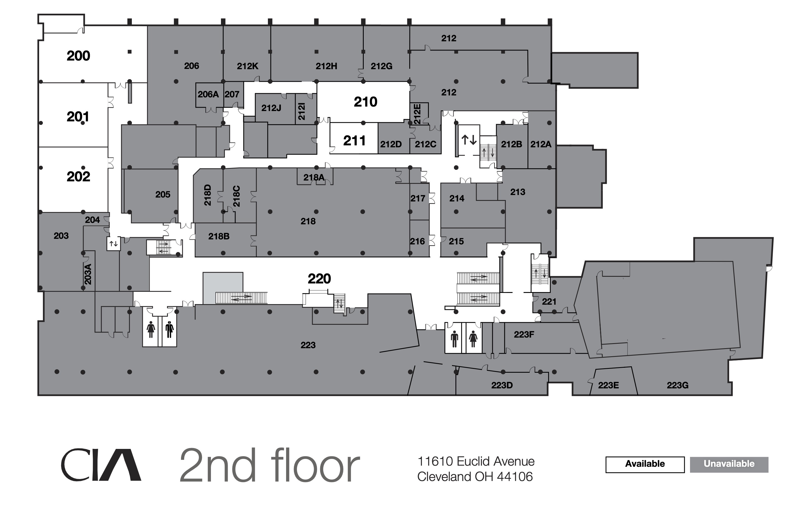

## Assignment Deliverables

1. 3D Model file of scale model of Sculpture + Expanded Mediaf Room (.blend, .mb, ma, .skp)
   - Label File YYYY-MM-DD Lastname Firstname room model
2. Minimum of 2 rendered images of room .(png, .jpg)
   - Label Files YYYY-MM-DD Lastname Firstname room render 1

## Overview

Use measurements taken from the physical space, photos, fSpy, and available floor plans to create and accurate 3D digital model of a room in the Sculpture + Expanded Media department.

- [How to Scale fSpy Camera to Existing 3D Model in Blender](../../../../3d-modeling/blender/scale-fspy-camera-to-existing-3d-model-in-blender.md)

<figure>

<figcaption>
 
[PDF of Cleveland Institute of Art Floor Plans](./CIA-All-Floors-28-Oct-2022.pdf) [Archive Link](./CIA-All-Floors-28-Oct-2022.pdf)

</figcaption>
</figure>

## Grading Rubric

| Objective                     | Points |
| ----------------------------- | ------ |
| 3D Model File Uploaded        | 10     |
| Room Proportions Correct      | 10     |
| Door Opening Present          | 10     |
| Additional Structures Details | 10     |
| Materials Added               | 10     |
| Lighting Added to Scene       | 10     |
| Sculpture or object added     | 10     |
| Render 1                      | 10     |
| Render 2                      | 10     |
| File Management               | 10     |

## Additional Resources

<iframe class="youTubeIframe" width="560" height="315" src="https://www.youtube.com/embed/okPjal2aFG4" title="YouTube video player" frameborder="0" allow="accelerometer; autoplay; clipboard-write; encrypted-media; gyroscope; picture-in-picture; web-share" referrerpolicy="strict-origin-when-cross-origin" allowfullscreen></iframe>

