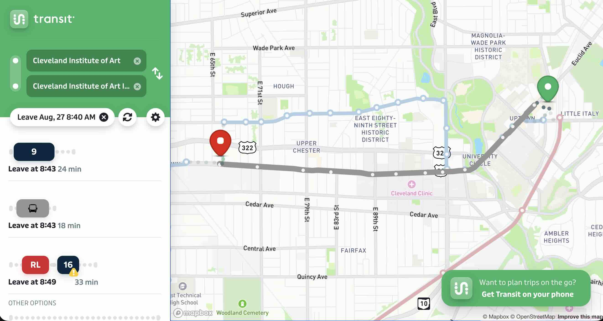

Please review the following instructions to ensure you arrive at the [IML](https://www.cia.edu/iml/) on time and fully prepared for class each week. Our class begins promptly at noon. You must arrange to arrive at the IML by 9:00 PM.

Interactive Media Lab
Warren E. Anderson MidTown Collaboration Center
1974 E 66th St, Cleveland, OH 44103

## Personal Transportation

You may use a bicycle or a personal vehicle. If you commute to CIA, you can go directly to the IML rather than coming to Main Campus first.

## RTA Bus Travel

**First Day Guided Trip:** To help you get familiar with the route, I will be waiting at the Euclid Av & E 115th St Station at approximately 8:35 AM on our first day of class. If you would like a guide, please meet me there, and we will ride the RTA bus to the IML together.

Enrollment at CIA includes an RTA pass for students. While you are not required to take the RTA bus, it is a highly recommended and convenient option. If you plan to ride the RTA, you must get the RTA bus pass sticker and place it on your student ID. You will need this sticker to ride the bus. Get the sticker from [Student Affairs Office](https://www.cia.edu/departments/student-affairs/) at CIA before the first day of class.

### RTA Transit App

<figure>

<figcaption>

[Transit App HealthLine Interactive Bus Directions to the IML](https://transitapp.com/en/trip?origin=41.5103335,-81.6022976&origin_search=Cleveland+Institute+of+Art&destination=41.504971,-81.6447542&destination_search=Cleveland+Institute+of+Art+Interactive+Media+Lab&leave_at=1787834400000)

</figcaption>
</figure>

[Download the Transit App](https://transitapp.com/) to see bus locations and arrival times updated in realtime.

  <!-- Apple App Store -->
  <a href="https://apps.apple.com/us/app/transit-subway-bus-times/id498151501" target="_blank" rel="noopener noreferrer">
    <rect width='135' height='40' rx='7' fill='%23000'/><path d='M28.7 20.3c0-3.3 2.7-4.9 2.8-5-1.5-2.2-3.9-2.5-4.7-2.6-2-.2-3.9 1.2-4.9 1.2-1 0-2.6-1.2-4.3-1.1-2.2 0-4.2 1.3-5.3 3.3-2.3 4-.6 9.9 1.6 13.1 1.1 1.6 2.4 3.3 4.1 3.2 1.6-.1 2.3-1.1 4.2-1.1s2.6 1.1 4.3 1.1c1.7 0 2.8-1.6 3.9-3.2 1.2-1.8 1.7-3.5 1.7-3.6-.1 0-3.4-1.3-3.4-5.3zm-3.6-9.6c.9-1.1 1.5-2.6 1.3-4.1-1.3.1-2.8.9-3.7 1.9-.8 1-1.5 2.5-1.3 4 1.4.1 2.8-.7 3.7-1.8z' fill='%23fff'/><text x='42' y='14' fill='%23fff' font-family='-apple-system, BlinkMacSystemFont, sans-serif' font-size='9' font-weight='400'>Download on the</text><text x='42' y='28' fill='%23fff' font-family='-apple-system, BlinkMacSystemFont, sans-serif' font-size='15' font-weight='700'>App Store</text></svg>" alt="Download on the App Store" style="height: 40px;">
  </a>

  <!-- Google Play Store -->
  <a href="https://play.google.com/store/apps/details?id=com.thetransitapp.droid" target="_blank" rel="noopener noreferrer">
    <rect width='135' height='40' rx='7' fill='%23000'/><path d='M16.5 10.8l8.2 8.2-8.2 8.2V10.8z' fill='%2300C9FF'/><path d='M27.2 21.5l-2.5-2.5-8.2-8.2 1.1-.6c.8-.5 1.9-.3 2.5.3l7.1 11z' fill='%23FFD900'/><path d='M16.5 27.2l8.2-8.2 2.5 2.5-7.1 11c-.6.6-1.7.8-2.5.3l-1.1-.6z' fill='%23FF3333'/><path d='M27.2 21.5l2.6-1.5c.8-.5.8-1.5 0-2l-2.6-1.5-2.5 2.5 2.5 2.5z' fill='%2300EA7B'/><text x='38' y='14' fill='%23fff' font-family='-apple-system, BlinkMacSystemFont, sans-serif' font-size='8' font-weight='400'>GET IT ON</text><text x='38' y='28' fill='%23fff' font-family='-apple-system, BlinkMacSystemFont, sans-serif' font-size='14' font-weight='700'>Google Play</text></svg>" alt="Get it on Google Play" style="height: 40px;">
  </a>

### RTA HealthLine Route and Schedule

Get on the Westbound HealthLine bus at the [Euclid Av & E 115th St Station](https://www.google.com/maps?cid=7261449139271461869&g_mp=CiVnb29nbGUubWFwcy5wbGFjZXMudjEuUGxhY2VzLkdldFBsYWNlEAMYASAFKgSoqNcy). This bus station is on the other side of the street from CIA Main Campus as indicated on the map. [Google Map Directions to the IML](https://maps.app.goo.gl/pp9burukWBBNKXyG7)

- [RTA HealthLine Online Schedule](https://www.riderta.com/routes/healthline/schedules/current)
- [RTA HealthLine PDF Schedule](https://www.riderta.com/sites/default/files/schedule-pdfs/HealthLine.pdf)

The HealthLine runs approximately every 15 minutes and the ride from E 115th to E 66th takes about 13-18 minutes, plus a short walk. Plan you departure time for future weeks to arrive to class on time.

### Euclid Av & E 115th St Station - RTA Bus Stop to Go to the IML

<iframe src="https://www.google.com/maps/embed?pb=!1m18!1m12!1m3!1d1036.7722824726966!2d-81.6040742380741!3d41.51019268019451!2m3!1f0!2f0!3f0!3m2!1i1024!2i768!4f13.1!3m3!1m2!1s0x8830fb8a73f01a87%3A0x64c5d984f4d76bed!2sEuclid%20Av%20%26%20E%20115th%20St%20Station!5e0!3m2!1sen!2sus!4v1787169543261!5m2!1sen!2sus" style="position: absolute; top: 0; left: 0; width: 100%; height: 100%; border: 0;" allowfullscreen="" loading="lazy" referrerpolicy="strict-origin-when-cross-origin"></iframe>

### Euclid Av & E 66th St Station - RTA Bus Stop to Get Off at on Way to IML

After getting off at E 66th St, walk to the crosswalk and cross Euclid Avenue to the north. Go to the main entrance of the Midtown Collaboration Center. From the lobby go up the bright yellow stairs to the CIA entrance to the IML. Your CIA student ID will open the lock on the door to the IML.

<iframe src="https://www.google.com/maps/embed?pb=!1m18!1m12!1m3!1d2987.9969964439297!2d-81.649717908479!3d41.50433989724669!2m3!1f0!2f0!3f0!3m2!1i1024!2i768!4f13.1!3m3!1m2!1s0x8830fbadaa60bfad%3A0xee4b9fbdd63a341b!2sEuclid%20Av%20%26%20E%2066th%20St%20Station!5e0!3m2!1sen!2sus!4v1787170930175!5m2!1sen!2sus" style="position: absolute; top: 0; left: 0; width: 100%; height: 100%; border: 0;" allowfullscreen="" loading="lazy" referrerpolicy="strict-origin-when-cross-origin"></iframe>

## What to Bring to Class

Please make sure you pack the following items for the first day of class:

- Your student ID (with the RTA sticker attached if you are riding the bus)
- Your laptop
- Your laptop charger
