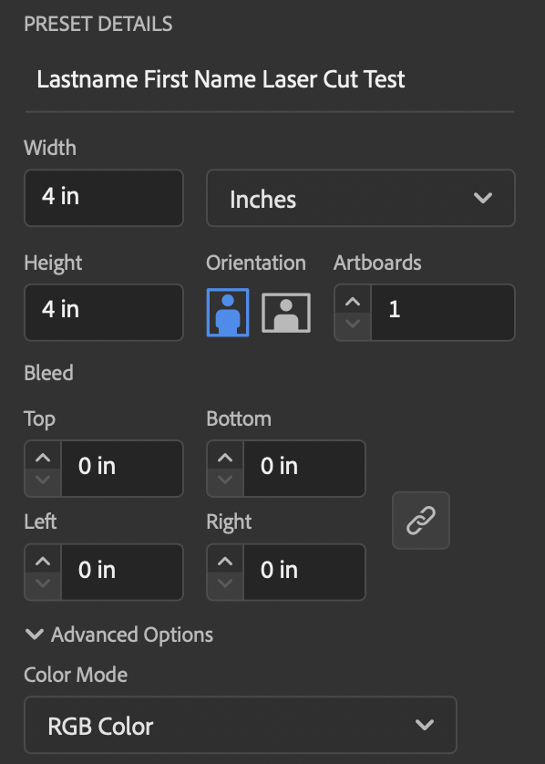
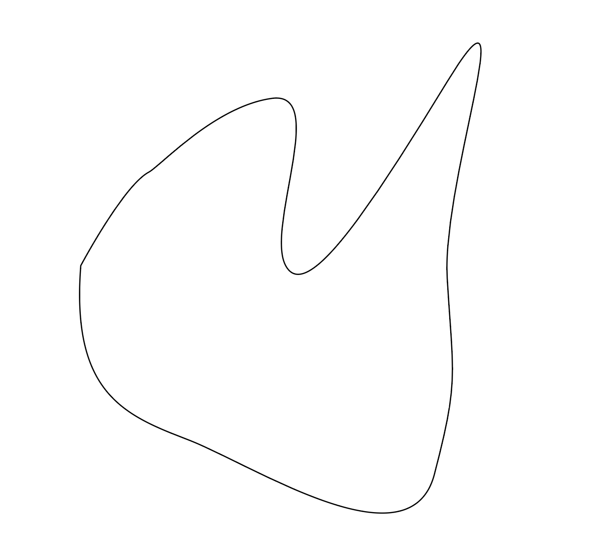
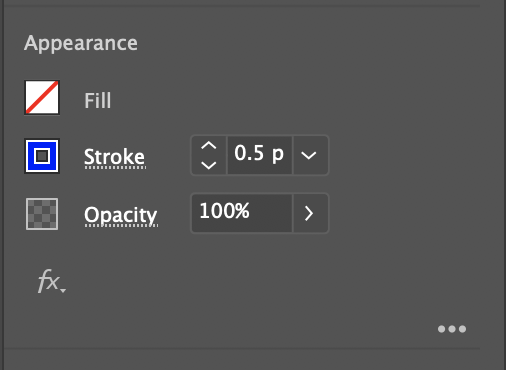

We will go to the think[box] to learn how to use the laser cutters.
We will each make a test cut from a file that we make. You need to have this
file made before going to the think[box]. There are specific instructions to make
the file in Adobe Illustrator. If you do not follow the directions then your
file will not work properly on the laser cutters.

The test cut will demonstrate the ability of a through cut and an etching cut on the laser cutters.

## Laser Cut Test File Creation Instructions

Open Adobe Illustrator

&nbsp;

- Create a New Document that is 4 inches by 4 inches in RGB color
- Label the File

- Draw path that is closed
- Keep the path away from the edges of the 4x4 Artboard

- Select the Path
- Set the Fill to transparent
- Change the stroke color to Red
- Change stroke width to .001 points
- Any red stroke with a width of .001 will be cut all the way through.

- Draw a new path inside your first path.
- Do not have the paths touch.

- Select the Path
- Set the Fill to transparent
- Change the stroke color to Blue
- Change stroke width to .5 points
- Any blue stroke with a width of .5 will be etched.

- Save your file
- Upload to Google Drive for later access
- Save your file on a USB Drive if available for redundancy

&nbsp;

Bring USB drive and / or Adobe Creative Cloud Password to think[box]. You need access to the test file from the USB drive or cloud storage.

&nbsp;

