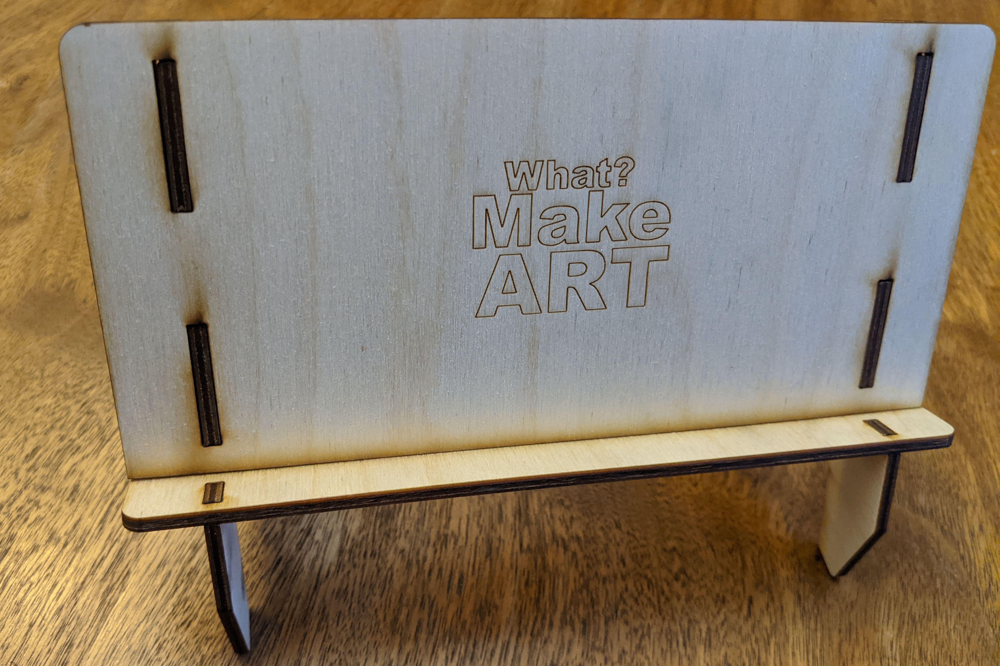

# Design Laser Cut Phone / Tablet or Laptop Stand - Design Research

We will use the power of [parametric modeling](../../../../3d-modeling/parametric-modeling.md) in Fusion 360 to design a phone, tablet or laptop stand that will be laser cut out of plywood or acrylic. The laser cutters can cut plywood and acrylic from 1/8" to 1/4" thick.

This project will use the entire design process.

- identifying the problem
- ideation and iteration
- refinement of ideas
- testing of ideas through physical models
- making of a digital model base on those tests
- outputting a physical prototype through a laser cutter

## Process

Initial Thinking

1. Think of the times that you use on a cell phone, tablet or laptop to see content on the screen. This could be video content, video chat, web browsing, a recipe while cooking, propped up while reading in bed or any other time the screen is on and you may want to be freehanded.
2. Think of the surfaces you may want the stand to work on. Consider what angle you want the device to be at and whether it would be vertical or horizontal.
3. Do you need to think about how the power cable would fit?
4. Do you need to think about where the power buttons and volume buttons are? What about the keyboard? Considering external devices connected?
5. Conduct research of existing solutions to the problem. You will not "copy" anything but you should be aware of what exists. It can inspire your and spark new ideas in your mind. Do an internet image search of [phone stands](https://www.google.com/search?q=phone+stands&tbm=isch), [tablet stands](https://www.google.com/search?q=tablet+stands&tbm=isch), [laptop stands](https://www.google.com/search?q=laptop+stands&tbm=isch) to get your brain buzzing.
6. Do an image search of [laser cut objects](https://www.google.com/search?q=laser+cut+objects&tbm=isch) to see what laser cutters can make.
