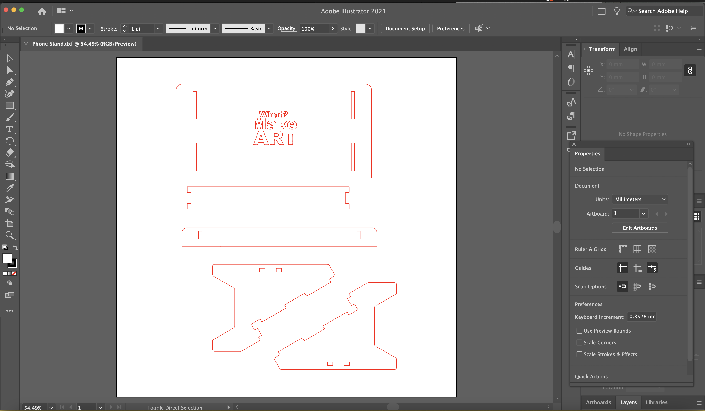

## Open DXF in Illustrator and Adjust Stroke

You need to change the stroke weight of the red strokes in Illustrator. Also you need to change the stroke color and weight of any strokes that you want to etch. You can also draw new strokes to etch while in Illustrator. Etched strokes need to be blue and .5. Make sure you scale the document 100% and have 1mm = 1mm.

Example of each part of the stand as a separate component at the top level assembly in Fusion 360.

Change the strokes to the correct weight and color in Illustrator. In Illustrator change the weight of the cut paths (cut with red stroke .001 weight and engraving with blue stroke .5 weight)
