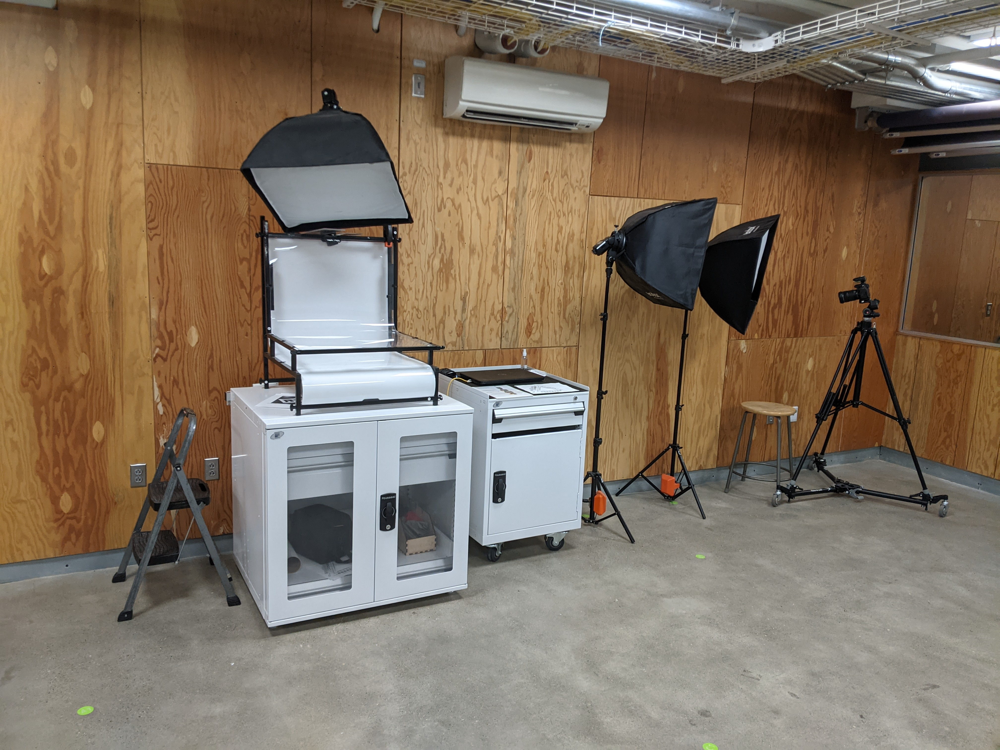

## Assignment Deliverables

- Take 2 Photos with a clean backdrop of your 3D Test Print.
- Upload both the "RAW" photo and the edited .jpg for all photos
- Label Photos YYYYMMDD Lastname Firstname 5 Word Description. (arw, cr2, dng, jpg, png)

## Assignment Overview

Take a minimum of two photos of your 3D Test Print. Take one from a 3/4 angle that shows a good representation of the form. Take the other from a composition of your choice. This could show some detail of the print. Make sure the print is in focus. Using a camera from the checkout with a zoom feature will help. Use good lighting and shoot in JPG and RAW so you can edit and post process your images.

White balance should be [corrected](https://www.youtube.com/watch?v=m0yZEWUSahk) and the levels should be adjusted to have good exposure. Use PhotoShop and [Adobe Camera Raw](https://www.youtube.com/watch?v=11jwSwUu2WI) to make adjustments and to retouch any mistakes in the images.

### Use Backdrop and Lights in the Classroom

You can set up lights and a clean backdrop. You can check out lights and a camera from the CIA equipment checkout. A backdrop is setup in the classroom for your use. Make sure to be careful with the shared resource. Do not leave marks on the paper or leave a mess.

### Use think[box] Photo Stand

There is a photo stand at the think[box]that is perfect for documenting small objects. You can also take your model to the think[box] and use the soft boxes and flashes already set up. Follow the [instructions](https://case.edu/thinkbox/equipment/other-equipment/photography-studio) provided by the think[box]. Do not use your cell phone with this setup.

## Grading Rubric

| Assessment                      | Weight    |
| ------------------------------- | --------- |
| Photo 1                         | 20 points |
| Photo 2                         | 20 points |
| Post Processing / White Balance | 20 points |
| RAW Files Uploaded              | 20 points |
| File Management                 | 10 points |

