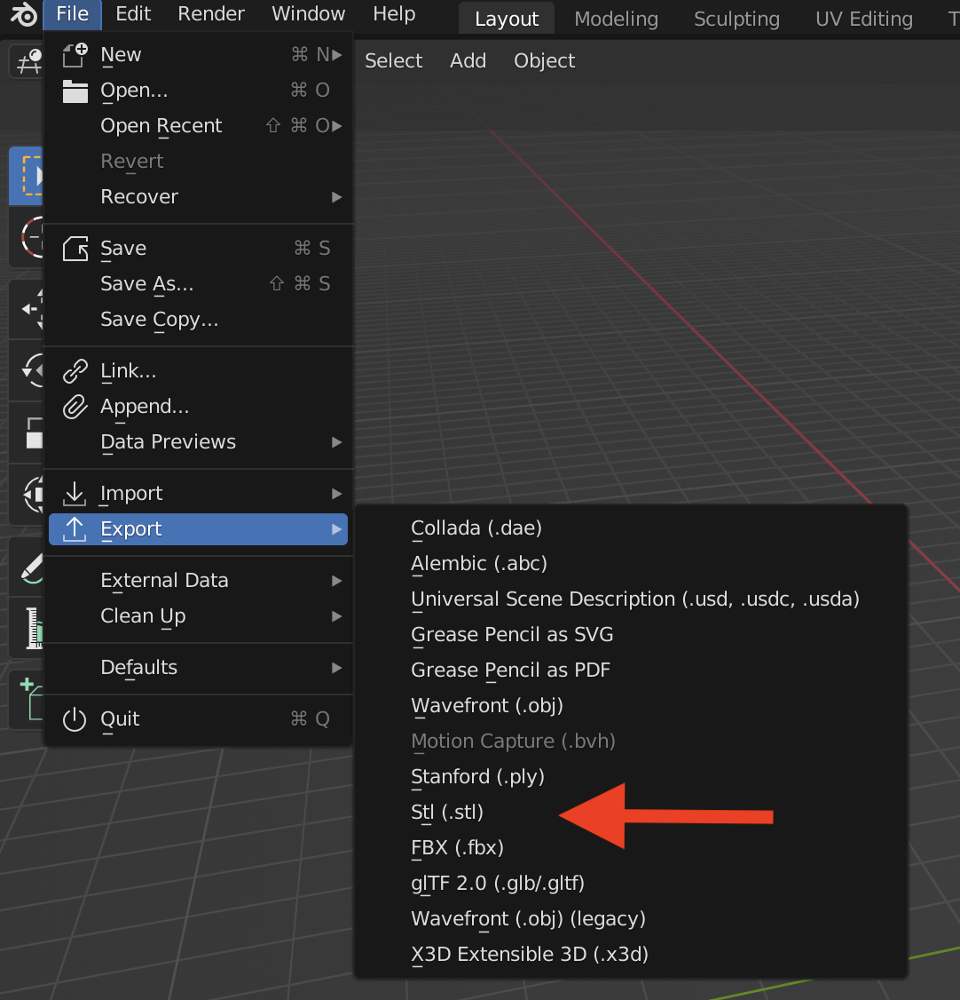

Blender's default unit scale is 1:1 meter. The default cube in a new Blender file is 2 units large, so it is a 2 x 2 x 2 meter cube. Scale is important for 3D prints. You can either model in meters, then scale the object to the correct size before export, or you can change the unit scale in Blender and work in millimeters. Sometimes it is easier to work larger and scale down but you may prefer to work at the exact size of the final object.

Exporting an STL from Blender is straightforward. Make sure you combine any objects made of multiple meshes with a boolean modifier set to exact. This way the part will be a solid, instead of being made up of different overlapping meshes.

## Turn of Smooth Preview

Smooth preview can trick you in to thinking that you have a smoother model than the actual geometry. Smooth shading is great for rendering and digital output but is not helpful for physical output like 3D printing. Make sure your model is in flat shading mode by right clicking on it in Object Mode and selecting "shade flat." If your model looks to angular or blocky, then add a subdivision modifier to your mesh and subdivide it as many times as needed to get a surface that is smooth enough. Unlike solid modeling programs, such as Fusion 360, the resolution of the subdivisions of the mesh determines the smoothness and fidelity of the exported geometry and 3D print. This is similar to pixel resolution in a jpg vs a vector file.

## Blender STL Add-ons

Blender has numerous add ons that ship with Blender as well as many add-ons available from the community. Some add-ons are enable by default, while others need to be enabled by the user. To see the addons for your Blender installation, go to Edit > Preferences > Add-ons. The Import-Export STL files add-on should be enabled by default. This is needed to have the STL export option available in the file menu.

Blender also has a "Mesh: 3D-Print Toolbox" add-on, but it is not enabled by default. You can find the add-on by typing "print" into the add-on search bar. Enabling this add-on, adds a tab to the mesh modeling screen.

This add-on has features for solid inspection, and repairing non-manifold geometry. It also can display statistics about the mesh that you want to 3D print, such as its volume and thickness for hollow parts, overhang angle, and edge sharpness. This add-on can be quite useful for making models for 3D printed output in Blender. This add-on has an export feature, but it will use the default name of the mesh you are working on. Unless you renamed the mesh it likely has an unhelpful name such as Cube.001 or Sphere.004. Make sure you rename your mesh before exporting so you know which file is which.

## Exporting STL from the Blender File Menu

Go to File > Export > STL ...

By default, "Selection Only" is not checked. Most of the time you will likely not want to export every mesh in your Blender scene. To make sure you do not export extra meshes, check "Selection Only" and then select the mesh that you want to export as an STL. There is also an option to apply all modifiers before export. This is generally a good idea. This allows sub-division and boolean modifiers to remain "un-applied" for ease in editing but be applied for the exported STL. The final option is to use the scene unit scale or the default scale. This will depend on your preferred workflow and 3D print slicer. Blender defaults to meters. Ensure that your object is the correct size before printing.

