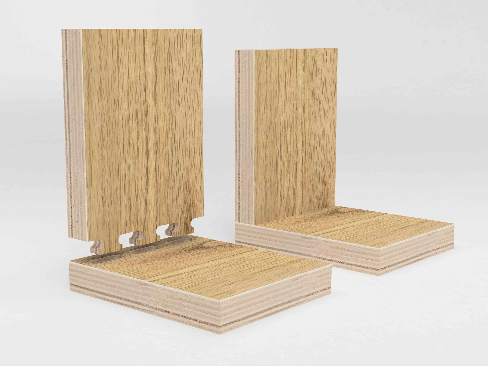
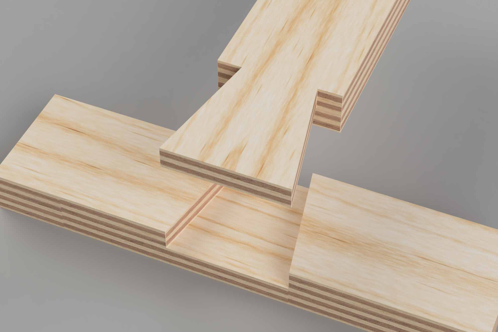
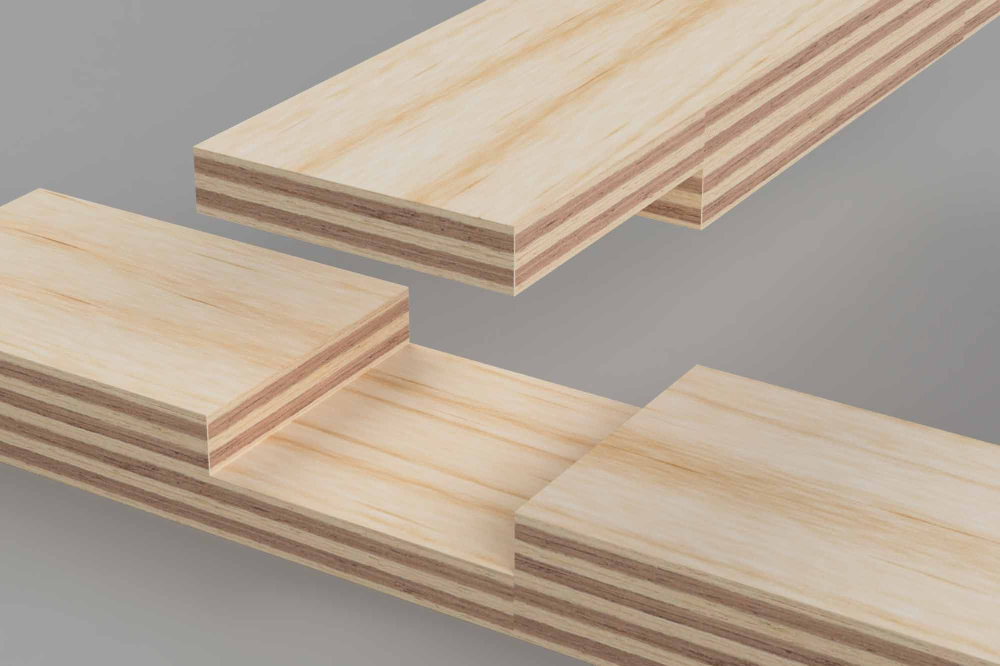

Although, a laser cutter can only etch on to the surface of the material or cut all the way through, a CNC router can make non-through cuts and 3 dimensional cuts. It can round off the top and make three-dimensional sculptural forms by cutting away parts of the material.

## Pocket Cuts

A pocket cut is a cut that does not go all the way through the base material. Pocket cuts are not possible with a laser cutter. Pocket cuts can create joints to secure different parts of projects. This is a convenient way to make tabs on one part slot into the "pocket" of another supporting piece. Pocket cuts can hide the construction and undesirable shape of joint tabs that we don't want to see in the final design.

## Dado Cut

A dado cut is a long pocket cut slot that fits another piece of wood.

## CNC Joints

Most traditional woodworking joints can be adapted to work with a CNC. The high precision of a CNC can make joints that are not possible or practical with traditional woodworking techniques. This precision comes with the need to design joints that work when cutting only on one side. Two sided cutting is possible with a 3 axis CNC, but it requires a jig and planning. This [Google Image Search](https://google.com/search?q=cnc+joints&tbm=isch) shows a great variety of [CNC joints](https://google.com/search?q=cnc+joints&tbm=isch) to try in your project.

Additional joints that can be made by CNC machines are:

- [lap joint](https://youtu.be/O5IR9pr9vdo?t=89)
- [tongue and groove joint](https://youtu.be/BA_oj65hh74)
- [mitered lap joint](https://youtu.be/O5IR9pr9vdo?t=218)
- [Dovetail Joint](https://youtu.be/O5IR9pr9vdo?t=470)
- [Curvy Dovetail for CNC](https://youtu.be/O5IR9pr9vdo?t=690)
- stair step mitered joints
- [t-lap joint](https://youtu.be/O5IR9pr9vdo?t=340)
- mortise and tenon joints
- [blind mortise and tenon joint](https://youtu.be/Pr7YYYhvJxY)
- box joint
- blind box joint
- keyed mortise and tenon joint

<figure>

<figcaption>

Blind Mortise Tenon Joint

</figcaption>
</figure>

<figure>

<figcaption>

Tongue and Groove Joint

</figcaption>
</figure>

<figure>

<figcaption>

Dovetail Joint

</figcaption>
</figure>

<figure>

<figcaption>

Lap Joint

</figcaption>
</figure>

<figure>

<figcaption>

T-Lap Joint

</figcaption>
</figure>

## Examples of CNC Joints in Fusion 360

### Tongue and Groove CNC Joints

<iframe class="youTubeIframe"  src="https://www.youtube.com/embed/BA_oj65hh74?rel=0" width="560" height="315" frameborder="0" allowfullscreen="allowfullscreen"></iframe>

### Blind Mortise and Tenon CNC Joints

<iframe class="youTubeIframe"  src="https://www.youtube.com/embed/Pr7YYYhvJxY?rel=0" width="560" height="315" frameborder="0" allowfullscreen="allowfullscreen"></iframe>

### Simple CNC Joints

<iframe class="youTubeIframe"  src="https://www.youtube.com/embed/O5IR9pr9vdo?rel=0" width="560" height="315" frameborder="0" allowfullscreen="allowfullscreen"></iframe>

