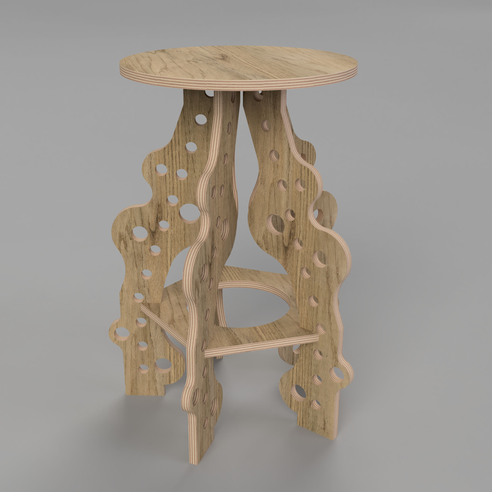

## Assignment Deliverables

- 7 thumbnail sketches each showing a different idea
- 3 revised sketches
- larger final sketch
- Label you files YYYYMMDD Lastname Firstname CNC Ideation Sketches

## Assignment Overview

In this project we will design a stool, chair, end table or another large supportive device with an intended purpose such as perfectly holding a PS5. If your desired design is not listed, such as a piggy bank holder, that is ok. Your designs and concepts must result in semi complex supportive devices made of interlocking pieces of CNC cut plywood. After that the content or design is up to you.

](./2021-cnc-stool-example.jpg)

### Design Requirements

- Support the weight of a person or the intended item
- Have considered aesthetics
- Use 1/2" or 3/4" plywood
- Use more than 1 type of joint
- Have a considered and designed top surface, this could have engraving or decorative joints
- Be a relatively standard size
- Use all of the space of a half sheet of plywood or all of the space of a full sheet of plywood

## Process

1.  Make a minimum of 7 thumbnail sketches of ideas. Keep the ideas varied and different. Push yourself to be inspired by designs you researched but to come up with your own ideas and concepts.
2.  After making initial sketches, choose 3 ideas and make larger refined sketches. You may need to draw these from different views and show details of how you plan to join the pieces together.
3.  Choose your favorite idea and draw a larger final sketch. This could be a third angle projection drawn by hand or with a t-square that includes the Front, Top and Right views. It could also be a detailed rendered image that is descriptive of its form and construction. Put dimensions on you drawing.
4.  Scan or photograph your sketches. If using a scanner, make sure that the DPI is high enough and that the exposure on the scanner captures enough detail, especially if you have light sketches. If you are photographing your sketches, ensure that there is even lighting, no shadows. Make sure that there are no extra items in the photo. Make sure there are no distortions or trapezoid shapes from taking the photo at an angle. Keep the camera square to the paper.

## Grading Rubric

| Assessment           | Weight    |
| -------------------- | --------- |
| 7 thumbnails         | 25 points |
| 3 revised sketches   | 25 points |
| Larger Final Sketch  | 25 points |
| Sketch Documentation | 15 points |
| File Management      | 10 points |

