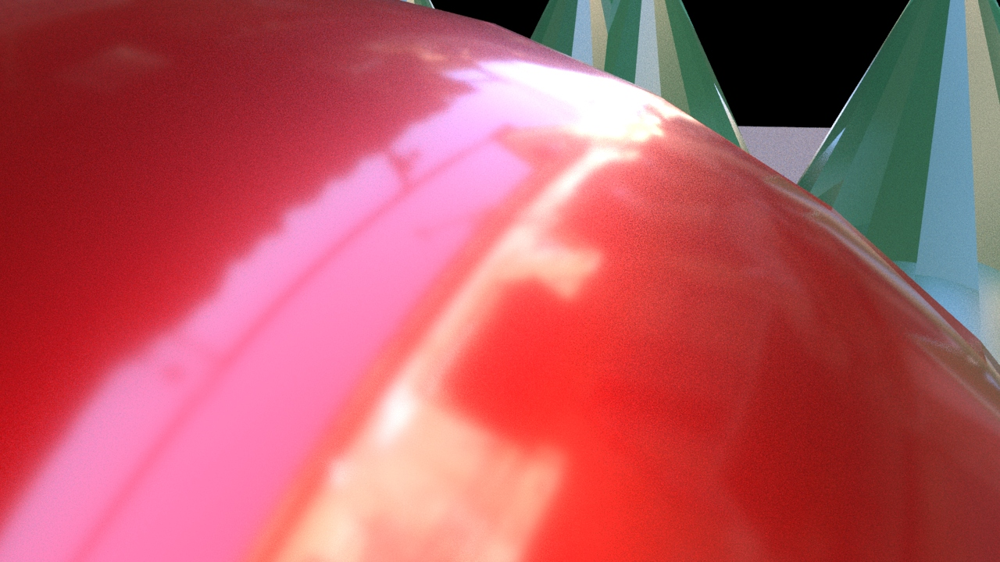

Think about movies, cartoons or video games that you have experienced? Is everything shown in one static camera shot? Of course not. That would be boring and uninteresting. The same thing holds true for your animation projects. Use multiple cameras and camera angles to break up your story and show different parts with more detail. Use wide establishing shots to set the scene. Your audience will piece all the shots together in their mind and create a convincing 3D world to experience your story in.

## Shot Types / Camera Angles

- **Long Shot / Establishing Shot** - Sets up the scene and gives the viewer a visual understanding of the environment around the subject
- **Full Shot** - All of the subject is visible in the frame but is closer than a long shot
- **Medium Shot** - the bottom of the frame is barely above or barely below the waist of the subject and the entire head and torso is in the shot
- **Close Up** - Usually cuts off the top of the head of the subject and shows just a bit of the shoulder line
- **Extreme Close Up** - Crops in to frame the subject's chin and forehead

### Examples of Shot Types

<figure>

<figcaption>

Establishing Shot

</figcaption>
</figure>

<figure>

<figcaption>

Full Shot

</figcaption>
</figure>

<figure>

<figcaption>

Medium Shot

</figcaption>
</figure>

<figure>

<figcaption>

Close Up

</figcaption>
</figure>

<figure>

<figcaption>

Extreme Close Up

</figcaption>
</figure>

## How Does This Work for Something Simple Like a Ball?

Using a simple shape like a ball as the subject of a composition does not change the shot types. There are still establishing shots and close ups. By changing the angle and distance of the camera the ball takes on new feelings and meaning.

<figure>

<figcaption>

Establishing Shot

</figcaption>
</figure>

<figure>

<figcaption>

Full Shot

</figcaption>
</figure>

<figure>

<figcaption>

Medium Shot

</figcaption>
</figure>

<figure>

<figcaption>

Close Up

</figcaption>
</figure>

<figure>

<figcaption>

Extreme Close Up

</figcaption>
</figure>

### Camera Angles

Think of the shot types above as changing the size of the frame or changing the size of the available composition. In addition to shot types, you can also change the angle of the camera or the placement of the camera to alter the viewer's perspective. The shot type and camera angle can be changed independently

Common camera angles include aerial shots, bird's eye perspective and low angle shots also know as worm's eye view.

Your animation must use a minimum of 3 different shot types. It is a good rule of thumb to change the shot type and the angle of the camera for each scene, camera cut or panel of your storyboards. This keeps the viewer engaged with your visuals.

## Rule of Thirds

This is a compositional rule of thumb. Divide the composition into 3 equal vertical sections and 3 equal horizontal sections. These sections are made by drawing 2 horizontal lines and 2 vertical lines each spaced evenly apart. The concept of the rule of thirds says that a composition is more dynamic and interesting if the main subject matter is placed on these composition lines or at the intersection of these lines. A brief survey of popular media will show this concept in wide use.

Use the rule of thirds when composing your shots and sequences.

<figure>

<figcaption>

Left image is original, right image is cropped with rule of thirds. [Link to Wikimedia Commons](https://commons.wikimedia.org/wiki/File:RuleOfThirds-SideBySide.gif)

</figcaption>
</figure>
