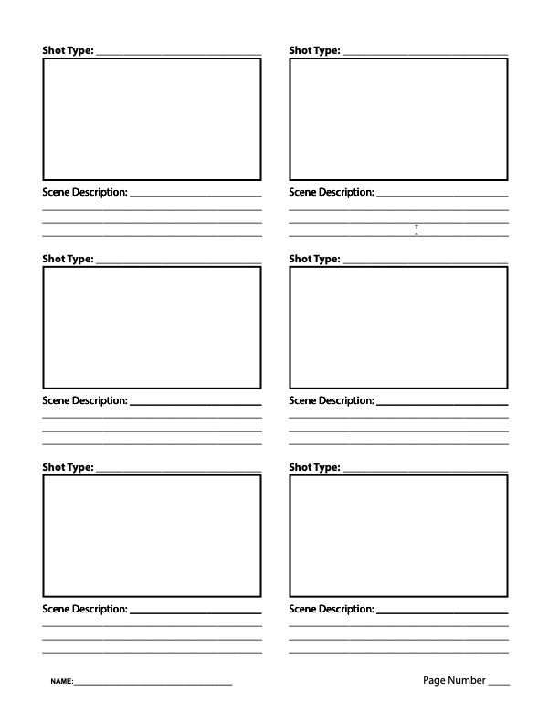
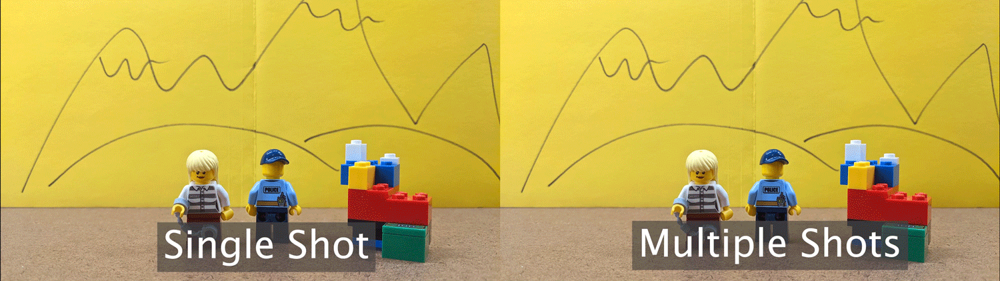
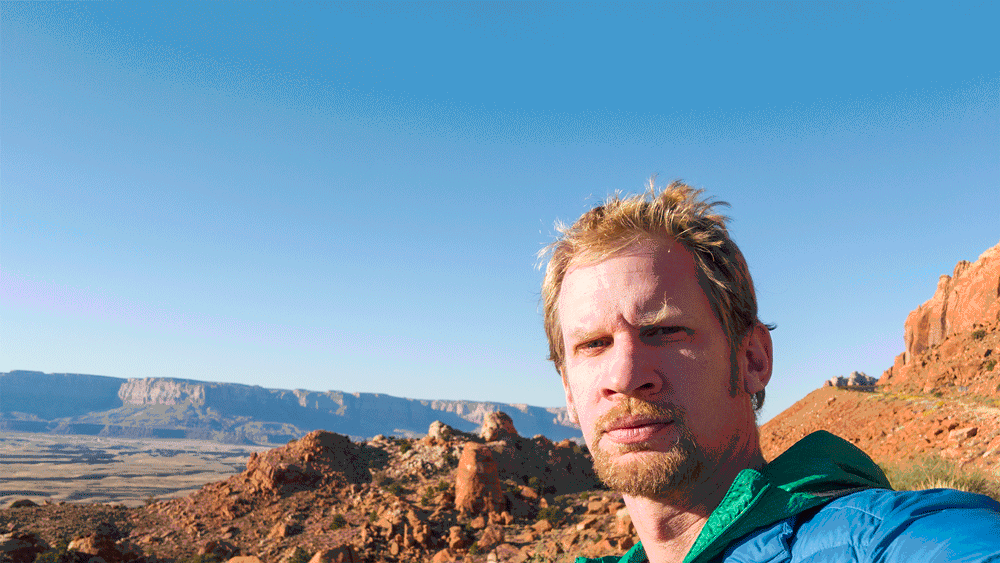
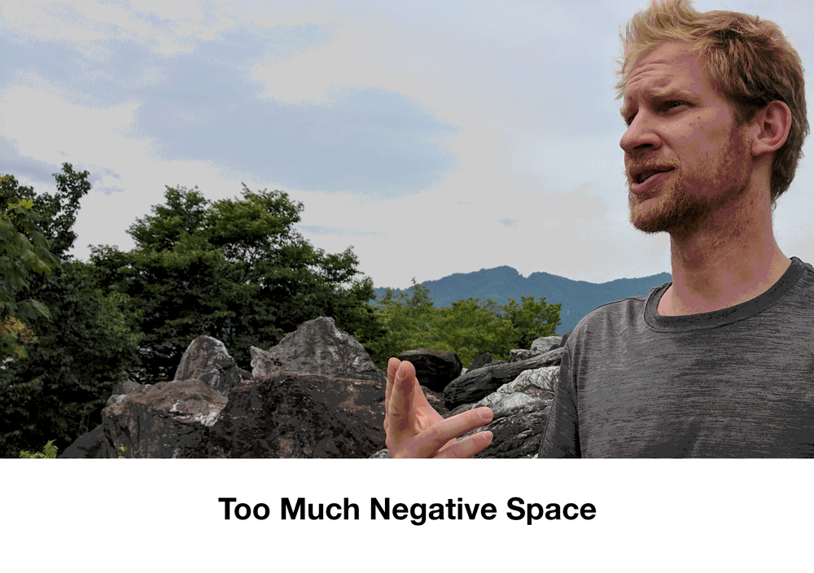
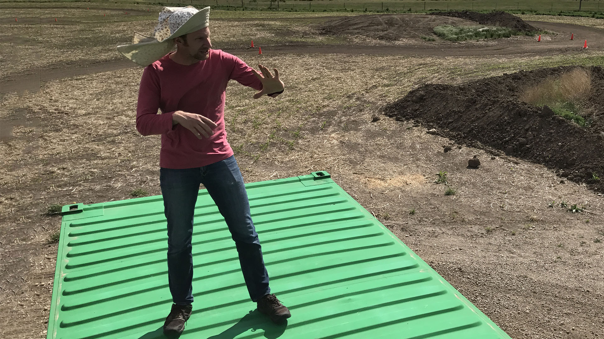

# Lights! Camera! You Have Magical Powers

### Narrative and Story Telling with the Moving Image

# What am I Turning In Next Week?

1.  Story Spine
2.  Storyboards drawn and scanned in

#### Google Drive Upload Folder 

[https://drive.google.com/drive/folders/1Ws6W7Zjhw7mT3V4ipYR0NrXj7qwSEttK](https://drive.google.com/drive/folders/1Ws6W7Zjhw7mT3V4ipYR0NrXj7qwSEttK)

---

# What am I Turning In in Two Weeks?

1.  Folder of video clips of all scenes shot

#### Google Drive Upload Folder

[https://drive.google.com/drive/folders/1QPB-mb0T3RJuLjpMzw6-E7UoDFhYHzjF](https://drive.google.com/drive/folders/1QPB-mb0T3RJuLjpMzw6-E7UoDFhYHzjF)

---

# What am I Turning In Last Day of Class?

1.  Edited and Exported mp4 video of Magical Powers Video with Sound and Music

#### Google Drive Upload Folder

[https://drive.google.com/drive/folders/19zv4dKoMfoGdqwC5-uMM9TETLgPoH-zQ](https://drive.google.com/drive/folders/19zv4dKoMfoGdqwC5-uMM9TETLgPoH-zQ)

## Make a 30 Seconds to One-Minute Movie:

- Subject: _Magical Powers_
- Show it, do not say it. No words or dialogue allowed.
- This should be an actual story with a beginning, middle and end.

## Overview

You will use a 3-part narrative structure as the foundation of the story. In the first step you will identify the main theme and motivations of your character(s). Then you will write an outline of a script using the concept of a “story spine” developed by Kenn Adams.  Once you have revised your story spine then you will develop the three acts and write a complete script.  When the script is complete you will draw storyboards before beginning to shoot footage.

Even though the final movie is only 30 seconds to 1 minute long, you will need to shoot about 3 - 6 minutes of footage. Shoot every scene 2-3 times as you planned it in your storyboards. Then while shooting experiment with spontaneous and improvised variations. You are welcome to have friends shoot up to be in the film too. You are welcome to bring in extra lighting. When in doubt about lighting, shoot outdoors during the daytime for guaranteed good lighting.

You can and should check out cameras from the Checkout on the third floor. You can also use your phone in good lighting. Make sure to shoot in Landscape mode at a minimum of 1920x1080 30fps. 60fps or 4k video is also ok but make sure the lighting is good. Remember if using a phone to hold it horizontal, not vertical.

## Requirements

Must be a ~30-60 second long video composed in Adobe Premiere using video clips shot by you. Should have a beginning middle and end.

- Use camera and / or editing tricks to show magical powers
- Have a structure, does not have to be narrative but must have structure.
- Include sounds created by you.
- Include music from public domain or created by you.
- Have multiple scenes.
- Have text as credits or intro.
- Turn in an H.264 mp4 video file

## Logistics

- Will you need improvised costumes? Hats? What about props for magical items?
- How many people? Due to current social distancing it may only be possible to take shots yourself using a tripod. YOu can get a tripod from the checkout. You can also use your laser cut cell phone stand to prop up your cell phone to take video. You will likely need to modify it to keep the camera square.
- Scout locations? Where are close, interesting settings that fit with your story?
- Lighting? Have lots of light. Shooting outdoors in the daytime is always a good bet.

## Size/Format

We’ll edit video in Adobe Premiere and prepare sound effects and music. You may use other software as long as you take the initiative to learn it and solve problems independently. You will export a 30-60 second mp4 encoded in H.264 and upload it to Google Drive as instructed.

## Technical Reminders

Make a folder for your video project and clearley label it.

Put all your files, including your sound files and video footage, into this folder before importing any of them into Premiere Pro. If you want to rename your clips, rename them before importing them into Premiere.

Once you have imported your files into Premiere, do not move the original files or rename the files or Premiere won’t know where to find them. You will see a warning text instead of your content.

# Potential Magical Powers

## Run super fast

Film yourself running. Then film the scene without you running. Put the empty scene below on the timeline. Then put your running scene on top. Cut out the sequence right as you start running and right as you end running. This effect does not require a green screen. The example video uses a static shot but you could have a cut in between the running to a more dramatic angle of the character to heighten the action.

<iframe class="youTubeIframe" title="YouTube video player" src="https://www.youtube.com/embed/TDhRkUcCHZc?rel=0" width="560" height="315" frameborder="0" allow="accelerometer; autoplay; clipboard-write; encrypted-media; gyroscope; picture-in-picture; web-share" referrerpolicy="strict-origin-when-cross-origin" allowfullscreen></iframe>

## Teleportation to Places or Through Objects

Shoot your self jumping in the air, snapping your fingers or some other gesture that symbolized teleportation powers. Then move to a new location. Film the same gesture that you used to teleport in the new location. In the video editor cut the first clip right after the gesture starts and delete the ending portion of the clip. In the second clip cut right as the gesture is ending and delete the beginning of that clip. Then put the two clips together. You might have to adjust the cuts and timing. Having and "exertion or effort" gesture in the first clip and a "relief or accomplishment" gesture in the second clip will help sell the effect to the audience.

You can teleport through walls. You can teleport form the third floor to the first floor. You can teleport through store front windows. You can teleport through a car door. The possibilities are endless. The key is to use a tripod and have precice cuts and quick cutsin your editing.

<iframe class="youTubeIframe" title="YouTube video player" src="https://www.youtube.com/embed/C4lfW2s7U7c?rel=0" width="560" height="315" frameborder="0" allow="accelerometer; autoplay; clipboard-write; encrypted-media; gyroscope; picture-in-picture; web-share" referrerpolicy="strict-origin-when-cross-origin" allowfullscreen></iframe>

## Use a Magic Wand to Make Objects Appear or Disappear

Use a tripod to shoot this shot. To make objects appear, start filming with nothing in the scene except you and your wand. Gesture with your wand to make the object(s) appear, React to them appearing. Don't move the camera. Place the objects in the scene. Make sure they do not overlap with you and your wand. Shoot the same length scene of the objects. In the video editor, put the objects clip on top of the magic wand clip. Then make a simple mask around the object. You can feather this mask. Then cut the objects clip and delete the first portion of it. Make the cut right when the objects should appear. Cutting to a reaction shot of a witness will help sell the effect.

<iframe class="youTubeIframe" title="YouTube video player" src="https://www.youtube.com/embed/hKK5fOqIFsE?rel=0" width="560" height="315" frameborder="0" allow="accelerometer; autoplay; clipboard-write; encrypted-media; gyroscope; picture-in-picture; web-share" referrerpolicy="strict-origin-when-cross-origin" allowfullscreen></iframe>

## Super Hero Fly

With creative and well timed editing, good shot framing and a little imagination, anyone can fly. For the take off, begin with a medium shot that shows your preparation to fly. Perhaps you bring one fist close to your chest, extend the other arm and begin to squat down. Then cut to a full shot from a slightly different angle. Squat down and jump as high as you can straight up. Then cut to a show of you with the sky behind you and arms out stretched. For landing you can use the remaining portion of the jump clip. To add special effects to this, make a hold frame at the end of the jump. Then cut out your figure. Keyframe it flying up. Add some motion blur and adjust the key frames to show acceleration.

<iframe class="youTubeIframe" title="YouTube video player" src="https://www.youtube.com/embed/Ow3H6kZ8lR0?rel=0" width="560" height="315" frameborder="0" allow="accelerometer; autoplay; clipboard-write; encrypted-media; gyroscope; picture-in-picture; web-share" referrerpolicy="strict-origin-when-cross-origin" allowfullscreen></iframe>

## Fire Fingers

Conjure up spells and the magic of the flame. You can use the provided [fire clip](https://drive.google.com/file/d/1fvw5g28W5_8TrjuCFES9pSiF1B-0BI_H/view) or make your own in Maya or After Effects. Maya's Bifrost has a demo torch that you could edit and then render on a black background. Place the fire video layer above the video of the character and then use the screen blending mode. This maked the black parts transparent. Then keyframe the position of the flame to follow your finger or rotate it to shoot fire balls. A better effect for moving flames can be animated in After Effects using particles. You can export a clip from Premiere to After Effects using Adobe's dynamic links.

<iframe class="youTubeIframe" title="YouTube video player" src="https://www.youtube.com/embed/C8W0OD6X4UM?rel=0" width="560" height="315" frameborder="0" allow="accelerometer; autoplay; clipboard-write; encrypted-media; gyroscope; picture-in-picture; web-share" referrerpolicy="strict-origin-when-cross-origin" allowfullscreen></iframe>

## Meet Your Double or Triple or Quadruple

Need extra help cleaning your room? Don't want to go to class? Have to many projects to complete? Wouldn't it be great if there was another you? Or ten more of you? Using simple video masking, a tripod and clever compositions you can duplicate yourself as many times as you want in a video.

For this effect to work without a green screen it is esential that your shots are filmed on a steady tripod and that you capture some empty frames for a blank "plate" to use as your background. Also works best if nothing is moving in the background.

<iframe class="youTubeIframe" title="YouTube video player" src="https://www.youtube.com/embed/PT1V1t61oT0?rel=0" width="560" height="315" frameborder="0" allow="accelerometer; autoplay; clipboard-write; encrypted-media; gyroscope; picture-in-picture; web-share" referrerpolicy="strict-origin-when-cross-origin" allowfullscreen></iframe>

## Walking on Walls

We assume the the camera is set right side up. Turn the camera to the side on your tripod. Pretend that the ground is the wall. Use a rope like old super hero tv shows to make it look like you are climbing. Keep things that would give away the effect out of the shot. You can turn over tables, chairs, couches, desks and other objects to make the scene seem more real. Creative framing and changing the shot to focus on the exertion on your face as you climb the wall or building will help sell the effect. Cutting to "reaction" shots of other people in the room will sell the effect as well.

## Levitation

A stop motion technique can work well for levitation. Using a tripod is best but is not necessary. With a partner or a remote control, take multiple shots that you will import as an image sequence into the video editor. For each shot jump and take the photo while you are in the air. Then move forward a bit. Jump again and take a photo in the air. Continue this process until you have levitated long enough. It is a bit cheezy but can be really fun looking. Make sure to check that you are taking photos while in the air. You can also combine stop motion camera movement. Each shot rotate the camera on the tripod just a little bit. It will look like the camera is panning when the shots are stitched together.

## Time Travel

Transporting a physical object from one moment in time to another. How can you show that time has elapsed beyond showing a clock? What type of visual and / or sound will indicate that time travel is occuring? This effect can also include teleportation to avoid walls and other objects that move in time.

## Snakes

Human actors in the prone position moving through space with ease. Lay on the ground in the frame of your shot. Take a single still image. Move forward a bit. Take another still image. Repeat the process until you have traveld to your destination. You can snake up and down stairs, snake over tables, snake around obstacles. Import all of the images as a sequence. You can use the rate stretch tool to adjust the timing of the clip.

## Make Things Huge! or Teeny Tiny!

Using Forced Perspective, you can make something appear to giant or tiny compared to another thing in the scene. Make a very tiny aperture so you have everything in focus in the foreground and background. Remember the aperture is the hole that the light shines through the camera. A large "F-Stop" number means a tiny aperture. Since the aperture will be small you'll need a lot of light to properly expose the image so this will work best outside in the daylight. Position the camera either low to the ground or high up or at your desired position. Put the larger object or person in the foreground and then position the other object or person farther in the background. Make sure if there are two people in the scene that they don't look at each other but look at where each other "should be" based on the perspective. You can do this by looking through the monitor or viewport of the camera. This effect can be combined with some masking and cutting for interesting effects such as jumping into a box or into someone's hands.

# Narrative Arc

## What is a Story Spine?

[Link to Blank Fillable Story Spine Sheet](https://docs.google.com/document/d/1vvbegQPV7Z1sd126H0XWCh8iD4bNExQ4/edit?usp=sharing&ouid=103106537131131071355&rtpof=true&sd=true)

Spend a few minutes to write a brief Story Spine that follows a narrative arc.

In part 1 explain the setting of the story. Where is it? What is seen? What is happening? What is the subject? Perhaps an origin story about the powers?

In part 2 introduce a problem, conflict or goal. What happens because of the magical powers? Are the powers a burden for the character to overcome?

In part 3 resolve part 2\. What is the result of the actions of the character harnesing their powers to overcome?

Writing a Story Spine and Storyboards will give you an outline and direction as you produce your materials. Rather than working with everything possible in the universe, the Story Spine and Story Boards will narrow the scope and set limitations that you can work creatively within.

## What is a Story Arc?

A traditional story arc contains an introduction of the story, plot, characters and setting. This is called the Exposition. This leads into the Rising Action when the character is faced with a problem. The character then confronts obstacles along the way toward the Climax of the story, a moment of crisis that directs the rest of the plot. This is followed by Falling Action as the plot moves from climax to the ending. Finally a Resolution occurs and stability returns to the story.

- **Exposition** – intro of plot, characters and setting
- **Rising Action** – multiple incidents occur providing suspense and tension
- **Climax** – moment of crisis that directs the rest of the plot
- **Falling Action** – plot moves from climax to ending
- **Resolution** – final results of plot - stability returns

## Story Spine Structure

A story spine is a concept created by Kenn Adams in the book "The Art of Spontaneous Theater.” It is a simple outline with prompts that assist a storyteller develop a structure for their narrative. We will use this 9 part structure to develop our story to have 3 simple acts.

### 3 Act Narrative Story Spine Structure

You will use the story spine as the foundation for your 3 act narrative structure.

**Act 1 – The first 3 parts of the story spine**

This act sets the scene, introduces characters, shows how the world works. The act leads up to having have the rising action of "But, one day..."

1.  Once upon a time...
2.  Every day...
3.  But, one day...

**Act 2 - The Journey or the "Because of that..." Sequences**

Show the journey of the character and how they overcome obstacles that they encounter. Often includes a low point of the character's journey. Hardship comes to the character as they experience a low point. A series of challenges is presented that lead to the climax or a fork in the road where a decision must be made. After this diction is made that there is often no going back.

1.  Because of that...
2.  Because of that...
3.  Because of that...

**Act 3 - Heading toward the climax and resolution**

The characters must make a choice to overcome the obstacles of Act 2\. This the “Until, finally…” climatic moment of the story arc. This moves the story toward conclusion and resolution. The character demonstrates learning and growth. This often demonstrates the moral of the story.

1.  Until, finally...
2.  And, ever since then...
3.  And the moral of the story is ....

# Storyboards

[Link to Printable Storyboard Sheets](https://drive.google.com/file/d/1fWi_5xjUC9eDOkhaZ8smU050QQmqBhUY/view?usp=sharing) You can print these for free in black and white in the classroom or in the library.

1.  Begin by writing down many different magical powers you could have or magical items that you could find. Do not limit yourself and be specific.
2.  Review your list and select a few that may be promising.
3.  Develop a story spine by filling out the 9 prompts in a Google Doc.  Revise the story spine. Each part of the story spine should only be a sentence or two.
4.  Once the 3 Acts are developed and written out using the story spine you need to decide how you will show the viewer the story.  Remember there is no dialogue in the story. You must rely on visuals to tell your narrative.
5.  Storyboard every new shot. Sometimes you may need several storyboards per shot if the composition changes over time. **Storyboards should be full panels with captions describing the scene.**

Scan your storyboards as a PDF. Label the PDF YYYYMMDD Lastname Firstname 3D Animation Storyboards.pdf. Upload to the Google Drive Folder.

)

# Shoot all of Your Footage

## Each Shot Should Change to Keep The Video Interesting

In this GIF below, the video on the left is a single shot for the duration. On the right the video uses multiple shots. Which one is easier to watch? Which is more interesting? Which one is more boring?

Make sure that each scene the distance of your shot changes as well as the angle by at least 45 degrees. This rule of thumb will keep your video more interesting. You can bounce back and forth between two different shots over an over but each cut should be a new distance from the camera and a new angle than the previous shot.

## Use a Good Camera and Lighting

You can and should check out cameras from the Checkout on the third floor. You can also use your phone in good lighting. Make sure to shoot in landscape mode at a minimum of 1920x1080 30fps. 60fps or 4k video is also ok but make sure the lighting is good. Remember if using a phone to hold it horizontal, not vertical.

## Map Out all of Your Shots and Shoot Each Shot at least Twice

Use your storyboards as a checklist for your shots. They can also help others understand what yo uare trying to frame in your shots. Shoot every panel of your storyboard, making sure that your change the distance and angle of the camera for each shot.

You do not need to shoot all of your scenes in order. If you have an angle that is used in multiple scenes you can put the camera on a tripod and shoot all of those scenes and then move the camera to shoot different scenes. A good example is a dialogue scene. If the camera switches back and forth between characters, then you could shoot all of one character, move the camera and then shoot all of the other character.

You should shoot all of your shots at least twice. Shoot it from one angle and then change it up or even shoot it again at the same angle. This doesn't take a lot of time and you will thank yourself when at least one of the shots is useable and you don't have to go capture more footage.

## Copy All Footage to Computer and Backup Immediately

After your capture your footage, copy it onto a folder on your computer. Then immediately backup that folder to Google Drive or other cloud service. You don't want all your hard work to be gone because of accidentally deleted files.

## Common Video Framing Mistakes

### Too Much Head Room

On medium shots and close ups the top of the character's head should be at the top of the frame. Often shots are taken with too much head room and this is wasted space on screen that could be used to show and tell your story.

Make sure that the top of the head is jsut cut off or just within the frame. The camera's viewfinder may or may not be accurate, make sure you check.

### Centered Shots / Not Using Rule of Thirds Correctly

Of course you can have centered shots. Of course you can have shots with "too much" negative space. Of course you can have shots that use the rule of thirds on the "wrong" side. These should be the exceptions to the rule and used for creative intent. Unless you have a reason to deviate from good composition rules such as the rule of thirds, don't.

### Light Source Behind the Subject

Having a silhouetted subject or just the reflected light of a subject can be a wise creative choice but most of the time it just hides the detail that you are trying to show. It is a good idea to keep the main illuminating source in front of the subject that you are framing in your shot.

### Subject Too Small in Full Shot

When framing a full shot, it is easy to make your subject too small. This is fine for establishing shots where the environment is the main character but for full shots the subject should fill the frame from top to bottom.

In the first shot, the character is too small and not the focal point. In the second image the character fills the frame from head to toe.

# Edit Your Video

## Organize and Setup Your Premiere Pro Project Folder

Make a folder for your video project and clearley label it.

Put all your files, including your sound files and video footage, into this folder before importing any of them into Premiere Pro. If you want to rename your clips, rename them before importing them into Premiere.

Once you have imported your files into Premiere, do not move the original files or rename the files or Premiere won’t know where to find them. You will see a warning text instead of your content.

## Make Edits and Cut Out as Much as Possible

You can always put footage back in. Try to cut out as much of the footage as possible. If you think you need more of the sceen, think if there is a better way to tell the story. Use the Ripple Edit tool to quickly trim down clips. Even a few frames less can really make a difference in pacing.

Cut on action. This means that you should cut as an action is still occuring rather than after it stops. This helps keep the flow of the video going.

Consider using B-Roll, footage of the environment to set the scene. Audio can happen even when the subject is off camera. Consider using a montage to show a sequence of events.

After you are done editing your footage, make sure to use Lumetri Color to color correct your shots to make them look cohesive. After all the shots have good white balance and exposure, you can color grade the shots to establish a mood.

## Add Music and Sound for your Magical Powers

In addition to rich visuals, adding music and sound to your video will make it come alive. This video shows [how to add sound effects](https://youtu.be/Ds2QJryBf84) to your video. We will your Creative Commons Licensed music and sound effects to make the magical objects and magical super powers seem more real. We will also create our own sound effects. All CC licensed music and sounds must have proper written attribution in the credits at the end.

- Adobe Sound Effects: [https://www.adobe.com/products/audition/offers/AdobeAuditionDLCSFX.html](https://www.adobe.com/products/audition/offers/AdobeAuditionDLCSFX.html)
- FTP of Adobe Music Loops and Beds (Must use FTP to download) - [ftp://ftp.adobe.com/pub/adobe/audition/Loops/](ftp://ftp.adobe.com/pub/adobe/audition/Loops/)
- Kevin McLeod's Music: [https://incompetech.com/music/royalty-free/music.html](https://incompetech.com/music/royalty-free/music.html) Remember to [credit](https://incompetech.com/music/royalty-free/faq.html) Kevin's music exactly as he requests.

<iframe class="youTubeIframe" title="YouTube video player" src="https://www.youtube.com/embed/Ds2QJryBf84?rel=0" width="560" height="315" frameborder="0" allow="accelerometer; autoplay; clipboard-write; encrypted-media; gyroscope; picture-in-picture; web-share" referrerpolicy="strict-origin-when-cross-origin" allowfullscreen></iframe>

## Export Your Video as an H.264 mp4

After you complete all of your edits, go to File > Export > Media ... (If nothing happens, make sure that the timeline was selected and the blue box was around it before clicking on File.) Also, make sure you do not have any in or out points set on your timeline. This can make it so not all of your video will export.

Chose H.264 as the format and match the source with a high bitrate. Click on the blue file name to label your video and to choose where to save it. After it exports, make sure you watch it all the way through to make sure you exported the whole video, your sound effects work, and there is not a long black sectio nat the end of the video causeed by a stray clip on the time line. Then upload your video to the Google Drive Folder.

# Video Tutorials

## Ultra Key Premiere Pro

<iframe class="youTubeIframe" title="YouTube video player" src="https://www.youtube.com/embed/gkZMbMUo-f0?rel=0" width="560" height="315" frameborder="0" allow="accelerometer; autoplay; clipboard-write; encrypted-media; gyroscope; picture-in-picture; web-share" referrerpolicy="strict-origin-when-cross-origin" allowfullscreen></iframe>

## Set Up Premiere Video Editing Project

<iframe class="youTubeIframe" title="YouTube video player" src="https://www.youtube.com/embed/zf8IDYvvUkY?rel=0" width="560" height="315" frameborder="0" allow="accelerometer; autoplay; clipboard-write; encrypted-media; gyroscope; picture-in-picture; web-share" referrerpolicy="strict-origin-when-cross-origin" allowfullscreen></iframe>

## Run Fast Effect

<iframe class="youTubeIframe" title="YouTube video player" src="https://www.youtube.com/embed/TDhRkUcCHZc?rel=0" width="560" height="315" frameborder="0" allow="accelerometer; autoplay; clipboard-write; encrypted-media; gyroscope; picture-in-picture; web-share" referrerpolicy="strict-origin-when-cross-origin" allowfullscreen></iframe>

## Fire Finger Effect

<iframe class="youTubeIframe" title="YouTube video player" src="https://www.youtube.com/embed/C8W0OD6X4UM?rel=0" width="560" height="315" frameborder="0" allow="accelerometer; autoplay; clipboard-write; encrypted-media; gyroscope; picture-in-picture; web-share" referrerpolicy="strict-origin-when-cross-origin" allowfullscreen></iframe>

## Video Double Effect

<iframe class="youTubeIframe" title="YouTube video player" src="https://www.youtube.com/embed/PT1V1t61oT0?rel=0" width="560" height="315" frameborder="0" allow="accelerometer; autoplay; clipboard-write; encrypted-media; gyroscope; picture-in-picture; web-share" referrerpolicy="strict-origin-when-cross-origin" allowfullscreen></iframe>

## Teleport Effect

<iframe class="youTubeIframe" title="YouTube video player" src="https://www.youtube.com/embed/C4lfW2s7U7c?rel=0" width="560" height="315" frameborder="0" allow="accelerometer; autoplay; clipboard-write; encrypted-media; gyroscope; picture-in-picture; web-share" referrerpolicy="strict-origin-when-cross-origin" allowfullscreen></iframe>

## Flying Effect

<iframe class="youTubeIframe" title="YouTube video player" src="https://www.youtube.com/embed/Ow3H6kZ8lR0?rel=0" width="560" height="315" frameborder="0" allow="accelerometer; autoplay; clipboard-write; encrypted-media; gyroscope; picture-in-picture; web-share" referrerpolicy="strict-origin-when-cross-origin" allowfullscreen></iframe>

## Magic Wand Effect

<iframe class="youTubeIframe" title="YouTube video player" src="https://www.youtube.com/embed/hKK5fOqIFsE?rel=0" width="560" height="315" frameborder="0" allow="accelerometer; autoplay; clipboard-write; encrypted-media; gyroscope; picture-in-picture; web-share" referrerpolicy="strict-origin-when-cross-origin" allowfullscreen></iframe>

## After Effects Tutorials

## Roto Brush Effect

<iframe class="youTubeIframe" title="YouTube video player" src="https://www.youtube.com/embed/ab0FEbKneks?rel=0" width="560" height="315" frameborder="0" allow="accelerometer; autoplay; clipboard-write; encrypted-media; gyroscope; picture-in-picture; web-share" referrerpolicy="strict-origin-when-cross-origin" allowfullscreen></iframe>

## Fix Bad Green Screen Footage

<iframe class="youTubeIframe" title="YouTube video player" src="https://www.youtube.com/embed/hQbYGQ97aMQ?rel=0" width="560" height="315" frameborder="0" allow="accelerometer; autoplay; clipboard-write; encrypted-media; gyroscope; picture-in-picture; web-share" referrerpolicy="strict-origin-when-cross-origin" allowfullscreen></iframe>

## Fast Green Screen - After Effects

<iframe class="youTubeIframe" title="YouTube video player" src="https://www.youtube.com/embed/2b796PpS9y8?rel=0" width="560" height="315" frameborder="0" allow="accelerometer; autoplay; clipboard-write; encrypted-media; gyroscope; picture-in-picture; web-share" referrerpolicy="strict-origin-when-cross-origin" allowfullscreen></iframe>

## Background Light Wrap - After Effects

<iframe class="youTubeIframe" title="YouTube video player" src="https://www.youtube.com/embed/P_gVhMT1doM?rel=0" width="560" height="315" frameborder="0" allow="accelerometer; autoplay; clipboard-write; encrypted-media; gyroscope; picture-in-picture; web-share" referrerpolicy="strict-origin-when-cross-origin" allowfullscreen></iframe>

# Grading Rubric

| Assessment                                   | Weight    |
| -------------------------------------------- | --------- |
| Multiple Scenes and Good Compositions        | 50 points |
| Editing to Show Magical Powers               | 50 Points |
| Narrative Structure                          | 25 points |
| Lighting, Camera Focus, Tripod Use           | 25 points |
| Use Sound Effects and Music to Enhance Video | 25 points |
| Text Credits                                 | 25 points |
