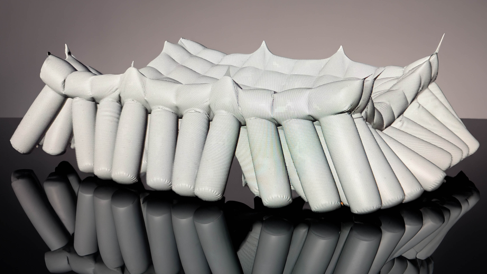

## Course Introduction

This course is intended for first year college students studying art and [design](../../../../art-faq/design.md).

The course introduces basic technical sketching, third angle projections, 3D modeling in Fusion 360, laser cutting, 3D printing, CNC fabrication, mesh / polygon modeling in Blender and Maya, and basic 3D animation and rendering, non linear video editing.

## Digital II Modeling and Fabrication Course Topics

- [Technical Sketching](../../../../drawing/technical-sketching.md)
  - [Third Angle Projections](../../../../drawing/third-angle-projection.md)
- [3D Modeling](../../../../3d-modeling/3d-modeling.md)
  - [Parametric Modeling](../../../../3d-modeling/parametric-modeling.md)
    - [Fusion 360](../../../../3d-modeling/fusion-360/fusion-360.md)
  - [Mesh / Polygon modeling](../../../../3d-modeling/polygon-mesh-3d-modeling-basics.md)
    - [Blender](../../../../3d-modeling/blender/blender.md)
    - [Maya](../../../../3d-modeling/maya/maya.md)
- [Laser Cutting](../../../../digital-fabrication/laser-cutting/laser-cutting.md)
- [3D Printing](../../../../digital-fabrication/3d-printing/3d-printing.md)
- [CNC Fabrication](../../../../digital-fabrication/cnc/cnc-basics.md)
- 3D Animation
  - [Blender 3D Animation](../../../../3d-modeling/blender/3d-animation-blender.md)
  - [Maya 3D Animation](../../../../3d-modeling/maya/3d-animation-maya.md)
- Rendering
  - [Blender Rendering](../../../../3d-modeling/blender/rendering-basics-blender.md)
  - [Maya Rendering](../../../../3d-modeling/maya/rendering-basics-maya.md)

## Course Information

- [Syllabus](./00-01-3d-modeling-and-fabrication-syllabus.md)
- [Course Links](./00-03-course-links.md)
