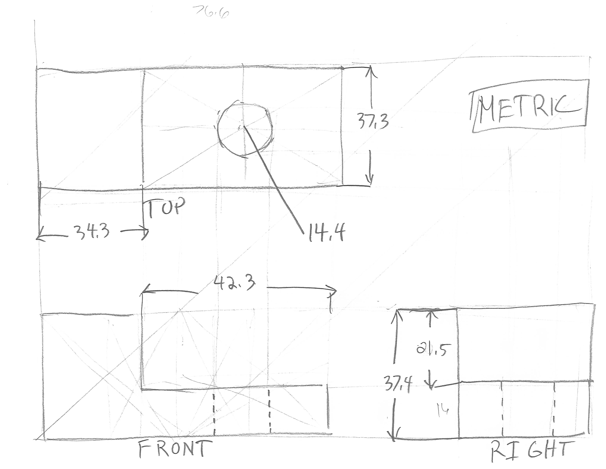

## Assignment Deliverables

1. Upload a minimum of 1 render image of the Fusion 360 Modeling Exercise
   - Label your exported render image: YYYYMMDD Lastname Firstname 3D Modeling Exercise Render.png

## Assignment Instructions

1. Watch the [Fusion 360 3D Modeling Exercise](https://youtu.be/arTAFuBS-qI) video. This walks you through modeling your first part in Fusion 360. It introduces sketches, sketch constraints, appearances as well as rendering. Follow along and make the part from the example. You can use the sketch of the part below for reference.
2. Add a material to the object other than the default grey steel. Press "a" on your keyboard to bring up the appearance browser. Select the material of your choice. It doesn't have to be wood and it doesn't have to be the same material on each face. Experiment and see what happens.
3. Export a render of your part as a PNG. You can render on your machine or in the cloud. Double check that the object is not super tiny in the render preview. In the render settings make sure one of the dimensions is set to 4000px so you have enough resolution.
4. Label the render image file and upload it. YYYYMMDD Lastname Firstname 3D Modeling Exercise Render.png

## Practice Modeling

Once you finish this exercise, try to model a creation of your own. Don't worry about making mistakes, just experiment. Add materials, make some renders, and upload them with your assignment. We will talk more about modeling techniques next week and throughout the semester.

## Link to Reference Sketch used in Tutorial Video

You can use [this sketch](../../../../drawing/attachments/2022-Sketch-of-Sample-Part-for-Fusion-360-Modeling-Exercise.jpeg) to model the part in Fusion 360.

### 2. Fusion 360 3D Modeling Exercise

<iframe class="youTubeIframe" src="https://www.youtube.com/embed/arTAFuBS-qI" width="300" height="150" frameborder="0" allowfullscreen="allowfullscreen"></iframe>

## Grading Rubric

| Assessment                                            | Weight    |
| ----------------------------------------------------- | --------- |
| Object Form and Proportions compared to example block | 30 points |
| Material Applied                                      | 20 points |
| Render Exported                                       | 10 points |
| Render Composition                                    | 10 points |
| File Management                                       | 10 points |

