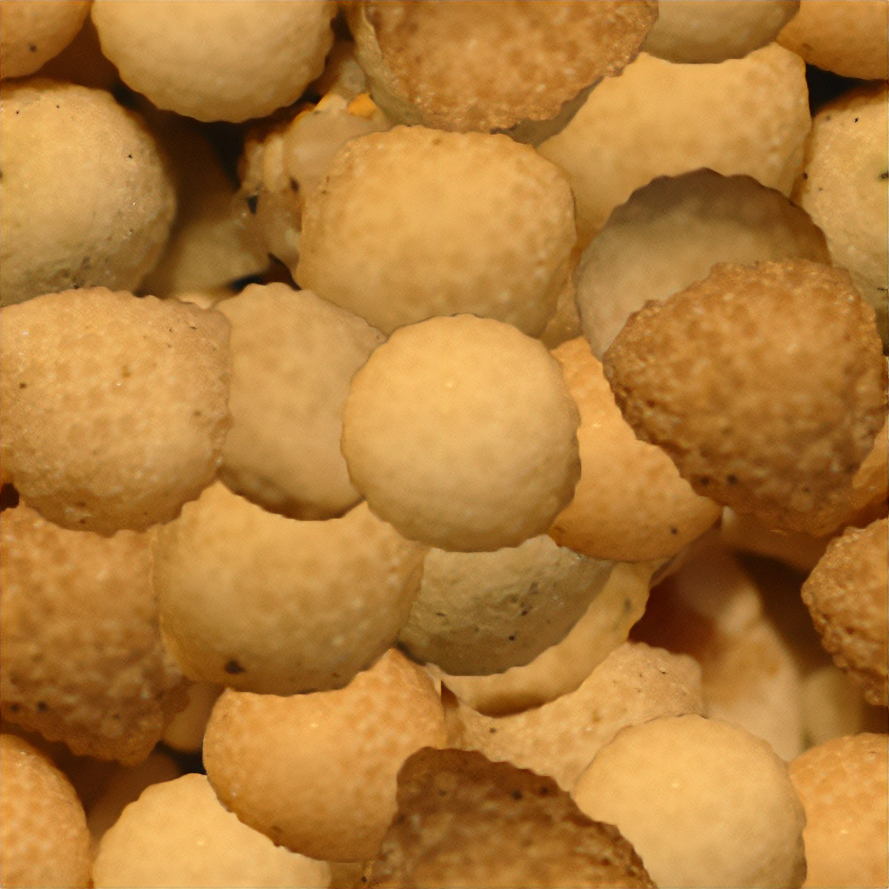

## Assignment Deliverables

1. Minimum of 2 render images each of a a UV unwrapped and textured object in [Blender](../../../../3d-modeling/blender/blender.md) **and in** [Maya](../../../../3d-modeling/maya/maya.md)
   - Minimum of 1 object mesh with more than 6 faces in scene
   - Minimum of 1 use of each of the following (Texture Image, Bump)
   - Minimum of 1 light source
   - Render 2 different camera views of the scene at a minimum 1920x1080 or 3840x2160 (.png or .jpg)
2. Upload Blender **and** Maya project file (.blend or (.mb or .ma in a scene archive .zip))
   - If using Blender, make sure to pack all external assets.
   - If using Maya, make sure to export an archive of the scene with all of the texture files.

## Assignment Overview

3D models used in rendering are boring and nondescript without textures and colors. These can be enhanced with physical based materials. Use the image textures provided or create your own image textures. UV unwrap an object mesh. Apply the image texture and bump map texture jso it wraps around the object without stretching.

Texture Image

Bump Map

Normal Map
