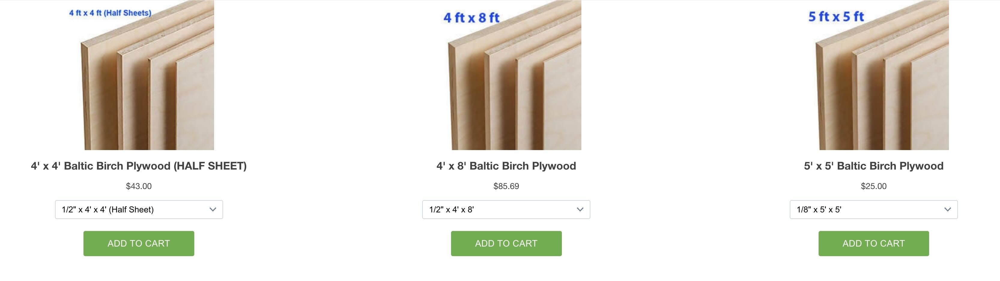

## Assignment Deliverables

1. Upload your .f3d file to the [CNC Project Google Drive Folder](https://drive.google.com/drive/folders/17Rl_j9kvIo-nTF9qpvY1pnIie4jpIoUv)
2. Make a ShopBot Reservation long enough to cutout your project
   - Take a Screenshot of your ShopBot Reservation or print a pdf of the confirmation email
   - Upload the screenshot or PDF to Canvas.

## Assignment Overview

It is necessary to reserve time to use the ShopBot so everyone can plan and schedule their CNC projects.

Remember that the CNC project documentation is due before the final critique. Make sure you make your reservation soon enough to have enough time to assemble your project, apply desired surface finishes, and take documentation photos.

### ShopBot Reservation Time

Make sure you reserve enough time to cut your project. If there is not enough time and the next student has a reservation, you will need to stop your cut. This can waste your plywood and time.

- It takes 9 minutes for the spindle warm up.
- It will take ~ 30 minutes to set up the tool and have your plywood in place.
- Look in Fusion 360 statistics to get an estimate of your machine time
- Multiply the machine time by 1.2 to add 20% buffer time.
- Add at least ~5-10 minutes to remove material from machine.
- Add everything together and make a reservation that is long enough.

You may need to make multiple reservations since the default reservation is 1 hour. If you need a 2 hour reservation, reserve two 1 hour slots. If you need 2 hours and 30 minutes then reserve three 1 hour slots in a row.

You must go to your reserved time because there are limited slots. The shop will let me know if you do not attend. You can cancel your slot but you must do it a minimum of 48 hours in advance. You then have to make another reservation.

## ShopBot Reservations

Click [this link](https://my.cia.edu/ICS/Departments/Fab_Studios/ShopBot_CNC.jnz) to make a [shopBot reservation](https://my.cia.edu/ICS/Departments/Fab_Studios/ShopBot_CNC.jnz).

## Purchase Additional Plywood

After you make your Fusion 360 model of your CNC project, lay the parts out flat. Then look at the size of the sketch that you needed to use in the Arrange command to lay your parts flat. This will let you know how much plywood that you need. You can buy plywood in 48"x48" or 48"x96" or 60"x60". It comes in a range of thicknesses. Stop by the Fab Studios to see the plywood in person. Then purchase the right size board for your project. If your model is just a bit over you may be able to fit the last piece on someone else's scrap.

[Purchase Plywood](https://my.cia.edu/ICS/Departments/CIA_Store/Fabrication_Studios/Wood/)

## Grading Rubric

| Assessment                      | Weight    |
| ------------------------------- | --------- |
| ShopBot File Uploaded to Folder | 35 points |
| ShopBot Reservation Screenshot  | 30 points |
| File Management                 | 10 points |

