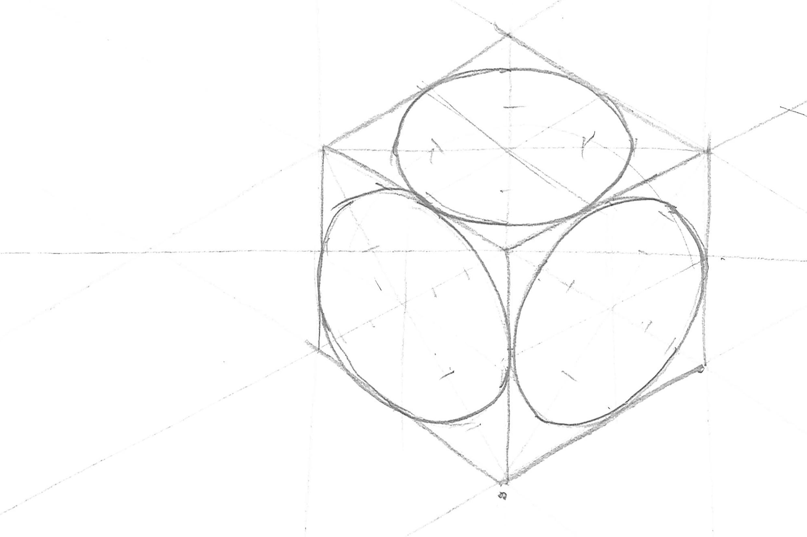

## Assignment Deliverables

You will upload three separate, scanned, and labeled JPEGs, PNGs, or PDFs of the following the sketching practice exercises:

1.  Page filled with straight lines
    - Label the scanned image as: YYYYMMDD Lastname Firstname page of straight lines.jpg
2.  Freehand isometric cube with three isometric circles
    - Label the scanned image as: YYYYMMDD Lastname Firstname freehand isometric cube and circles.jpg
3.  Isometric Cube with three isometric circles drawn with T-Square and Compass
    - Label the scanned image as: YYYYMMDD Lastname Firstname isometric cube and circles t-square and compass.jpg

## Assignment Instructions

Using loose sheets of paper, not in your sketchbooks, do each of the following sketching exercises on your own.

### 1. Page Filled with Straight Lines

Draw a minimum of 1 page filled with straight lines. It is a good idea to do this multiple times until you get the hang of it. It will help you in your sketching in all of your classes. Remember to draw from the shoulder. Video demo of [drawing freehand straight lines](https://www.youtu.be/UUQa2CtzIwE).

### 2. Freehand Isometric Cube with Circles

After you have a page of good straight lines, then follow the video to draw an isometric cube with circles. Do this freehand. Freehand sketching is import for quickly communicating ideas, generating ideations, and solving design problems. Video demos of [freehand isometric cubes](https://www.youtu.be/8FkcqdCmT1U) and [freehand isometric circles](https://www.youtu.be/twj5luXIC_c).

### 3. Isometric Cube with Circles using Drawing Tools

Once you finish the freehand isometric cube, draw the same cube on a new sheet of paper but this time use your drafting tools. Although freehand sketching is great and very important, often we have to take our freehand sketch ideas and refine them for presentation. Video demos of using drawing tools to draw [isometric cubes](https://www.youtu.be/7t4ycR3fXJ4) and [isometric circles with a compass](https://www.youtu.be/EaTwlLaMYao).

## Technical Sketching Exercise Videos

The videos below demonstrate how to practice drawing straight lines freehand. This is an important skill for ideation sketching, 3D modeling sketching and isometric crating. The videos then demonstrate how to draw an isometric cube with isometric circles on each face of the cube freehand. This is followed by a demonstration of how to draw an isometric cube with isometric circles on each face using a t-square, 30 / 60 triangle, and a compass.

### 1. How to Draw Straight Lines

<iframe class="youTubeIframe" src="https://www.youtube.com/embed/UUQa2CtzIwE?rel=0" title="YouTube video player" width="560" height="315" frameborder="0" allow="accelerometer; autoplay; clipboard-write; encrypted-media; gyroscope; picture-in-picture; web-share" referrerpolicy="strict-origin-when-cross-origin" allowfullscreen></iframe>

### 2. Draw Isometric Cube Freehand

<iframe class="youTubeIframe" src="https://www.youtube.com/embed/8FkcqdCmT1U?rel=0" title="YouTube video player" width="560" height="315" frameborder="0" allow="accelerometer; autoplay; clipboard-write; encrypted-media; gyroscope; picture-in-picture; web-share" referrerpolicy="strict-origin-when-cross-origin" allowfullscreen></iframe>

### 3. Draw Isometric Circle Freehand

<iframe class="youTubeIframe" src="https://www.youtube.com/embed/twj5luXIC_c?rel=0" title="YouTube video player" width="560" height="315" frameborder="0" allow="accelerometer; autoplay; clipboard-write; encrypted-media; gyroscope; picture-in-picture; web-share" referrerpolicy="strict-origin-when-cross-origin" allowfullscreen></iframe>

### 4. Draw Isometric Cube with a T-Square

<iframe class="youTubeIframe" src="https://www.youtube.com/embed/7t4ycR3fXJ4?rel=0" title="YouTube video player" width="560" height="315" frameborder="0" allow="accelerometer; autoplay; clipboard-write; encrypted-media; gyroscope; picture-in-picture; web-share" referrerpolicy="strict-origin-when-cross-origin" allowfullscreen></iframe>

### 5. Draw Isometric Circle with a Compass

<iframe class="youTubeIframe" src="https://www.youtube.com/embed/EaTwlLaMYao?rel=0" title="YouTube video player" width="560" height="315" frameborder="0" allow="accelerometer; autoplay; clipboard-write; encrypted-media; gyroscope; picture-in-picture; web-share" referrerpolicy="strict-origin-when-cross-origin" allowfullscreen></iframe>

## Grading Rubric

| Assessment                                | Weight    |
| ----------------------------------------- | --------- |
| Page of Straight Lines                    | 10 points |
| Isometric Cube with Circles Freehand      | 20 points |
| Isometric Cube with Circles with T-Square | 20 points |
| Sketch Documentation                      | 20 points |
| File Management                           | 10 points |

