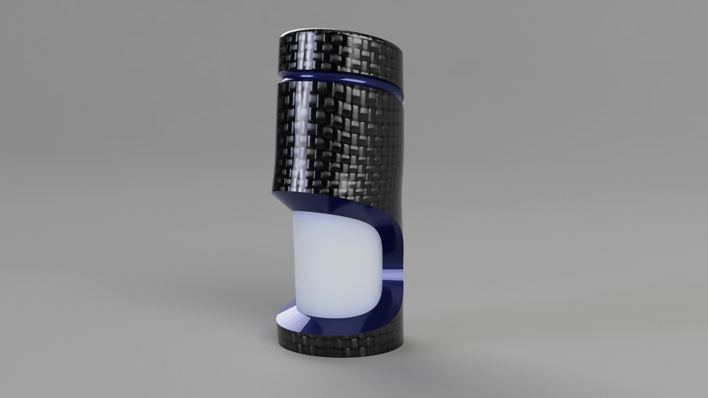
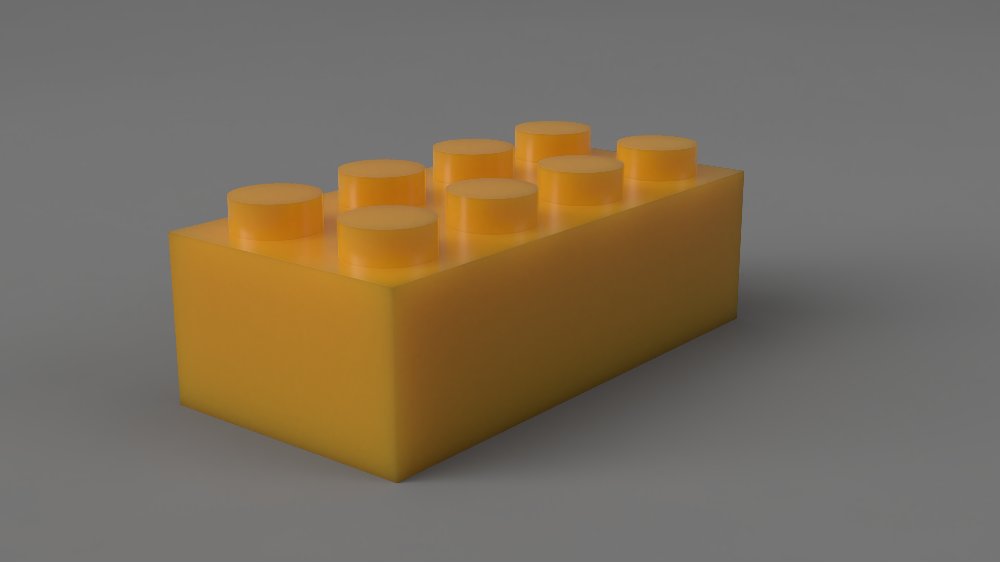
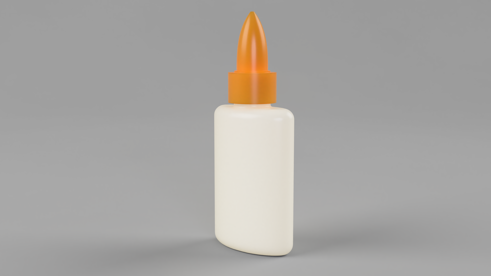
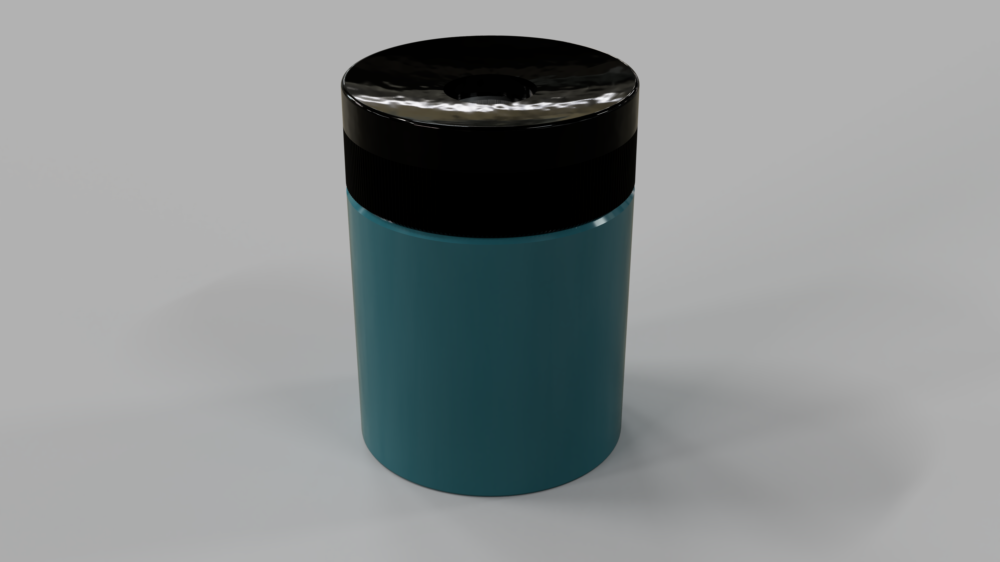

## Assignment Deliverables

Upload the following:

- 1 high resolution, labeled render image (1:1, 4:3, 16:9 aspect ratio, 4000px minimum largest side)
- 1 exported Fusion 360 .f3d file [How to export .f3d File](../../../../3d-modeling/fusion-360/export-f3d-file-fusion-360.md)

Label your files:

- YYYYMMDD Lastname Firstname Render Custom Model 1.png/jpg
- YYYYMMDD Lastname Firstname Fusion 360 Custom Model 1.f3d

## Overview

Now that you have modeled a complete model from on of the example modeling exercises, you will do your best to model one of your objects from your third angle projection. Or, if you don't like the object in your third angle projection, you can choose a different object, make a quick third angle projection with dimensions and then model that object.

There is no "right" way to model your object. Try to think of the main shapes. Break those down into pieces and then model the main form. Add details after you get the main forms. Look at the example videos to see different techniques and approaches to modeling simple objects.

Using your third angle projection sketches, make a model at least one of your objects in Fusion 360. Use [Rule Number 1](https://youtu.be/ZYXSJ6EQ9S4) to divide you object into components. Label your components and make sure to activate each component when you are working on it. It is easy to forget which component is activated so it is good practice to right click on the component and isolate it so it is the only thing you can see. Remember to click the dot in the browser to activate the component that you want to work on so that the design history in the timeline stays with that component.

## Instructions

1. Model at least 1 of your objects but you may model more.
2. Make all of the dimensions that you need are in your third angle projection sketch.
3. If any dimensions are missing from the sketch, remeasure the object so you have the information needed to make an accurate model in Fusion 360.
4. If you do not like the objects from your third angle projections, you can choose new objects. Draw new third angle projections with dimensions so you can make the 3D models.
5. Use the basic Fusion 360 modeling techniques covered in this course. You likely will not be able to model every detail exactly, but give it your best shot to have some representation of each part of the object in your Fusion 360 model.
6. Remember Rule #1 - make a component, label the component, and activate it. This will help keep your design history timeline cleaner.
7. Use sketches to map out the views from your sketch. Then use Extrude and other modeling operations to begin defining the form.
8. Continue to refine the form with tools such as fillet, chamfer, and shell from the modify menu in Fusion 360.

### Apply Materials to the Model

9. Press "a" to bring up the appearance menu in order to apply materials to the model.
10. Apply materials to each part of your model.
11. Experiment with different materials. You can edit materials that have been applied to change the color of the materials to match your object.
12. By default, materials apply to bodies and components. If you only want a material to apply to one face of an object, click the button on the top of the appearance menu that says faces.
13. Some materials need to be downloaded to work, click on the down arrow to use.
14. **Tip:** In the Design workspace, the materials do not appear as they will in the render. You can apply materials in the render workspace so you get a better idea of what they look like. Press "a" to bring up the appearance menu.

### Render the Model

15. In the Render workspace, select an environment that you want or a solid color background.
16. Rotate and position the model.
17. Change any lighting preferences.
18. Click on the teapot to bring up the render setting menu.
19. Make sure the render are high resolution. The max resolution that Fusion renders at is 4000x4000 pixels. You don't need to render in high resolution when making test renders but after you finalize your model and materials, export a 4000x4000 pixel render.
20. You can render locally on your computer or in the cloud so your computer does not have to do the work and can submit multiple render(s) of different views and angles.
21. After the render(s) are complete, save them to your computer.
22. Label the render file(s) - YYYYMMDD Lastname Firstname Render Image 1.png/jpg

### Download Fusion .f3d files

Download the Fusion 360 model files to your computer. (To download a .f3d file you need to go to the file menu and click "...export". Then you can save a .f3d file to your computer.) Upload the .f3d files along with your render image.

.f3d Files are a way to share Fusion models. If you have questions about your model during this assignment or during this course, download your .f3d file and send your questions and .f3d file to your instructor via email.

## Example Renders

## Grading Rubric

| Assessment                             | Weight    |
| -------------------------------------- | --------- |
| Convincing Object Form and Proportions | 30 points |
| Materials Applied                      | 20 points |
| Render Exported                        | 10 points |
| Render Composition                     | 10 points |
| File Management                        | 10 points |

