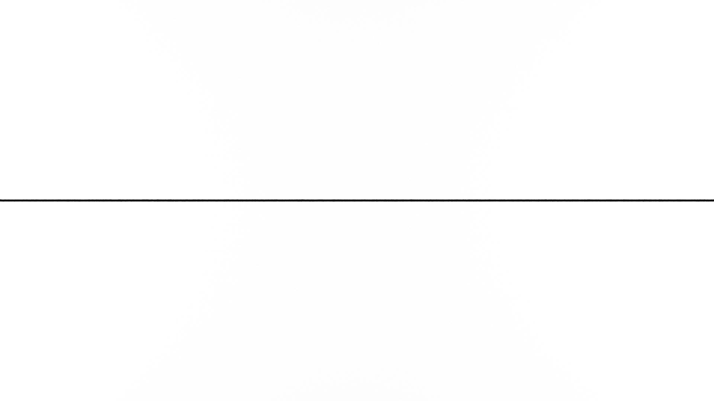
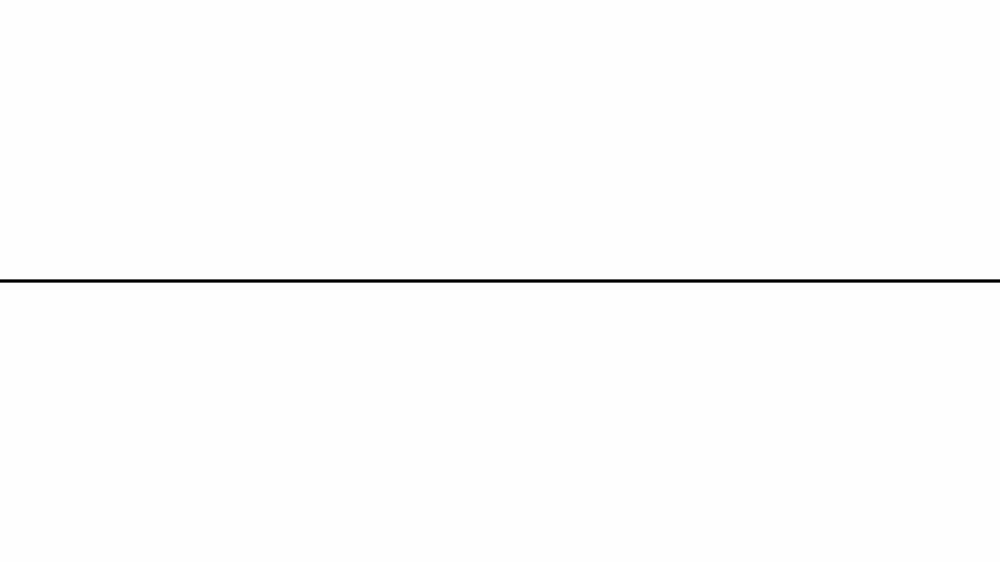

## Line Animation Starter Project Files

- [Maya Line Animation Starter Project File](./2025-Line-Animation-Maya.zip)
- [Blender Line Animation Starter Project Archive File](./2025-Line-Animation-Blender.blend)

## Assignment Deliverables

1. Exported `.mp4` video file with .h264 compression of a 30 second 3D animation with sound
   - Label file YYYYMMDD Lastname Firstname 3D Line Animation.mp4
2. Blender file with all external resources packed `.blend` or Maya project archive file `.zip` with all scenes and assets (.zip)
   - Label file YYYYMMDD Lastname Firstname 3D Animation Project File

## Assignment Requirements

Create a 30 second long video composed in Adobe Premiere using images created and rendered in Blender or Maya

- Begin with "line" as first frame
- End with "line" as last frame
- Ease gradually away from first frame and ease gradually into last frame
- Include multiple animated sequences from Blender or Maya
- Use a minimum of 2 different camera angles and distances from subject
- Have UV mapped objects with textures created by you
- Show basic animation principles such as squash and stretch, movement in arcs, acceleration / deceleration, easing in / easing out
- Include sounds created by you

## Objectives

<figure>

<figcaption>

Starting and Ending "Line" Animation Frame Rendered in Blender

[Blender Line Animation Starter Project File](./2025-Line-Animation-Blender.blend)

</figcaption>
</figure>

<figure>

<figcaption>

Starting and Ending "Line" Animation Frame Rendered in Maya

[Maya Line Animation Starter Project Archive File](./2025-Line-Animation-Maya.zip)

</figcaption>
</figure>

You are tasked with creating a captivating 30 second animation using Blender, or Maya, with self-created sound. The narrative will start and end with the exact same frame, simulating a single horizontal line drawn across the frame. The animations will be joined into a larger video with other students' animations. Each student will start and stop their animations with the same "line" frame so the animations seamlessly transition from one to another.

Composes an animation that navigates through an inventive 3D environment crafted by you, using modeling, texturing, and animating various elements within the setting. Through the creation of a story spine and storyboards, students will plan and execute their animation, leverage basic animation principles such as squash and stretch, and employing a minimum of two camera angles to add depth and interest. Designing and applying textures to the 3D objects using UV mapping and texturing tools, will add visual interest to your project. The incorporation of custom lighting and the strategic use of sound effects will be crucial in enhancing the overall impact of the animations.

## Process

Draft a [Story Spine](../../../../video/story-spine.md) that follows a basic narrative arc. This will give you guidelines and a plan to make your animation. Use the story spine to draw storyboards of the scenes and different camera angles that you want to use.

Draw a page of storyboards to use a a guide for production.

Create a 3D environment or "animation set" of 3D modeled objects. This environment should be real world scale and be interesting enough to use as a setting for your animation. You can model different items for your scene and combine the meshes and group them together. You can save the items all in one scene or save each item as a different scene and import them into your main scene.

Use the UV mapping editor in Maya to map the UVs of your objects and export UV snapshots for importing into Photoshop. Paint textures onto the UV snapshots and export the new textures to your "sourceimages" folder in your Maya project. Apply the Textures and edit as needed. You can also use Adobe's Substance Painter to add detailed textures. Smooth your object and then save it as an .obj file to import into Substance Painter. Then you can use all of the materials in Substance Painter.

Add lights to the scene. Make sure to only add "Arnold Lights." Do not use any of the older Maya lights or you will not be able to use the some render farms. Remember that you will have to increase the exposure of the lights to make your render show up in the Arnold Renderer.

Add multiple cameras to the scene. Animate a bouncing ball that travels through the scene in an interesting way. Use the animation principles of squash, stretch, exaggeration, anticipation and follow through. Use a minimum of 3 different camera angles and shot types. to apply textures to your objects. Export the different camera angles as separate sequence renders.

## Grading Rubric

| Assessment                          | Weight    |
| ----------------------------------- | --------- |
| Start with Line Frame               | 25 points |
| End With Line Frame                 | 25 points |
| Have Multiple Camera Angles / Shots | 25 points |
| Show Basic Animation Principles     | 25 points |
| Use of Lighting                     | 25 points |
| UV Textures Applied to Objects      | 25 points |
| Use Sound Effects                   | 25 points |
| Credits PDF Uploaded                | 25 Points |

