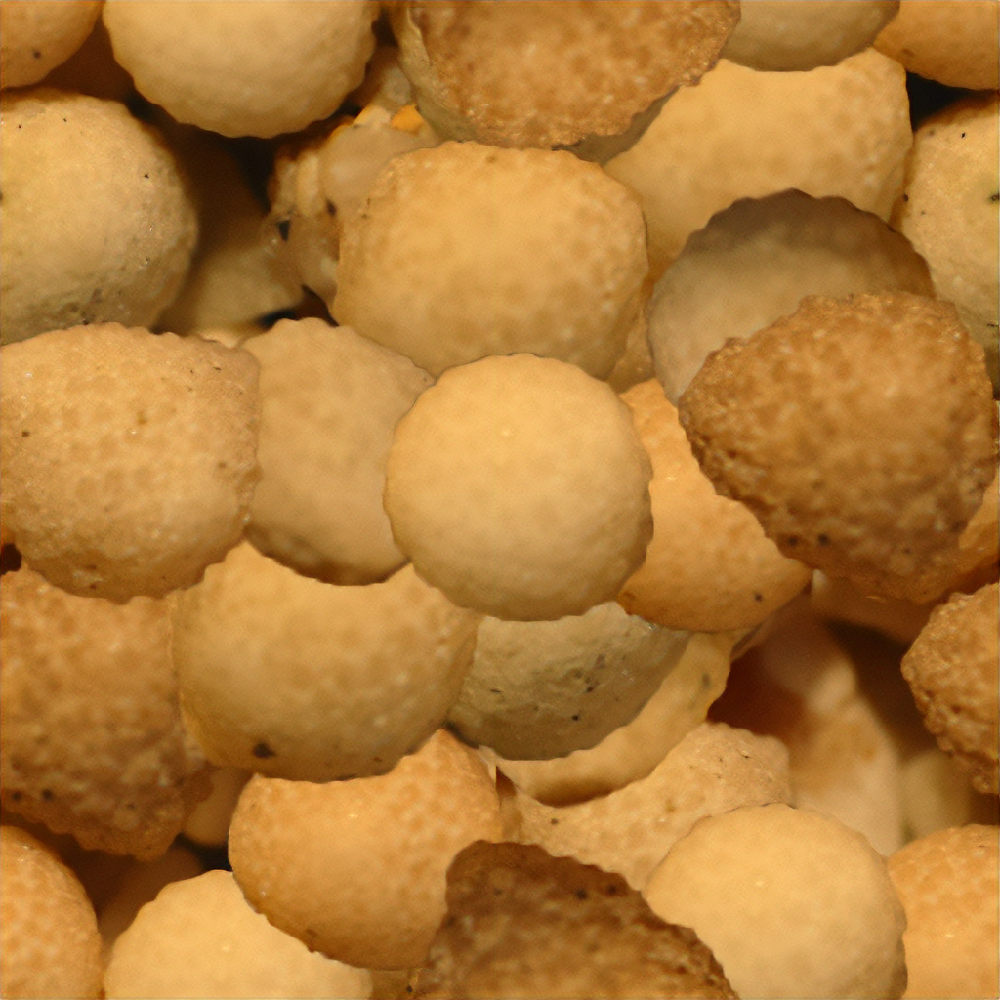
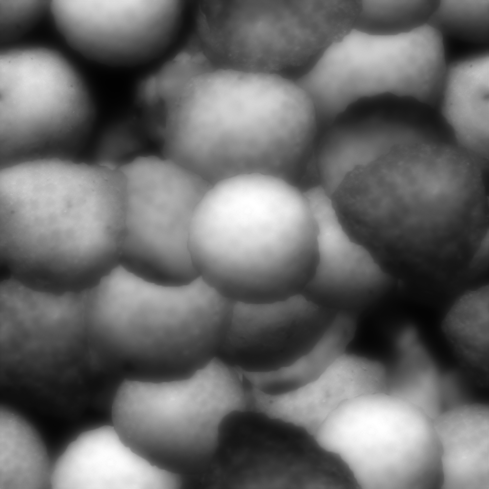

## Assignment Deliverables

1. Minimum of 2 render images each of a a UV unwrapped and textured object in [Blender](../../../../3d-modeling/blender/blender.md) **or in** [Maya](../../../../3d-modeling/maya/maya.md)
   - Minimum of 1 object mesh with more than 6 faces in scene
   - Minimum of 1 use of each of the following (Texture Image, Bump)
   - Minimum of 1 light source
   - Render 2 different camera views of the scene at a minimum 1920x1080 or 3840x2160 (.png or .jpg)
2. Upload Blender **or** a Maya project saved as a Maya Scene Archive
   (.blend and a Maya scene archive .zip)
   - When using Blender, make sure to [pack all external assets](https://youtu.be/x6H6HFBLRlUl) File > External Data > Automatically Pack Resources.
   - When using Maya, make sure to export [Maya Scene Archive](https://youtu.be/gic-kMWKjNI) of the scene with all of the texture files.

## Assignment Overview

3D models used in rendering are boring and nondescript without textures and colors. These can be enhanced with physical based materials. Use the image textures provided or create your own image textures. UV unwrap an object mesh. Apply the image texture and bump map texture jso it wraps around the object without stretching.

### Texture Images

<figure>

<figcaption>

Texture Image

</figcaption>
</figure>
<figure>

<figcaption>

Bump Map

</figcaption>
</figure>
<figure>

<figcaption>

Normal Map

</figcaption>
</figure>

## Assignment Resources

- [Maya How to Archive Scene](https://youtu.be/gic-kMWKjNI)
- [Blender pack all external assets](https://youtu.be/x6H6HFBLRlUl)

### Video Tutorials

- [Maya UV in Class Exercise](https://youtu.be/D3q2HleBJIs)
- [Blender UV in Class Exercise](https://youtu.be/OOmQNgawF8c)

#### Maya UV in Class Exercise

<iframe class="youTubeIframe" width="560" height="315" src="https://www.youtube.com/embed/D3q2HleBJIs" title="YouTube video player" frameborder="0" allow="accelerometer; autoplay; clipboard-write; encrypted-media; gyroscope; picture-in-picture; web-share" referrerpolicy="strict-origin-when-cross-origin" allowfullscreen></iframe>

#### Blender UV in Class Exercise

<iframe class="youTubeIframe" width="560" height="315" src="https://www.youtube.com/embed/OOmQNgawF8c?si=qkpRun0uEaGDfp2e" title="YouTube video player" frameborder="0" allow="accelerometer; autoplay; clipboard-write; encrypted-media; gyroscope; picture-in-picture; web-share" referrerpolicy="strict-origin-when-cross-origin" allowfullscreen></iframe>

#### Maya HDRI Image

<iframe class="youTubeIframe" width="560" height="315" src="https://www.youtube.com/embed/wiad9sjWAOI" title="YouTube video player" frameborder="0" allow="accelerometer; autoplay; clipboard-write; encrypted-media; gyroscope; picture-in-picture; web-share" referrerpolicy="strict-origin-when-cross-origin" allowfullscreen></iframe>

#### Blender HDRI Image

<iframe class="youTubeIframe" width="560" height="315" src="https://www.youtube.com/embed/VaGfn4i5dKQ" title="YouTube video player" frameborder="0" allow="accelerometer; autoplay; clipboard-write; encrypted-media; gyroscope; picture-in-picture; web-share" referrerpolicy="strict-origin-when-cross-origin" allowfullscreen></iframe>

## Grading Rubric

| Assessment                                                                             | Weight    |
| -------------------------------------------------------------------------------------- | --------- |
| More than 6 faces on object in 3D scene                                                | 20        |
| Use Texture Image + Bump Map on material                                               | 20        |
| Minimum of 1 light source                                                              | 20        |
| Render 2 different camera views                                                        | 20        |
| Upload Blender .blend file with packed resources **or** Upload Maya scene archive .zip | 10        |
| File Management and Labeling                                                           | 10 points |

