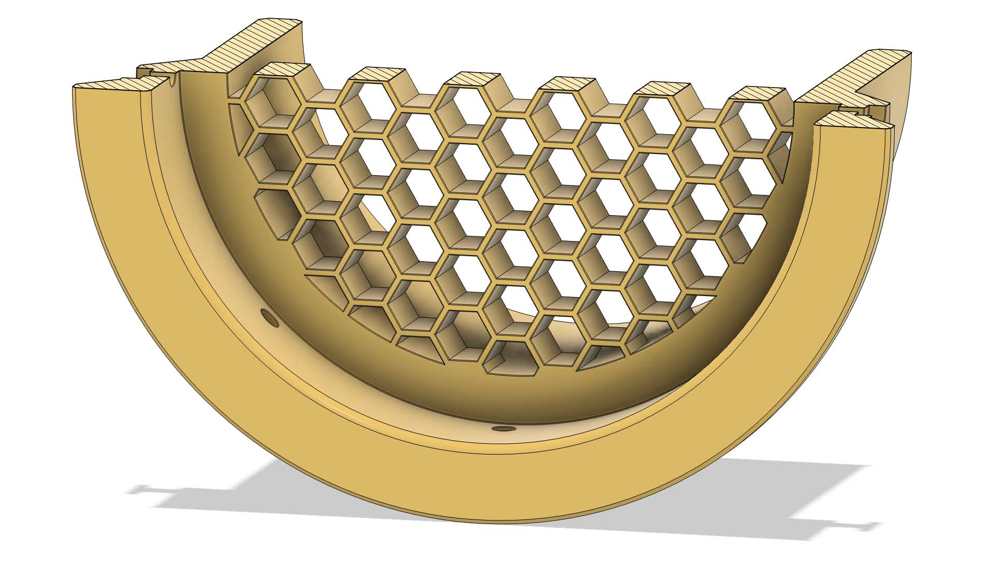

## Course Introduction

This course is intended for first year college students studying art and [design](../../../../art-faq/design.md).

The course introduces basic technical sketching, third angle projections, 3D modeling in Fusion 360, laser cutting, 3D printing, CNC fabrication, mesh / polygon modeling in Blender and Maya, and basic 3D animation and rendering, non-linear video editing.

## Course Materials

- [Canvas Course Page](https://cia.instructure.com/courses/1202)
- [Course Website](https://whatmakeart.com/courses/modeling-and-fabrication/2024-spring/)

## Material Sources

### School Material and Equipment Resources

- [CIA Fabrication Studios Store](https://my.cia.edu/ICS/Departments/CIA_Store/Fabrication_Studios/)
- [CIA Equipment Checkout](https://cia.webcheckout.net/sso/patron#!/center/1)
- [Think\[box\] Material Store](https://case.edu/thinkbox/equipment/materials-and-supplies)

### Local Stores

- [Lakewood Art Supply](https://lakewoodartsupply.godaddysites.com/) - 13345 Madison Avenue, Lakewood, Ohio 44107 Phone: 440-857-0537
- [Blick Art Materials](https://www.dickblick.com/) - 2768 Mayfield Road, Cleveland Heights, Ohio 44106 Phone: 216-371-3500
- [Sutton Industrial Hardware](https://www.suttonhardware.com/) - 3848 Prospect Avenue, Cleveland, Ohio 44114 Phone: 216-696-8340
- [Heights Hardware](http://www.heightshardware.com/) - 1792 Coventry Road, Cleveland Heights, Ohio 44118 Phone: 216-321-4701 **Student Discount with CIA ID**
- [Cleveland Lumber](https://www.clevelandlumber.com/) - 9410 Madison Avenue, Cleveland, Ohio 44102 Phone: 216-961-5550
- [Upcycle Parts Shop](https://www.upcyclepartsshop.org/) - 6419 St. Clair Avenue Cleveland, OH 44103 Phone: 216-361-9933
- [Habitat for Humanity ReStore](https://www.clevelandhabitat.org/restore/restore.html) - 4601 Northfield Road, North Randall, Ohio 44128 Phone: 216-429-1299
- [Home Depot](https://www.homedepot.com/) 3460 Mayfield Road, Cleveland Heights, Ohio 44118 Phone: 216-297-1303
- [HGR Industrial Surplus](https://hgrinc.com/) 20001 Euclid Ave, Euclid, Ohio 44117 Phone: 216-486-4567
- [Total Plastics International](https://totalplastics.com/) 17851 Englewood Drive, Middleburg Heights, Ohio 44130 Phone: 440-891-1140

## Software Documentation

- [Autodesk Fusion 360 Online Product Documentation](https://help.autodesk.com/view/fusion360/ENU/)
- [Blender Docs](https://docs.blender.org/)
- [Maya Documentation](https://www.autodesk.com/support/technical/article/caas/tsarticles/ts/lC3jaffqnWFyQoLPEPm7n.html)
- [Ultimaker Support](https://support.ultimaker.com/s/)
- [Adobe Premiere User Guide](https://helpx.adobe.com/premiere-pro/user-guide.html)

## Digital II Modeling and Fabrication Course Topics

- [Technical Sketching](../../../../drawing/technical-sketching.md)
  - [Third Angle Projections](../../../../drawing/third-angle-projection.md)
- [3D Modeling](../../../../3d-modeling/3d-modeling.md)
  - [Parametric Modeling](../../../../3d-modeling/parametric-modeling.md)
    - [Fusion 360](../../../../3d-modeling/fusion-360/fusion-360.md)
  - [Mesh / Polygon modeling](../../../../3d-modeling/polygon-mesh-3d-modeling-basics.md)
    - [Blender](../../../../3d-modeling/blender/blender.md)
    - [Maya](../../../../3d-modeling/maya/maya.md)
- [Laser Cutting](../../../../digital-fabrication/laser-cutting/laser-cutting.md)
- [3D Printing](../../../../digital-fabrication/3d-printing/3d-printing.md)
- [CNC Fabrication](../../../../digital-fabrication/cnc/cnc-basics.md)
- 3D Animation
  - [Blender 3D Animation](../../../../3d-modeling/blender/3d-animation-blender.md)
  - [Maya 3D Animation](../../../../3d-modeling/maya/3d-animation-maya.md)
- Rendering
  - [Blender Rendering](../../../../3d-modeling/blender/rendering-basics-blender.md)
  - [Maya Rendering](../../../../3d-modeling/maya/rendering-basics-maya.md)

## Course Information

- [Syllabus](00-00-121-08-3d-modeling-and-fabrication-syllabus.md)

## External Resources

[CAD Quest](https://cadquest.io) - Online learning platform that presents CAD challenges and puzzles
