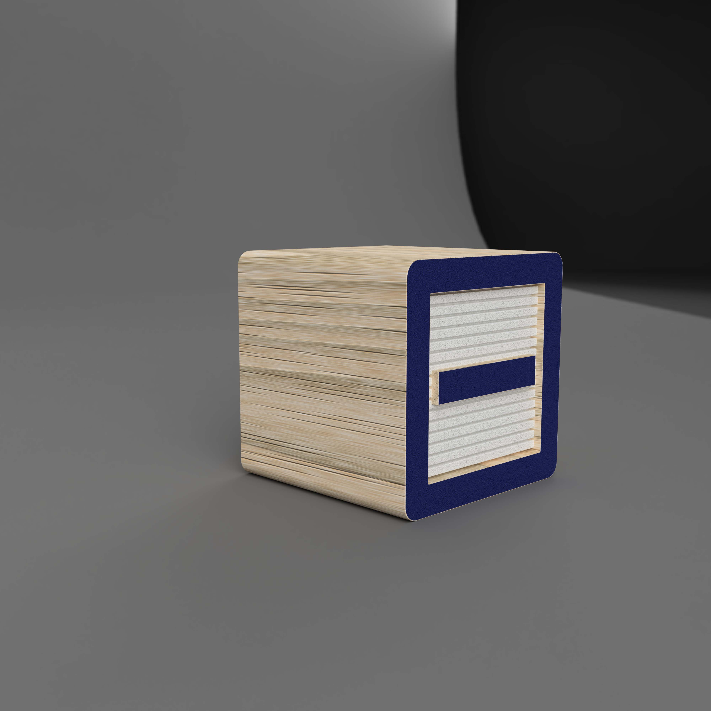
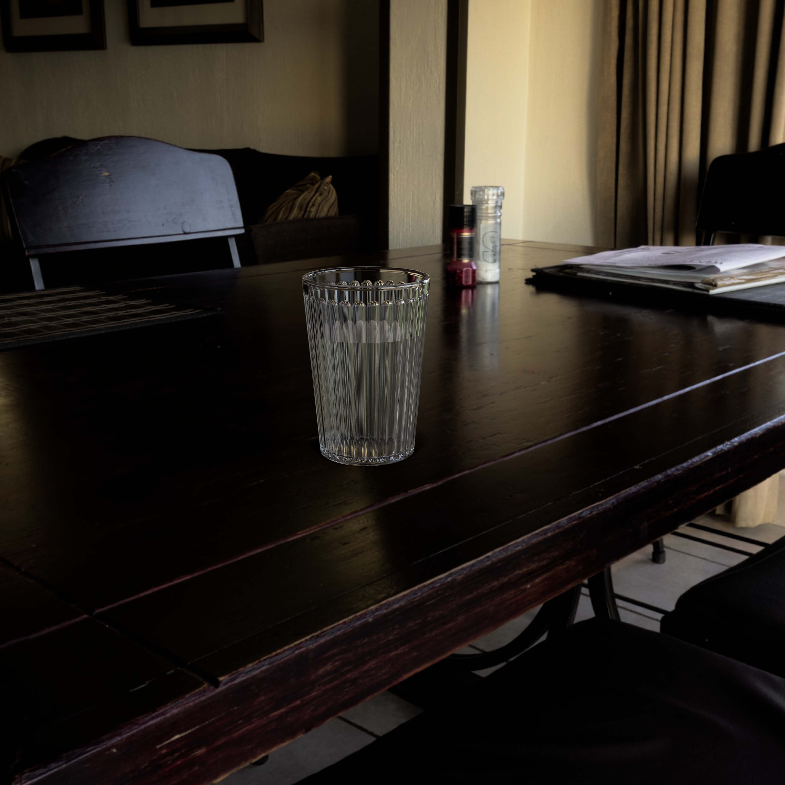
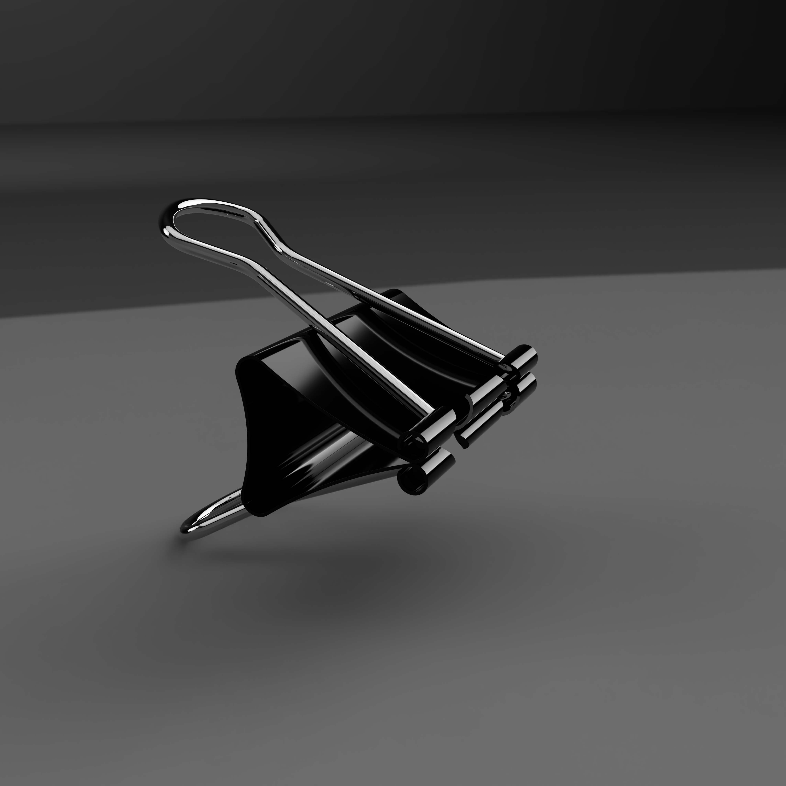
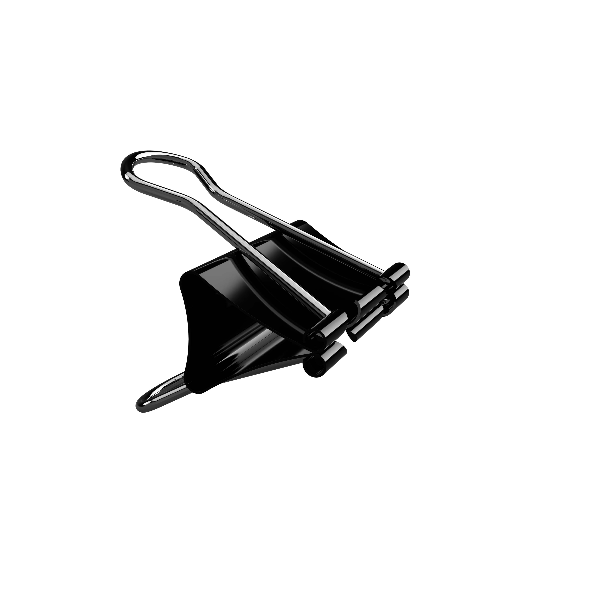

## Assignment Deliverables

Upload the following:

- 1 high resolution, labeled render image (1:1, 4:3, 16:9 aspect ratio, 4000px minimum largest side)
- 1 exported Fusion 360 .f3d file [How to export .f3d File](../../../../3d-modeling/fusion-360/export-f3d-file-fusion-360.md)

Label your files:

- YYYYMMDD Lastname Firstname Render Image of Example Model.png/jpg
- YYYYMMDD Lastname Firstname Fusion 360 Example Model.f3d

## Instructions

Choose 1 of the example objects from the demo videos. The choice is up to you. Follow along and make the 3D model using the techniques in the video. Then make a render and upload it with the exported .f3d file of the model from Fusion 360. You can put any materials you want on the models to make interesting renders, but should try your best to make them the same size and shape.

## Fusion 360 Example Modeling Videos

### Screwdriver

<iframe class="youTubeIframe" src="https://www.youtube.com/embed/YgRV2KPkYdg?rel=0" title="YouTube video player" width="560" height="315" frameborder="0" allow="accelerometer; autoplay; clipboard-write; encrypted-media; gyroscope; picture-in-picture; web-share" referrerpolicy="strict-origin-when-cross-origin" allowfullscreen></iframe>

### USB Plug

<iframe class="youTubeIframe" src="https://www.youtube.com/embed/VLx9AsbZ8R0?rel=0" title="YouTube video player" width="560" height="315" frameborder="0" allow="accelerometer; autoplay; clipboard-write; encrypted-media; gyroscope; picture-in-picture; web-share" referrerpolicy="strict-origin-when-cross-origin" allowfullscreen></iframe>

### Toy Block

<iframe class="youTubeIframe" src="https://www.youtube.com/embed/OJx09e5SrEw?rel=0" title="YouTube video player" width="560" height="315" frameborder="0" allow="accelerometer; autoplay; clipboard-write; encrypted-media; gyroscope; picture-in-picture; web-share" referrerpolicy="strict-origin-when-cross-origin" allowfullscreen></iframe>

### Drinking Glass

<iframe class="youTubeIframe" src="https://www.youtube.com/embed/2agSzLpN8Z0?rel=0" title="YouTube video player" width="560" height="315" frameborder="0" allow="accelerometer; autoplay; clipboard-write; encrypted-media; gyroscope; picture-in-picture; web-share" referrerpolicy="strict-origin-when-cross-origin" allowfullscreen></iframe>

### Binder Clip

<iframe class="youTubeIframe" src="https://www.youtube.com/embed/MLphWafTfWY?rel=0" title="YouTube video player" width="560" height="315" frameborder="0" allow="accelerometer; autoplay; clipboard-write; encrypted-media; gyroscope; picture-in-picture; web-share" referrerpolicy="strict-origin-when-cross-origin" allowfullscreen></iframe>

### Padlock

<iframe class="youTubeIframe" src="https://www.youtube.com/embed/8CNllmIHQN0?rel=0" title="YouTube video player" width="560" height="315" frameborder="0" allow="accelerometer; autoplay; clipboard-write; encrypted-media; gyroscope; picture-in-picture; web-share" referrerpolicy="strict-origin-when-cross-origin" allowfullscreen></iframe>

## Grading Rubric

| Assessment                                      | Weight    |
| ----------------------------------------------- | --------- |
| Object Form and Proportions match example model | 30 points |
| Material Applied                                | 20 points |
| Render Exported                                 | 10 points |
| Render Composition                              | 10 points |
| File Management                                 | 10 points |

## Examples of Fusion 360 Renders of Example Objects

Toy Block with Environment

Drinking Glass with Custom HDRI

Drinking Glass with Environment

Drinking Glass with Transparent Background

Binder Clip with Environment

Binder Clip with Transparent Background

